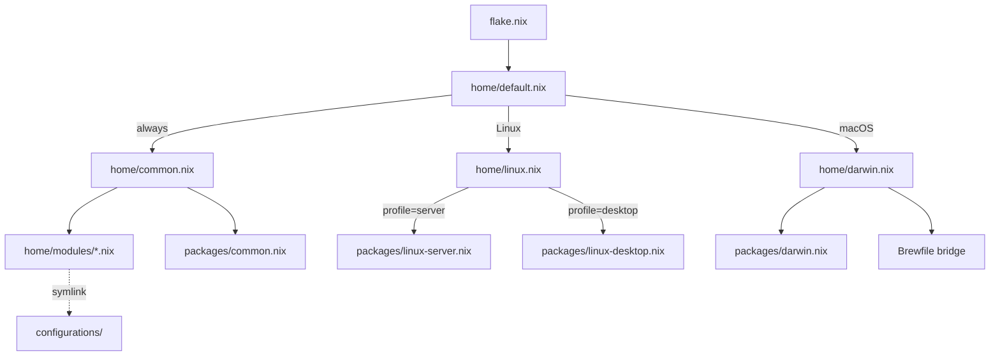

# Dotfiles v2 — Refactor Roadmap

A phased plan to turn this repo into a clean, agentic-friendly, hybrid Nix + native-package dotfiles setup.

---

## Status at a glance

Branch: `refactor/v2` (base tag `v1-final`). Tick state of each phase reflects what's
actually landed on this branch — keep this table in sync when shipping a phase.

| Phase | Title                                          | Status      | Commit                                                       |
| ----- | ---------------------------------------------- | ----------- | ------------------------------------------------------------ |
| 0     | Safety net                                     | ✅ shipped   | `8e31035 chore(phase-0): add ROADMAP and scripts/cleanup.sh safety net` |
| 1     | Repo skeleton + dispatcher refactor            | ✅ shipped   | `be053df refactor(home): split default.nix into platform dispatchers` |
| 2     | `configurations/` + scoped symlink scheme      | ✅ shipped   | `2418866 feat(configurations): add scoped backup-configs.sh` |
| 3     | Zsh: drop OMZ, aliases, atuin                  | ✅ shipped   | `05f3587 refactor(zsh): drop OMZ, add shared aliases/, replace histdb with atuin` |
| 4     | Starship slim-down                             | ✅ shipped   | `261fe2f refactor(starship): trim language modules, externalize toml` |
| 5     | Vim + Neovim shared rc                         | ✅ shipped   | `f3c74bc feat(editor): vim + neovim with shared rc and full plugin suite` |
| 6     | Tmux + Catppuccin Mocha everywhere             | ✅ shipped   | `7d223db feat(theme): tmux + unified Catppuccin Mocha across terminal stack` |
| 7     | Git + conventional commits + lefthook          | ✅ shipped   | `1eacae1 feat(git,commits): delta, conventional commits enforcement, lefthook` |
| 7.1   | GPG signing follow-up (reverses old Q4)        | ✅ shipped   | `9400c98 feat(gpg): signing wizard + HM module, reverses Q4` |
| 8     | Ghostty as default terminal (XDG path)         | ✅ shipped   | `979f5e1 feat(ghostty): default terminal across platforms via XDG path` |
| 9     | Linux desktop: Waybar only                     | ✅ shipped   | `35b83f9 feat(linux-desktop): waybar-only, drop polybar`     |
| 10    | Hybrid native package strategy                 | ✅ shipped   | `974f6af feat(packages): hybrid native+nix install paths`    |
| 11    | `scripts/update.sh` — packages + configurations | ⏳ next      | —                                                            |
| 12    | Agentic conversion (`.claude/` tree)           | ⏳ pending   | —                                                            |
| 13    | Documentation (per-module / per-command docs)  | ⏳ pending   | —                                                            |
| 14    | Polish (`.editorconfig`, `.gitignore`, cleanup) | ⏳ pending   | —                                                            |

Phase-7-deferred docs (`doc/commands/*.md`, `doc/hooks/*.md`) live inside the Phase 7
checklist below but actually ship as part of Phase 13 — Phase 12 has to land first.

---

## Decisions (locked)

| #  | Decision                                                                                                                 | Notes              |
| -- | ------------------------------------------------------------------------------------------------------------------------ | ------------------ |
| A1 | **Drop oh-my-zsh entirely. Keep Home Manager.** Trim Starship/HM features as we go.                                       | Phase 3 implements. |
| A2 | **Hybrid Nix + native.** Nix for cross-platform CLI; `brew` casks on macOS, `apt`/`pacman`/`dnf` on Linux for GUI apps.   | Phase 10 implements. |
| A3 | **Port Linux-desktop apps to macOS via `brew` casks** in `configurations/brew/Brewfile`, driven from `home/darwin.nix`.   | Phase 8 + 10.       |
| A4 | **`configurations/<app>/` + HM `mkOutOfStoreSymlink`.** Edits in `configurations/` take effect without rebuild.           | Phase 2 implements. |
| A5 | Dismissed (covered by the agentic conversion item, Phase 12).                                                            | —                  |
| Q1 | **Both Vim and Neovim** installed, sharing a single vimrc.                                                                | Phase 5.            |
| Q2 | **atuin** replaces `zsh-histdb`. Encrypted, fuzzy, sync-capable.                                                          | Phase 3.            |
| Q3 | **lefthook** (single Go binary) for commit/pre-commit hooks.                                                              | Phase 7.            |
| Q4 | **GPG signing IS in scope** (reversed). Declarative agent/profile in `home/modules/gpg.nix`; runtime key creation via `scripts/gpg-setup.sh`; signing config pulled into git via an `include` so unprovisioned hosts stay clean. | Phase 7 follow-up.  |
| Q5 | **Repo-local `.claude/` only.** `~/.claude/` is untouched. Brief "promote to global" guide at end of this file.           | Phase 12.           |

Additional locked refinements:

| Topic                                | Decision                                                                                                                                    |
| ------------------------------------ | ------------------------------------------------------------------------------------------------------------------------------------------- |
| OS detection                         | `lib.optional (lib.hasSuffix "darwin" system) …` style throughout — no `pkgs.stdenv.isDarwin`.                                              |
| Backup scope                         | Only configs **this project manages**. Anything else under `~/.config/` is left alone.                                                       |
| Aliases                              | No third-party multishell alias manager exists; use `configurations/aliases/*.sh` with portable `alias` syntax, sourced from zsh + bash.    |
| Editor                               | Both Vim and Neovim, single shared rc.                                                                                                       |
| Theming                              | Unified Catppuccin Mocha across **all** terminal apps (Ghostty, tmux, Vim/Neovim, bat, delta, fzf, eza, less, dunst, starship, zsh-syntax). |
| Agentic docs                         | `doc/` contains a page **per command** and **per hook**, in addition to per-nix-file docs.                                                  |
| Ghostty config path                  | `~/.config/ghostty/config` on **every** platform. Never write to `~/Library/Application Support/com.mitchellh.ghostty/config` on macOS.     |
| Update script                        | Updates **both** packages (flake / HM / brew) **and** configurations (re-symlink, re-install hooks, refresh themes).                         |

---

## Target structure

```text
dotfiles/
├── flake.nix                           # inputs: nixpkgs, home-manager
├── flake.lock
├── setup.sh                            # bootstrap (updated for new layout)
├── ROADMAP.md                          # this file (delete when done)
├── README.md                           # rewritten; links into doc/
├── CLAUDE.md                           # project-level agentic rules
├── .editorconfig
├── .gitignore
├── LICENSE
│
├── home/
│   ├── default.nix                     # dispatcher only — selects platform + profile
│   ├── common.nix                      # imports modules + packages/common.nix
│   ├── linux.nix                       # imports common + linux-server or linux-desktop
│   ├── darwin.nix                      # imports common + packages/darwin.nix + brew bridge
│   └── modules/
│       ├── zsh.nix                     # no OMZ, sources aliases/, atuin integration
│       ├── bash.nix                    # sources the same aliases/ folder
│       ├── atuin.nix                   # encrypted fuzzy shell history
│       ├── starship.nix                # reads ../../configurations/starship/starship.toml
│       ├── tmux.nix                    # reads ../../configurations/tmux/tmux.conf
│       ├── git.nix                     # delta pager, conventional-commit-friendly (no signing)
│       ├── editor.nix                  # enables BOTH vim and neovim, shared rc
│       ├── fzf.nix                     # wired to ripgrep + fd + bat, Catppuccin colors
│       ├── bat.nix                     # Catppuccin-mocha theme
│       ├── eza.nix                     # Catppuccin-mocha colors
│       ├── zoxide.nix
│       ├── direnv.nix                  # new
│       ├── ssh.nix                     # programs.ssh with declarative matchBlocks
│       ├── scripts.nix                 # auto-installs scripts/
│       └── packages/
│           ├── common.nix              # ripgrep, fd, bat, eza, delta, gh, just, yq, …
│           ├── linux-server.nix
│           ├── linux-desktop.nix       # Waybar only (no polybar); ghostty; sway stack
│           └── darwin.nix              # GUI ports of linux-desktop via brew bridge
│
├── configurations/                     # raw dotfiles, symlinked into ~ by HM
│   ├── ghostty/config                  # Ghostty terminal — used identically on every platform
│   ├── tmux/tmux.conf
│   ├── vim/
│   │   ├── vimrc                       # shared by Vim + Neovim
│   │   └── ftplugin/{nix,go,yaml,python}.vim
│   ├── nvim/init.vim                   # tiny stub that sources ~/.vimrc
│   ├── starship/starship.toml          # add_newline = true (per your instruction)
│   ├── zsh/                            # extra non-HM-managed snippets
│   ├── aliases/                        # cross-shell POSIX alias files
│   │   ├── 00-general.sh
│   │   ├── git.sh
│   │   ├── kubectl.sh
│   │   ├── docker.sh
│   │   ├── nix.sh
│   │   └── system.sh
│   ├── atuin/config.toml
│   ├── themes/                         # palette files for apps that need a real file
│   │   ├── bat/Catppuccin-mocha.tmTheme
│   │   ├── delta/catppuccin.gitconfig  # included by git.nix
│   │   ├── fzf/catppuccin-mocha.sh
│   │   ├── eza/catppuccin-mocha.yml
│   │   └── tmux/catppuccin-mocha.conf
│   ├── waybar/                         # Linux desktop only
│   │   ├── config.jsonc
│   │   └── style.css
│   ├── sway/config
│   ├── dunst/dunstrc                   # Catppuccin Mocha colors
│   ├── git/
│   │   ├── commit-template
│   │   └── commitlint.config.cjs       # conventional commits config
│   ├── brew/Brewfile                   # macOS GUI bridge
│   └── lefthook.yml
│
├── scripts/
│   ├── cleanup.sh                      # NEW, temporary — see Phase 0
│   ├── update.sh                       # NEW — updates packages AND configurations
│   ├── backup-configs.sh               # NEW — scoped to this project's apps only
│   ├── symlink-configs.sh              # NEW — only used if HM symlinks drift
│   ├── ssh-gen                         # existing
│   ├── ssh-get-pub-key                 # existing
│   └── add-ssh-key-for-host            # existing
│
├── doc/                                # per nix file + per command + per hook + topic guides
│   ├── README.md                       # index, with a top-level architecture diagram
│   ├── architecture.md                 # cross-cutting diagrams
│   ├── flake.md
│   ├── home-default.md
│   ├── home-common.md
│   ├── home-linux.md
│   ├── home-darwin.md
│   ├── modules-zsh.md
│   ├── modules-bash.md
│   ├── modules-atuin.md
│   ├── modules-starship.md
│   ├── modules-tmux.md
│   ├── modules-editor.md
│   ├── modules-git.md
│   ├── modules-fzf.md
│   ├── modules-bat.md
│   ├── modules-eza.md
│   ├── modules-zoxide.md
│   ├── modules-direnv.md
│   ├── modules-ssh.md
│   ├── modules-scripts.md
│   ├── packages-common.md
│   ├── packages-linux-server.md
│   ├── packages-linux-desktop.md
│   ├── packages-darwin.md
│   ├── configurations.md               # how the symlink scheme works
│   ├── theming.md                      # cross-app Catppuccin Mocha guide
│   ├── conventional-commits.md
│   ├── agentic.md                      # explains .claude/ layout
│   ├── commands/
│   │   ├── apply.md
│   │   ├── update.md
│   │   ├── new-module.md
│   │   ├── commit.md
│   │   └── check.md
│   └── hooks/
│       ├── pre-commit.md
│       ├── commit-msg.md
│       └── post-tool-use.md
│
└── .claude/                            # agentic rules for this repo (repo-local only)
    ├── settings.json                   # permissions, env vars, hooks
    ├── commands/
    │   ├── apply.md                    # /apply → setup.sh wrapper
    │   ├── update.md                   # /update → scripts/update.sh
    │   ├── new-module.md               # /new-module <name> → scaffolds module + doc
    │   ├── commit.md                   # /commit → conventional-commit assistant
    │   └── check.md                    # /check → flake check + lints
    ├── skills/
    │   ├── nix-module-author/SKILL.md
    │   └── doc-author/SKILL.md
    └── hooks/
        ├── pre-commit.sh               # runs lefthook checks
        ├── commit-msg.sh               # validates conventional commits
        └── post-tool-use.sh            # warns when a .nix changes without doc/*.md update
```

### Module dispatch diagram



---

## Phase 0 — Safety net

- [x] **Goal**: ability to roll back at any moment.
- [x] Create branch `refactor/v2`.
- [x] Tag current commit as `v1-final` so we can return to the OMZ era if needed.
- [x] Write `scripts/cleanup.sh` (temporary; deleted in Phase 14):
    - [x] Lists every file currently managed by Home Manager (`home-manager generations`, current symlinks under `~`).
    - [x] Optional `home-manager switch --rollback` to the previous generation.
    - [x] Removes the current HM generation's symlinks leaving real backups in place.
    - [x] Moves `~/.zshrc`, `~/.config/starship.toml`, `~/.tmux.conf`, `~/.gitconfig`, `~/.config/nvim/`, etc. to `~/.dotfiles-backup-<timestamp>/` **before** removal.
    - [x] Prints a final report of what it moved and what remains.
    - [x] Hard `--dry-run` default; needs `--apply` to actually do anything.

**Deliverable**: `scripts/cleanup.sh`, branch, tag.

---

## Phase 1 — Repo skeleton + dispatcher refactor

- [x] Create the new directory tree from the "Target structure" section (empty placeholders).
- [x] Rewrite `home/default.nix` as a **pure dispatcher** using string-suffix OS detection:

    ```nix
    { lib, system, profile, ... }:
    let
      isDarwin = lib.hasSuffix "darwin" system;
      isLinux  = lib.hasSuffix "linux"  system;
    in {
      imports =
        [ ./common.nix ]
        ++ lib.optional isDarwin ./darwin.nix
        ++ lib.optional isLinux  ./linux.nix;
    }
    ```

- [x] `home/linux.nix` applies the same trick on `profile`:

    ```nix
    { lib, profile, ... }: {
      imports =
        [ ./modules/packages/linux-server.nix ]
        ++ lib.optional (profile == "desktop") ./modules/packages/linux-desktop.nix;
    }
    ```

- [x] Create `home/common.nix` and `home/darwin.nix` that import the module list + matching `packages/*.nix`.
- [x] Move existing modules into the new tree (relocation only — no behavior changes yet).
- [x] Update `flake.nix` to pass `system` and `profile` through `specialArgs`.
- [x] Commit: `refactor(home): split default.nix into platform dispatchers`.

---

## Phase 2 — `configurations/` folder + scoped symlink scheme

- [x] For each app config currently inline in a `.nix` file, extract it to `configurations/<app>/<file>`.
- [x] In its module, replace the inline string with `mkOutOfStoreSymlink`:

    ```nix
    xdg.configFile."<app>/<file>".source =
      config.lib.file.mkOutOfStoreSymlink "${config.home.homeDirectory}/dotfiles/configurations/<app>/<file>";
    ```

- [x] Write `scripts/backup-configs.sh` — **scoped, not blanket**:
    - [x] Read the directory list under `configurations/` (e.g. `ghostty`, `tmux`, `vim`, `nvim`, `starship`, `waybar`, `sway`, `dunst`, `git`, `aliases`).
    - [x] For each, if `~/.config/<name>` (or app-specific path like `~/.tmux.conf`, `~/.vimrc`, `~/.gitconfig`) exists **and is not already a symlink into this repo**, move it to `~/.dotfiles-backup-<timestamp>/<name>/`.
    - [x] Skip everything else under `~/.config/` (Slack, Code, browsers, etc.).
    - [x] Dry-run by default; `--apply` to actually move.
    - [x] Emit a manifest (`~/.dotfiles-backup-<timestamp>/MANIFEST.txt`) listing what was moved and from where.
- [x] Commit: `feat(configurations): externalize app configs and scoped backup`.

---

## Phase 3 — Zsh: drop OMZ, aliases folder, atuin

- [x] Remove the `programs.zsh.oh-my-zsh` block from `home/modules/zsh.nix`.
- [x] Aliases — folder-based, sourced cross-shell:

    ```text
    configurations/aliases/
    ├── 00-general.sh     # ll, la, .., ..., grep colors
    ├── git.sh            # gst, gco, gca, gp, gl, glo, gd, …   (replaces OMZ git plugin)
    ├── kubectl.sh        # k, kgp, kgs, kga, kdp, kdel, …       (replaces OMZ kubectl plugin)
    ├── docker.sh         # d, dc, dps, di, dexec, dlogs
    ├── nix.sh            # nrs, nfu, nfc, hms
    └── system.sh         # OS-aware: brew on darwin, systemctl on linux
    ```

- [x] Each file uses portable `alias name='cmd'` syntax (zsh + bash compatible).
- [x] `home/modules/zsh.nix` sources them all:

    ```nix
    programs.zsh.initContent = ''
      for f in ${config.home.homeDirectory}/dotfiles/configurations/aliases/*.sh; do
        [ -r "$f" ] && source "$f"
      done
    '';
    ```

- [x] `home/modules/bash.nix` (new) — `programs.bash.bashrcExtra` sources the same folder.
- [x] Drop the OMZ plugins entirely:
    - [x] `git` plugin → covered by `git.sh`.
    - [x] `kubectl` plugin → covered by `kubectl.sh`.
    - [x] `aws` plugin → drop (completion already covered by `enableCompletion`).
    - [x] `nodenv` plugin → drop unless still actively used; if yes, switch to `mise`.
- [x] Keep HM-managed zsh features: `autosuggestion`, `syntaxHighlighting`, `enableCompletion`, `historySubstringSearch`.
- [x] **Replace `zsh-histdb` with `atuin`**:
    - [x] New module `home/modules/atuin.nix` (`programs.atuin.enable = true; enableZshIntegration = true;`).
    - [x] `Ctrl-R` → fuzzy history search; `Up` → optional prefix mode.
    - [x] `configurations/atuin/config.toml` carries filter rules (replaces the old `HISTORY_IGNORE` regex). Patterns target leading tokens: `aws`, `secret`, `password`, `token`, `api`, `key`, `pass`, plus noisy `cat`/`ls`.
    - [x] Sync off by default (`auto_sync = false`).
    - [x] Remove the `zsh-histdb` plugin entry and the `zshaddhistory` regex function.
- [x] Quote-review autosuggest color: change `fg=#666611,bg=black,bold,underline` → `fg=8` so it adapts to the terminal palette.
- [x] Commit: `refactor(zsh): drop OMZ, aliases/ folder, replace histdb with atuin`.

---

## Phase 4 — Starship slim-down

- [x] Move `home/modules/zsh/starship.toml` → `configurations/starship/starship.toml`.
- [x] Keep `add_newline = true` (per your instruction).
- [x] **Disable** rarely-used language modules (`java`, `kotlin`, `php`, `conda`, `haskell` if present) by adding `disabled = true` to each.
- [x] Drop Catppuccin variants you don't switch between; keep only `catppuccin_mocha`.
- [x] Add transient prompt (Starship ≥ 1.16) so old prompts collapse to a single `❯` in scrollback.
- [x] Commit: `refactor(starship): trim language modules, externalize toml`.

---

## Phase 5 — Vim + Neovim with shared config

Both editors installed; **single shared rc file** so muscle memory carries over.

- [x] `~/.vimrc` → symlink to `configurations/vim/vimrc`.
- [x] `~/.config/nvim/init.vim` → tiny stub that does `set runtimepath^=~/.vim runtimepath+=~/.vim/after` then `source ~/.vimrc`, then adds Neovim-only extras (`inccommand=split`, terminal-mode mappings).
- [x] Divergent settings in the shared vimrc are guarded with `if has('nvim')` / `if !has('nvim')`.

### Plugins (grouped by purpose)

| Category    | Plugin                              | Why                                                                    |
| ----------- | ----------------------------------- | ---------------------------------------------------------------------- |
| File tree   | `nerdtree`                          | Project sidebar — toggled with `<Leader>e`.                            |
| File tree   | `vim-nerdtree-syntax-highlight`     | Icons + filetype colors for NERDTree.                                  |
| File tree   | `vim-devicons`                      | File-type glyphs (needs JetBrains Mono Nerd Font, already installed).   |
| Fuzzy       | `fzf` + `fzf-vim`                   | `<Leader>p` files, `<Leader>b` buffers, `<Leader>g` grep, `<Leader>l` lines. |
| Git         | `vim-fugitive`                      | `:G status`, `:G blame`, `:Gdiffsplit`.                                |
| Git         | `vim-gitgutter`                     | Sign-column diff markers + `]c` / `[c` hunk hop.                       |
| Git         | `vim-rhubarb`                       | `:GBrowse` opens current line on GitHub.                               |
| Editing     | `vim-surround`                      | `cs"'`, `ds(`, `ysiw"`.                                                |
| Editing     | `vim-commentary`                    | `gcc`, `gc<motion>`.                                                   |
| Editing     | `vim-repeat`                        | Makes `.` repeat plugin actions.                                       |
| Editing     | `auto-pairs`                        | Auto-close brackets/quotes.                                            |
| Editing     | `vim-multiple-cursors`              | Sublime-style `Ctrl-N`.                                                |
| Editing     | `tabular`                           | `:Tab /=`.                                                             |
| Editing     | `vim-easymotion`                    | `<Leader><Leader>w` jump to any visible word.                          |
| UI          | `vim-airline` + `vim-airline-themes` | Status/tab line.                                                       |
| UI          | `catppuccin/vim`                    | **Unified theme — see Phase 6.**                                       |
| UI          | `indentLine`                        | Vertical indent guides.                                                |
| Syntax      | `vim-polyglot`                      | Filetype/syntax for ~600 languages.                                    |
| Lint        | `ale`                               | Async linting + LSP-lite.                                              |
| Snippets    | `ultisnips` + `vim-snippets`        | Tab-expanded snippets.                                                 |
| Buffer mgmt | `bufexplorer`                       | `<Leader>be`; complements fzf buffers.                                 |
| QoL         | `vim-sensible`                      | Keep — already in your config.                                         |

### Shortcuts (in `configurations/vim/vimrc`)

```vim
let mapleader = " "

" NERDTree
nnoremap <Leader>e :NERDTreeToggle<CR>
nnoremap <Leader>f :NERDTreeFind<CR>

" fzf
nnoremap <Leader>p :Files<CR>
nnoremap <Leader>b :Buffers<CR>
nnoremap <Leader>g :Rg<CR>
nnoremap <Leader>l :BLines<CR>
nnoremap <Leader>h :History<CR>

" git (fugitive)
nnoremap <Leader>gs :G<CR>
nnoremap <Leader>gb :G blame<CR>
nnoremap <Leader>gd :Gdiffsplit<CR>
nnoremap <Leader>gp :G push<CR>

" buffers
nnoremap <S-l> :bnext<CR>
nnoremap <S-h> :bprevious<CR>
nnoremap <Leader>x :bdelete<CR>

" windows
nnoremap <C-h> <C-w>h
nnoremap <C-j> <C-w>j
nnoremap <C-k> <C-w>k
nnoremap <C-l> <C-w>l

" misc
nnoremap <Leader>w :w<CR>
nnoremap <Leader>q :q<CR>
nnoremap <Esc> :nohlsearch<CR>
```

### Settings (additions on top of current `vim.nix`)

- `set hidden`, `set mouse=a`, `set clipboard=unnamedplus`
- `set undofile`, `set undodir=~/.local/state/vim/undo` (persistent undo)
- `set ignorecase smartcase incsearch hlsearch`
- `set splitright splitbelow`
- `set termguicolors`, `set background=dark`
- `set updatetime=300` (faster gitgutter / cursor-hold events)
- `set signcolumn=yes` (no jumpy gutter)
- `set scrolloff=8 sidescrolloff=8`
- `filetype plugin indent on`
- ftplugin overrides for `nix` (2-space), `go` (tab), `yaml` (2-space), `python` (4-space)

### Implementation steps

- [x] New module `home/modules/editor.nix` enables **both** editors:
    - [x] `programs.vim.enable = true;` with `plugins = with pkgs.vimPlugins; [ ... ];` from the table above.
    - [x] `programs.neovim.enable = true;` with `vimAlias = true; viAlias = true; defaultEditor = true;` and the same `plugins` list.
    - [x] Symlink the rc file from this repo via `mkOutOfStoreSymlink` to **both** locations:
        - [x] `home.file.".vimrc".source = …configurations/vim/vimrc`
        - [x] `xdg.configFile."nvim/init.vim".source = …configurations/nvim/init.vim`
- [x] Add `configurations/vim/vimrc` — shared rc with the shortcuts and settings above. Use `if has('nvim')` guards for divergent behavior.
- [x] Add `configurations/nvim/init.vim` — three-line stub: extend runtimepath, source `~/.vimrc`, set Neovim-only options.
- [x] Add `configurations/vim/ftplugin/{nix,go,yaml,python}.vim` for per-filetype indent rules.
- [x] Add `ripgrep`, `fd`, `bat` to `packages/common.nix` (fzf-vim needs ripgrep for `:Rg`).
- [x] Smoke test on **both** binaries:
    - [x] `vim some-file.go` → `<Space>p`, `<Space>e`, `<Space>gs`, airline icons.
    - [x] `nvim some-file.go` → same shortcuts; `:checkhealth` is clean.
- [x] Commit: `feat(editor): vim + neovim with shared rc and full plugin suite`.

---

## Phase 6 — Tmux + unified terminal theming (Catppuccin Mocha)

**Identity color**: **Catppuccin Mocha** everywhere a terminal pixel can take a color. The goal is a single visual identity across Ghostty, tmux, Vim/Neovim, paging, fuzzy search, listing, notifications.

### Tmux config

- [x] Write `configurations/tmux/tmux.conf`:
    - [x] Prefix `C-a`.
    - [x] `mouse on`, `focus-events on`, `renumber-windows on`.
    - [x] Splits inherit CWD.
    - [x] Vim-style pane navigation; integrate `christoomey/vim-tmux-navigator`.
    - [x] `tmux-256color` + truecolor: `set -ag terminal-overrides ",*:RGB"`.
    - [x] Status bar uses the Catppuccin Mocha tmux plugin (see below).
- [x] Plugins via `programs.tmux.plugins`: `sensible`, `resurrect`, `continuum`, `catppuccin/tmux`, `tmux-yank`, `vim-tmux-navigator`.

### Cross-app theming

- [x] `configurations/themes/` directory holds palette files where an app needs a file:
    - [x] `themes/bat/Catppuccin-mocha.tmTheme` (downloaded from `catppuccin/bat`).
    - [x] `themes/fzf/catppuccin-mocha.sh` (exports `FZF_DEFAULT_OPTS` color flags).
    - [x] `themes/eza/catppuccin-mocha.yml` (sets `EZA_COLORS`).
    - [x] `themes/delta/catppuccin.gitconfig` (included by `git.nix`).
    - [x] `themes/tmux/catppuccin-mocha.conf` (sourced from `tmux.conf`).
- [x] **Ghostty** (`configurations/ghostty/config`): `theme = catppuccin-mocha`. Ghostty ships the palette in-tree.
- [x] **Tmux**: Catppuccin/tmux plugin with `set -g @catppuccin_flavour 'mocha'`.
- [x] **Vim + Neovim**: `colorscheme catppuccin_mocha` in the shared vimrc (replaces `onedark`).
- [x] **bat** (`home/modules/bat.nix`): `programs.bat.config.theme = "Catppuccin-mocha"` + drop the theme file into `~/.config/bat/themes/` via `xdg.configFile` then run `bat cache --build` in a `home.activation` step.
- [x] **delta** (in `git.nix`): include `themes/delta/catppuccin.gitconfig` so the pager picks up palette-aware syntax colors.
- [x] **fzf** (`home/modules/fzf.nix`): set `programs.fzf.defaultOptions = [ "--color=…" ];` from `themes/fzf/catppuccin-mocha.sh`. The same file is sourced from `aliases/00-general.sh` so non-fzf scripts that read `FZF_DEFAULT_OPTS` see the same palette.
- [x] **eza** (`home/modules/eza.nix`): export `EZA_COLORS` from `themes/eza/catppuccin-mocha.yml`.
- [x] **less / man pages**: `MANPAGER="sh -c 'col -bx | bat -l man -p'"` so man uses the same bat palette. Set `LESS="-R --use-color -Dd+r$Du+b"` for color sanity.
- [x] **zsh syntax highlighting**: set `ZSH_HIGHLIGHT_STYLES` overrides to Catppuccin Mocha hexes in `zsh.nix`.
- [x] **starship**: already Catppuccin Mocha post-Phase 4.
- [x] **dunst** (Linux desktop): `configurations/dunst/dunstrc` uses Catppuccin Mocha colors.
- [x] Document the whole scheme in `doc/theming.md` with a palette table and one screenshot per app.
- [x] Commit: `feat(theme): tmux + unified Catppuccin Mocha across terminal stack`.

---

## Phase 7 — Git + conventional commits + lefthook

This phase covers git ergonomics, conventional commits, and the hook runner. GPG signing was originally out of scope (old Q4); the decision was reversed and signing now ships as a Phase 7 follow-up — see `home/modules/gpg.nix` and `scripts/gpg-setup.sh`.

### Git config

- [x] **`home/modules/git.nix`** additions on top of the existing dual-email setup (signing is wired up in the Phase 7 follow-up below; the base module only `include`s the wizard-written file):

    ```text
    core.pager = delta
    pull.rebase = true            # confirm preference with you
    push.autoSetupRemote = true
    rebase.autoStash = true
    rebase.autosquash = true
    merge.conflictStyle = zdiff3
    diff.algorithm = histogram
    diff.colorMoved = default
    fetch.prune = true
    commit.template = ~/.config/git/commit-template
    commit.verbose = true
    ```

- [x] Include the delta theme file so the pager picks up Catppuccin Mocha:

    ```text
    [include]
        path = ~/dotfiles/configurations/themes/delta/catppuccin.gitconfig
    ```

### Conventional commits

- [x] `configurations/git/commit-template` — pre-filled with `type(scope): subject` skeleton + footer hints.
- [x] `configurations/git/commitlint.config.cjs` with the standard rule set (`@commitlint/config-conventional`).
- [x] `configurations/lefthook.yml`:
    - [x] `commit-msg` → `commitlint --edit {1}`
    - [x] `pre-commit` → `nixpkgs-fmt --check`, `shellcheck scripts/*`, `markdownlint-cli2 doc/**/*.md`
- [x] Add `lefthook` to `packages/common.nix`.
- [x] `setup.sh` runs `lefthook install` inside this repo as the last bootstrap step.
- [x] Global git template directory: `init.templateDir = ~/.config/git/template` with the lefthook hook pre-installed so **every new repo on this machine inherits** the conventional-commit guard.

### Per-command and per-hook docs

> **Deferred to Phase 13** (Documentation). These docs describe the slash commands and
> hooks introduced by Phase 12, so they can't be written until Phase 12 lands. Phase 7
> itself shipped without them; commit `1eacae1` covers everything else in this section.

- [ ] `doc/commands/apply.md` — purpose, args, what `setup.sh` does in each mode, failure modes.
- [ ] `doc/commands/update.md` — packages + configurations refresh flow (mirrors Phase 11).
- [ ] `doc/commands/new-module.md` — files it scaffolds, where it edits `home/common.nix`, how it back-fills the `doc/` entry.
- [ ] `doc/commands/commit.md` — how the assistant inspects the staged diff and which Conventional Commits types it picks from.
- [ ] `doc/commands/check.md` — every linter/formatter it runs and how to interpret failures.
- [ ] `doc/hooks/pre-commit.md` — lefthook stages, how to skip safely (`LEFTHOOK=0`), what each check guards against.
- [ ] `doc/hooks/commit-msg.md` — conventional commits regex, type/scope list, common rejections + how to fix.
- [ ] `doc/hooks/post-tool-use.md` — when the agent edits `home/modules/*.nix`, this hook flags `doc/modules-<name>.md` as stale.
- [x] Commit: `feat(git,commits): delta, conventional commits enforcement, lefthook`.

### Phase 7 follow-up — GPG signing (reverses old Q4)

- [x] `home/modules/gpg.nix` — declarative `programs.gpg` settings (long key-IDs, SHA-512, AES-256) + inline `~/.gnupg/gpg-agent.conf` with `pinentry-program /opt/homebrew/bin/pinentry-mac` on macOS only. OS detection via `lib.hasSuffix "darwin" system`, never `pkgs.stdenv.isDarwin`.
- [x] `home/modules/git.nix` — add a fourth `includes.path` entry pointing at `~/.config/git/signing.gitconfig`. No top-level `commit.gpgsign` / `user.signingkey` — git's `include.path` is silent on missing files, so unprovisioned hosts still commit cleanly.
- [x] `scripts/gpg-setup.sh` — idempotent wizard: ed25519 sign + cv25519 encr subkey, 2y expiry, writes `~/.config/git/signing.gitconfig`. Flags: `--batch`, `--rotate`, `--print-pubkey`.
- [x] `configurations/brew/Brewfile` — add `brew "pinentry-mac"` so the macOS pinentry program exists at the path gpg-agent.conf references.
- [x] Commit: `feat(gpg): signing wizard + HM module, reverses Q4`.

---

## Phase 8 — Ghostty as default terminal (XDG path only)

- [x] `configurations/ghostty/config` — single file, used identically on macOS and Linux.
- [x] macOS: install via Homebrew cask (`brew install --cask ghostty`) from the Brewfile bridge — nixpkgs Ghostty is Linux-only.
- [x] Linux desktop: install via Nix in `packages/linux-desktop.nix`; remove `alacritty` and `wezterm` from that file.
- [x] **Single symlink target on every platform**: `~/.config/ghostty/config` (Ghostty reads `$XDG_CONFIG_HOME/ghostty/config` on macOS too — confirmed in Ghostty docs).
    - [x] **Do NOT touch** `~/Library/Application Support/com.mitchellh.ghostty/config`. The app owns that path; if both exist, Ghostty prefers the XDG path when present, which is exactly what we want.
    - [x] `darwin.nix` activation step: if `~/Library/Application Support/com.mitchellh.ghostty/config` is a *regular file* (not a symlink), leave it alone but print a one-line notice telling the user it's now superseded by `~/.config/ghostty/config`.
- [x] Config contents: `theme = catppuccin-mocha`, `font-family = JetBrainsMono Nerd Font`, `font-size = 13`, `window-padding-x = 8`, `window-padding-y = 8`, `cursor-style = bar`, `mouse-hide-while-typing = true`, `macos-titlebar-style = tabs` (macOS-only — harmless on Linux).
- [x] Commit: `feat(ghostty): default terminal across platforms via XDG path`.

---

## Phase 9 — Linux desktop: Waybar only

- [x] Remove `polybar` from `home/modules/packages/linux-desktop.nix`.
- [x] Add `programs.waybar.enable = true`.
- [x] `configurations/waybar/config.jsonc` + `style.css` — Catppuccin Mocha theme; modules: workspaces, window title, clock, battery, network, pulseaudio, tray.
- [x] Keep Sway, Swaylock, Swayidle, Dunst — drop the duplicate dmenu (replace with `wofi` or `fuzzel`).
- [x] Commit: `feat(linux-desktop): waybar-only, drop polybar`.

---

## Phase 10 — Hybrid native package strategy

Per A2: Nix where it's pure; native for OS-integrated apps.

### macOS (`home/darwin.nix` + Brewfile)

- [x] `configurations/brew/Brewfile` lists casks: `ghostty`, `karabiner-elements`, `rectangle` (or `aerospace`), `obs`, `discord`, `telegram`, `kdiff3`, `veracrypt`, `flameshot`, `qt-creator`.
- [x] `home/darwin.nix` runs a `home.activation` step that calls `brew bundle --file ~/dotfiles/configurations/brew/Brewfile --no-lock` on every `home-manager switch`.
- [x] Install Homebrew itself in `setup.sh` (idempotent: skip if `command -v brew`).

### Linux (`home/linux.nix`)

- [x] Detect distro in `setup.sh` (`/etc/os-release`).
- [x] Maintain `configurations/native/{apt,pacman,dnf}.list`. `setup.sh` runs only the matching install for packages we explicitly mark as native (e.g., NVIDIA drivers, distro-specific GUI tooling). Default remains Nix.
- [x] Commit: `feat(packages): hybrid native+nix install paths`.

---

## Phase 11 — Update script (packages **and** configurations)

`scripts/update.sh` refreshes everything this repo manages — not only packages, but also the configurations layer (symlinks, hooks, theme caches).

### Packages

- [ ] `cd "$(git rev-parse --show-toplevel)"`.
- [ ] `git pull --rebase` (with confirmation prompt unless `--yes`).
- [ ] `nix flake update` (skip with `--no-flake`).
- [ ] `home-manager switch --flake .#default -b backup-$(date +%F---%s)`.
- [ ] On macOS: `brew update && brew bundle --file configurations/brew/Brewfile && brew cleanup`.
- [ ] On Linux: re-run the distro-specific install list from Phase 10 if it changed since last update.

### Configurations

- [ ] Re-run `scripts/backup-configs.sh --apply` in *check-only* mode — confirms every managed config is still a symlink into this repo and warns if anything regressed to a regular file.
- [ ] `lefthook install` — refreshes git hooks in case `lefthook.yml` changed.
- [ ] `lefthook run pre-commit --all-files` — verifies the new hook set still passes against the working tree.
- [ ] `bat cache --build` — refreshes the bat theme cache after any change to `configurations/themes/bat/`.
- [ ] `tmux source-file ~/.config/tmux/tmux.conf` if a tmux server is running (best-effort; ignore failures).
- [ ] Reload tpm plugins headless: `~/.config/tmux/plugins/tpm/bin/install_plugins` if `~/.config/tmux/plugins/tpm` exists.
- [ ] `nvim --headless "+Lazy! sync" +qa` if Neovim chosen (best-effort; ignore failures).
- [ ] `atuin daemon restart` if atuin is configured for sync.

### Behavior

- [ ] Idempotent + safe to interrupt.
- [ ] Exits non-zero on any failure; prints which stage failed.
- [ ] `--dry-run` flag walks every step and prints the command it *would* run.
- [ ] `--only=packages` / `--only=configurations` to scope the run.
- [ ] Commit: `feat(scripts): update.sh refreshes packages and configurations`.

---

## Phase 12 — Agentic conversion

- [ ] **Root `CLAUDE.md`** scoped to dotfiles tasks:
    - [ ] "Never edit `flake.lock` by hand; use `nix flake update`."
    - [ ] "Any new app config goes under `configurations/<app>/` and is symlinked via `xdg.configFile`."
    - [ ] "Every new `.nix` file in `home/modules/` needs a matching `doc/modules-<name>.md` entry."
    - [ ] "Commit messages follow Conventional Commits — types: `feat`, `fix`, `refactor`, `chore`, `docs`, `style`, `perf`, `build`, `ci`, `test`."
    - [ ] "Line length 120 cols; never collapse multi-line constructs."
- [ ] **`.claude/settings.json`** — permissions allowlist (`Bash(nix*)`, `Bash(home-manager*)`, `Bash(git*)`, `Bash(brew*)`, `Bash(lefthook*)`, …), env vars, hook wiring.
- [ ] **`.claude/commands/`** slash commands (each gets a matching `doc/commands/<name>.md`):
    - [ ] `/apply` — runs `setup.sh` in dry-run mode then asks for confirmation.
    - [ ] `/update` — runs `scripts/update.sh`.
    - [ ] `/new-module <name>` — scaffolds `home/modules/<name>.nix` + `doc/modules-<name>.md` + entry in `home/common.nix` + entry in `README.md`.
    - [ ] `/commit` — builds a Conventional Commit message from staged diff.
    - [ ] `/check` — runs `nix flake check`, `nixpkgs-fmt --check`, `shellcheck scripts/*`, `commitlint --from origin/main`.
- [ ] **`.claude/skills/`**:
    - [ ] `nix-module-author/SKILL.md` — the right way to add a HM module.
    - [ ] `doc-author/SKILL.md` — keeps `doc/*.md` and nix files in lockstep.
- [ ] **`.claude/hooks/`** (each gets a matching `doc/hooks/<name>.md`):
    - [ ] `pre-commit.sh` — runs lefthook checks.
    - [ ] `commit-msg.sh` — validates conventional commits.
    - [ ] `post-tool-use.sh` — `PostToolUse` on `Write|Edit` of `home/modules/*.nix` warns when `doc/modules-<name>.md` wasn't touched in the same edit.
- [ ] Commit: `feat(agentic): claude commands, skills, hooks`.

---

## Phase 13 — Documentation

- [ ] `doc/README.md` — index with a single top-level architecture mermaid diagram + a table linking each module / command / hook to its doc.
- [ ] **Per-nix-file doc convention** — every file uses this frontmatter:

    ```markdown
    ---
    nix-file: home/modules/<name>.nix
    maintainer: emrahurhan@buyutech.com.tr
    claude-rule: "Update this doc whenever the nix file changes."
    ---
    # <Name>

    ## Purpose
    ## My preferences (why it's configured this way)
    ## Options enabled
    ## Diagram
    ## Related
    ```

- [ ] Diagram types per file:
    - [ ] `flake.md` — input graph.
    - [ ] `home-default.md` — dispatch diagram.
    - [ ] `modules-zsh.md` — startup sequence (login → zshenv → zprofile → zshrc → plugins → prompt).
    - [ ] `modules-git.md` — gitdir-based identity selection.
    - [ ] `modules-editor.md` — Vim/Neovim shared-rc flow.
    - [ ] `packages-*.md` — package classification table.
    - [ ] `theming.md` — Catppuccin Mocha palette table + per-app config mapping.
- [ ] `README.md` at repo root — short tagline + quick start + a *Documentation* section linking every `doc/**/*.md`.
- [ ] Commit: `docs: per-module, per-command, per-hook documentation`.

---

## Phase 14 — Polish

- [ ] `.editorconfig` matching the global preference (120 cols, 2-space Nix, 4-space shell, LF, trim trailing whitespace).
- [ ] `.gitignore` additions: `.direnv/`, `result`, `result-*`, `.DS_Store`, `*.swp`, `.installed`, `.history`.
- [ ] `setup.sh` updated to pass `profile`, install lefthook (`lefthook install`).
- [ ] Delete `scripts/cleanup.sh` (Phase 0 artifact).
- [ ] Delete `ROADMAP.md` (this file).
- [ ] Commit: `chore: editorconfig, gitignore, final polish`.

---

## Suggested commit order

```mermaid
gantt
    title Phase plan
    dateFormat X
    axisFormat %s
    section Safety
    Phase 0 Cleanup script           :p0, 0, 1
    section Structure
    Phase 1 Dispatcher refactor      :p1, after p0, 1
    Phase 2 configurations/+symlinks :p2, after p1, 1
    section Trim
    Phase 3 Zsh / drop OMZ           :p3, after p2, 1
    Phase 4 Starship slim            :p4, after p3, 1
    section Build out
    Phase 5 Editor                   :p5, after p4, 1
    Phase 6 Tmux + theming           :p6, after p5, 1
    Phase 7 Git + commits + lefthook :p7, after p6, 1
    Phase 8 Ghostty                  :p8, after p7, 1
    Phase 9 Waybar-only              :p9, after p8, 1
    Phase 10 Native bridge           :p10, after p9, 1
    Phase 11 update.sh               :p11, after p10, 1
    section Agentic+docs
    Phase 12 .claude/                :p12, after p11, 1
    Phase 13 doc/                    :p13, after p12, 1
    Phase 14 Polish                  :p14, after p13, 1
```



---

## Appendix A — Brief GPG usage (since Phase 7 skips automated setup)

When you eventually want commit signing or encrypted secrets, here is the short version. Run these by hand; do **not** put them in `setup.sh`.

### Key generation

```bash
gpg --full-generate-key
# 1) ECC (sign and encrypt), Curve 25519 — fast, modern, 64-char fingerprint
# 2) 0 = key does not expire (or 1y if you rotate)
# 3) Real name + email = your git author identity
gpg --list-secret-keys --keyid-format=long
# copy the long key id, e.g. ABCDEF1234567890
```

### Wire it into git

```bash
git config --global user.signingkey ABCDEF1234567890
git config --global commit.gpgsign true
git config --global tag.gpgsign true
git config --global gpg.format openpgp        # or `ssh` to sign with your SSH key instead
```

### Agent (so you don't retype the passphrase)

```bash
# Linux: pinentry-gnome3 (desktop) or pinentry-curses (server)
# macOS: pinentry-mac (brew install pinentry-mac)
mkdir -p ~/.gnupg && chmod 700 ~/.gnupg
cat > ~/.gnupg/gpg-agent.conf <<'EOF'
default-cache-ttl 28800
max-cache-ttl 86400
pinentry-program /opt/homebrew/bin/pinentry-mac   # adjust per OS
EOF
gpgconf --kill gpg-agent
```

### Upload your public key

```bash
gpg --armor --export ABCDEF1234567890 | pbcopy   # macOS
gpg --armor --export ABCDEF1234567890 | wl-copy  # Wayland
gpg --armor --export ABCDEF1234567890 | xclip -selection clipboard  # X11
# Paste into https://github.com/settings/keys → "New GPG key"
```

### Best-case scenarios for GPG in this repo

- **You want verified commits on GitHub.** Above is enough. The "Verified" badge appears once your public key is uploaded.
- **You want to encrypt one-off secrets in the repo.** Use [`sops-nix`](https://github.com/Mic92/sops-nix) instead of rolling your own — it integrates with Home Manager, supports age + GPG, and keeps decrypted values out of the Nix store.
- **You want a single key for git + SSH.** Use `ssh` signing format (`gpg.format = ssh` with `user.signingkey = ~/.ssh/id_ed25519.pub`) — no GPG required at all, and GitHub supports it.
- **You're on a server with no display.** `pinentry-curses` is the safe choice; never use `pinentry-tty` in shared screens.
- **You're rotating.** `gpg --edit-key <id>` → `expire` to extend, or generate a subkey for the new period; keep the master offline.

### When GPG is overkill

If you only need signing, **SSH-key signing** (`gpg.format = ssh`) is simpler, uses keys you already manage, and is supported by GitHub, GitLab, and Gitea. The whole GPG stack becomes unnecessary.

---

## Appendix B — Moving the agentic config from repo-local to global

Per Q5, this repo keeps `.claude/` local. If you later want some of these rules to apply across **all** your projects, here is how to promote them safely.

### Repo-local vs global responsibilities

| Concern                                | Belongs in repo-local `.claude/` | Belongs in global `~/.claude/`        |
| -------------------------------------- | -------------------------------- | ------------------------------------- |
| "Edit `home/modules/*.nix` only here"  | ✓ (path-specific)                | ✗ (would leak rules to other repos)   |
| Conventional Commits enforcement       | ✓ for this repo                  | ✓ once you want it everywhere         |
| Line-length / formatting style         | usually global                   | ✓                                     |
| Permissions allowlist for Nix commands | ✓ (Nix only matters here)        | optional, narrower scope better       |
| `/commit` slash command                | ✓ (initial home)                 | ✓ once it works for any repo          |
| `/new-module` slash command            | ✓ (dotfiles-specific)            | ✗                                     |
| Hooks that lint `*.nix`                | ✓                                | ✗                                     |
| Hooks that lint commit messages        | ✓                                | ✓                                     |

### Promotion procedure

1. **Identify what's truly cross-project** — anything path-specific (modules, packages, configurations) stays local. Anything stylistic (commit style, line length, response tone) is a candidate.
2. **Copy, don't move, the first time.** Keep the repo-local copy until you've used the global one for a week without surprises:

    ```bash
    mkdir -p ~/.claude/commands ~/.claude/hooks ~/.claude/skills
    cp .claude/commands/commit.md ~/.claude/commands/commit.md
    cp .claude/hooks/commit-msg.sh ~/.claude/hooks/commit-msg.sh
    ```

3. **Merge `settings.json`, don't overwrite.** Global `~/.claude/settings.json` is loaded first, repo-local overrides on top. Keep the global one minimal — just permissions and shared hooks. Don't put repo-specific allowlists in it.
4. **Delete the local copies** of anything you promoted, **only after** the global ones have proven themselves. Stale duplicates are worse than missing rules.
5. **Symlink for parity (optional).** If you actively edit a command in both places and want them to stay in lockstep:

    ```bash
    ln -sf ~/.claude/commands/commit.md .claude/commands/commit.md
    ```

    Then the repo just inherits the global version. Avoid this for `settings.json` — merging is more flexible than symlinking.

### Best-case scenarios for going global

- **You wrote a Conventional Commits hook and use it on five repos.** Promote `commit-msg.sh` to `~/.claude/hooks/`, delete the per-repo copies, done.
- **Your style preferences (line length, no trailing summaries, no emojis) are stable.** Put them in `~/.claude/CLAUDE.md` once; every project inherits.
- **A slash command became repo-agnostic.** `/commit` for example: it only needs `git diff --cached`, no project knowledge.

### When to keep things local

- The rule references a path inside the repo (`home/modules/*.nix`, `configurations/<app>/`).
- The permission allowlist needs to be narrower than global (e.g. allowing `Bash(home-manager switch*)` everywhere would let the agent rebuild your home from any cloned repo — usually not what you want).
- Skills that document this repo's architecture — they're useless outside it and would only confuse the agent if loaded globally.

### Audit checklist before promoting

- [ ] Does it reference a path outside `~`? → keep local.
- [ ] Does it grant elevated permissions? → keep local, scope tightly.
- [ ] Would a future-you working in a totally different language/stack still want this rule? → safe to promote.
- [ ] Is it stylistic and stable? → safe to promote.
