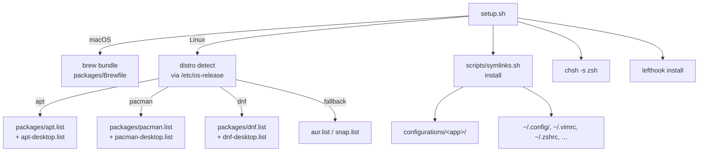

# Documentation index

One doc per significant artifact: the package inventory, the
theming palette, the per-command and per-hook reference. The
frontmatter `claude-rule:` on each page is a contract — agents
edit the doc whenever they edit its source.

## Architecture at a glance

## Top-level

| File                | Doc                                  |
| ------------------- | ------------------------------------ |
| `setup.sh`          | (this README) — bootstrap entrypoint |
| `scripts/symlinks.sh` | (inline help via `--help`) — symlink driver |
| `scripts/update-dotfiles` | (inline help) — refresh entrypoint |
| `scripts/dotfiles-state.sh` | [state-management.md](state-management.md) — realized-state ledger |
| `scripts/uninstall.sh` | (inline help via `--help`) — one-pass uninstall: symlinks + ledger-recorded plugins/bootstraps + `.path` segments + rmdir-only empty-dir pruning, optional ledger-driven `--purge` (native managers and script-lane `~/.local/bin`) and `--shell` revert |
| `scripts/gpg-setup.sh` | (inline help) — GPG signing wizard |
| `scripts/claude-worktree` | [claude-worktrees.md](claude-worktrees.md) — parallel Claude sessions in git worktrees |
| `configurations/herdr/config.toml` | [herdr.md](herdr.md) — herdr keybindings, the ctrl+alt navigation layer, mode inventory |
| `scripts/nix-uninstall.sh` | (inline help) — legacy Nix cleanup |
| `scripts/leak-guard` | [leak-guard.md](leak-guard.md) — keeps project/workplace data out of this public repo |
| `scripts/dc-image-update` | [dc-image-update.md](dc-image-update.md) — interactive docker compose image pull/recreate helper |
| `scripts/claude-reset.sh` | [claude-folder-reset.md](claude-folder-reset.md) — fully automatic, backup-first `~/.claude` cleanup |
| `scripts/agent-skills` | [agent-skills.md](agent-skills.md) — global skills repo shared by Claude Code + opencode, its private mirror |
| `scripts/add-ssh-key-for-host` | (inline help via `--help`) — add an SSH key entry + `IdentityFile` block for a host in `~/.ssh/config` |
| `scripts/backup-configs.sh` | (inline help via `--help`) — scoped pre-symlink backup of repo-managed configs (dry-run default, `--apply` to run) |
| `scripts/ssh-gen` | (inline help via `--help`) — generate an ed25519 SSH key in `~/.ssh/` |
| `scripts/ssh-get-pub-key` | (inline help via `--help`) — print the public half of a named SSH key in `~/.ssh/` |
| `scripts/git-filter-repo` | (vendored upstream, b486a4e) — git history rewriting, the `filter-branch`/BFG replacement |

## Packages

| Doc                                              | Purpose                                                                 |
| ------------------------------------------------ | ----------------------------------------------------------------------- |
| [packages-native.md](packages-native.md)         | Single lookup table — every package, per OS, with fallback notes.       |
| [packages-summary.md](packages-summary.md)       | Flat summary — one row per package, per-OS install lane.                |

## Slash commands (`.claude/commands/*.md`)

| Command         | Doc                                            |
| --------------- | ---------------------------------------------- |
| `/apply`        | [commands/apply.md](commands/apply.md)         |
| `/update`       | [commands/update.md](commands/update.md)       |
| `/commit`       | [commands/commit.md](commands/commit.md)       |
| `/check`        | [commands/check.md](commands/check.md)         |
| `/migrate-config` | [commands/migrate-config.md](commands/migrate-config.md) |

## Hooks (`.claude/hooks/*.sh`)

| Hook               | Doc                                              |
| ------------------ | ------------------------------------------------ |
| `pre-commit.sh`    | [hooks/pre-commit.md](hooks/pre-commit.md)       |
| `commit-msg.sh`    | [hooks/commit-msg.md](hooks/commit-msg.md)       |
| `post-tool-use.sh` | [hooks/post-tool-use.md](hooks/post-tool-use.md) |

## Refactor history

| Doc                                                         | Purpose                                                                 |
| ----------------------------------------------------------- | ----------------------------------------------------------------------- |
| [v3-native-inventory.md](v3-native-inventory.md)            | The v2→v3 plan: maps every former Nix-managed surface to its native equivalent and tracks phase status. |

## Cross-cutting

| Topic              | Doc                                                                                                 |
| ------------------ | --------------------------------------------------------------------------------------------------- |
| Theming            | [theming.md](theming.md) — Catppuccin Mocha palette + per-app mapping.                              |
| Shell history      | [atuin.md](atuin.md) — atuin's three search surfaces, all pinned to global (non-session) scope.     |
| Project init       | [init-proj.md](init-proj.md) — the `/init-proj-*` command family and how per-project standards layer. |
| Parallel Claude    | [claude-worktrees.md](claude-worktrees.md) — `claude-worktree` / `cwt`: a worktree + Claude session per branch. |
| Footprint / state  | [state-management.md](state-management.md) — the realized-state ledger that records what got planted (and what we may safely remove). |
| Agentic promotion  | [agentic-promotion.md](agentic-promotion.md) — lifting rules from repo-local `.claude/` to global. |
| Claude settings    | [claude-settings.md](claude-settings.md) — tracked `settings.json` vs. gitignored `settings.local.json`, and the atomic-save symlink-break failure mode. |
