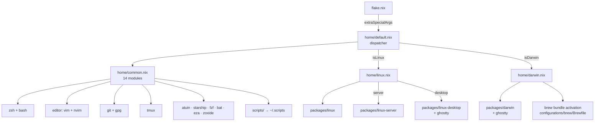

# Documentation index

One doc per significant file: every Home Manager module, every
packages bucket, every slash command, every hook. The frontmatter
`claude-rule:` on each page is a contract — agents edit the doc
whenever they edit its source.

## Architecture at a glance

## Top-level

| File                                | Doc                                  |
| ----------------------------------- | ------------------------------------ |
| `flake.nix`                         | [flake.md](flake.md)                 |
| `home/default.nix` + `common.nix` + `darwin.nix` + `linux.nix` | [home-default.md](home-default.md) |

## Modules (`home/modules/*.nix`)

| Module          | Doc                                            |
| --------------- | ---------------------------------------------- |
| `zsh.nix`       | [modules-zsh.md](modules-zsh.md)               |
| `bash.nix`      | [modules-bash.md](modules-bash.md)             |
| `atuin.nix`     | [modules-atuin.md](modules-atuin.md)           |
| `starship.nix`  | [modules-starship.md](modules-starship.md)     |
| `git.nix`       | [modules-git.md](modules-git.md)               |
| `gpg.nix`       | [modules-gpg.md](modules-gpg.md)               |
| `editor.nix`    | [modules-editor.md](modules-editor.md)         |
| `tmux.nix`      | [modules-tmux.md](modules-tmux.md)             |
| `ghostty.nix`   | [modules-ghostty.md](modules-ghostty.md)       |
| `fzf.nix`       | [modules-fzf.md](modules-fzf.md)               |
| `bat.nix`       | [modules-bat.md](modules-bat.md)               |
| `eza.nix`       | [modules-eza.md](modules-eza.md)               |
| `zoxide.nix`    | [modules-zoxide.md](modules-zoxide.md)         |
| `scripts.nix`   | [modules-scripts.md](modules-scripts.md)       |

## Packages (`home/modules/packages/*.nix`)

| Bucket                | Doc                                                  |
| --------------------- | ---------------------------------------------------- |
| `common.nix`          | [packages-common.md](packages-common.md)             |
| `darwin.nix`          | [packages-darwin.md](packages-darwin.md)             |
| `linux.nix`           | [packages-linux.md](packages-linux.md)               |
| `linux-server.nix`    | [packages-linux-server.md](packages-linux-server.md) |
| `linux-desktop.nix`   | [packages-linux-desktop.md](packages-linux-desktop.md) |

## Slash commands (`.claude/commands/*.md`)

| Command         | Doc                                  |
| --------------- | ------------------------------------ |
| `/apply`        | [commands/apply.md](commands/apply.md)         |
| `/update`       | [commands/update.md](commands/update.md)       |
| `/new-module`   | [commands/new-module.md](commands/new-module.md) |
| `/commit`       | [commands/commit.md](commands/commit.md)       |
| `/check`        | [commands/check.md](commands/check.md)         |

## Hooks (`.claude/hooks/*.sh`)

| Hook               | Doc                                              |
| ------------------ | ------------------------------------------------ |
| `pre-commit.sh`    | [hooks/pre-commit.md](hooks/pre-commit.md)       |
| `commit-msg.sh`    | [hooks/commit-msg.md](hooks/commit-msg.md)       |
| `post-tool-use.sh` | [hooks/post-tool-use.md](hooks/post-tool-use.md) |

## Cross-cutting

| Topic              | Doc                                                                 |
| ------------------ | ------------------------------------------------------------------- |
| Theming            | [theming.md](theming.md) — Catppuccin Mocha palette + per-app mapping. |
| Agentic promotion  | [agentic-promotion.md](agentic-promotion.md) — lifting rules from repo-local `.claude/` to global `~/.claude/`. |
