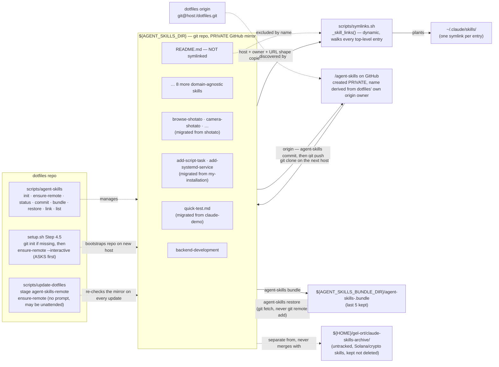

# Claude skills — the global repo and its private mirror

## Why this exists

Skills used to live inside this repo, at `configurations/claude/skills/`, symlinked into
`~/.claude/skills/` like any other managed config. `raxetul/dotfiles` was confirmed to be a
**public** GitHub repository, and 11 skills had already been pushed to it. That is the mistake this
setup exists to prevent: skills carry capability and knowledge, so they must never sit on a
**public** remote. They moved into `${AGENT_SKILLS_DIR}` — a git repo of its own that this repo
only *links into*, never vendors.

The exposure problem is about **visibility, not about remotes**. A repo with no remote at all is
safe from leaking but also unbacked: lose the disk, lose every skill. So the current policy pairs
the separate repo with a **required private GitHub mirror**:

| Aspect | Policy |
| --- | --- |
| Where skills live | `${AGENT_SKILLS_DIR}` (default `${HOME}/gel-ort/agent-skills`), a git repo of its own |
| Remote | **Required**, and named after the dotfiles owner: `<owner>/agent-skills` |
| Visibility on creation | **Always private.** The tooling never creates a public one, and never flips visibility either way |
| Who wires it | `scripts/agent-skills ensure-remote`, called by `setup.sh` (asks first) and `scripts/update-dotfiles` (doesn't) |
| Second backup layer | `git bundle` via `scripts/agent-skills bundle` — unchanged, additive, fully local |
| Unchanged — the taxonomy decisions | Technology variety inside a skill is still a `references/` file, not a new skill. Solana/crypto/hackathon skills stay archived at `${HOME}/gel-ort/claude-skills-archive/` |

## Frontmatter limits

One `SKILL.md` now serves two readers — Claude Code and opencode — so the binding constraint is
the **stricter of the two tools' limits**, measured directly against each tool's own docs/schema:

| Field | Claude Code | opencode | Binding limit |
| --- | --- | --- | --- |
| `name` | required | required, `^[a-z0-9]+(-[a-z0-9]+)*$`, **1–64 chars** | opencode's — it is the stricter |
| `description` | required | required, **1–1024 chars** | opencode's |
| unknown fields | — | ignored | safe to keep tool-specific extras |

A file that satisfies opencode's limits satisfies Claude Code's too, so opencode's numbers are what
to check against when authoring or editing a skill.

**Already measured across all 25 skills currently in the repo — this is current state, not a
standing TODO:**

| Check | Result |
| --- | --- |
| `name` violations | Zero |
| Longest `description` | `page-load-animations` — 876 chars |
| Runner-up | `frontend-design-guidelines` — 859 chars |
| Third | `brand-design` — 815 chars |
| Headroom | All 25 are under the 1024-char cap; the longest has roughly 15% to spare |

Don't re-measure this on a routine pass — re-check only after adding or substantially rewriting a
skill's `description`.

## How the mirror name is derived

Nothing is hardcoded. `ensure-remote` reads the **dotfiles repo's own** `origin` (path from
`DOTFILES_DIR`, default `${HOME}/gel-ort/dotfiles`), parses out the host and owner, and keeps the
same URL *shape* — SSH stays SSH, HTTPS stays HTTPS:

| dotfiles `origin` | expected agent-skills mirror |
| --- | --- |
| `git@github.com:raxetul/dotfiles.git` | `git@github.com:raxetul/agent-skills.git` |
| `https://github.com/raxetul/dotfiles` | `https://github.com/raxetul/agent-skills.git` |

If `DOTFILES_DIR` isn't a git repo, or has no parseable `origin`, `ensure-remote` warns and stops
there — it never breaks `init` or any other subcommand over it.

## Creating the mirror: who asks, who doesn't

`gh` (GitHub CLI) does the create; it's a declared dependency in every package list. If `gh` is
missing or unauthenticated, the whole remote step is skipped with a warning — dotfiles keeps
working on a host where `gh` isn't set up yet.

| Situation | `setup.sh` (`ensure-remote --interactive`) | `scripts/update-dotfiles` (`ensure-remote`) |
| --- | --- | --- |
| Origin already correct | Confirms it, prints visibility, does nothing | Same |
| Origin missing, GitHub repo **exists** | Wires `origin` — no prompt, nothing is being created | Same |
| Origin missing, GitHub repo **absent** | Explains why it's needed, then **asks** `[Y/n]`; declining is non-fatal and re-checked next run | **Creates it private without asking** (an update run may be unattended), logging what it did and why |
| Local repo has zero commits | Creates without `--push`; the next `agent-skills commit` is the first thing that lands | Same |

Creating the *local* skills repo is `setup.sh`'s job, so `update-dotfiles` skips its
`agent-skills-remote` stage with a warning (never a failure) on a host where
`${AGENT_SKILLS_DIR}` doesn't exist yet. That stage is also reachable on its own:

```sh
scripts/update-dotfiles --only=agent-skills-remote
scripts/update-dotfiles --only=agent-skills-remote --dry-run   # prints, changes nothing
```

## Missing remote vs. public remote

Two different situations, deliberately reported differently:

- **No remote at all** → a real problem. `scripts/agent-skills status` prints a `WARNING`, and the
  next `setup.sh` / `update-dotfiles` run fixes it.
- **Remote present but public** → **information, not an alarm.** The user may flip that repo to
  public themselves, deliberately; the "must be private" rule governs what *this tooling does when
  it creates the repo*, not a perpetual runtime check that nags about a choice the user made. So
  `status` prints `remote: <url> (public — user's own choice)` and moves on.

The invariant to check by hand:

```sh
git -C "${AGENT_SKILLS_DIR}" remote get-url origin
# must print the expected private mirror, e.g. git@github.com:raxetul/agent-skills.git
```

## Repo location and layout

```
${AGENT_SKILLS_DIR}                    (default: ${HOME}/gel-ort/agent-skills)
├── README.md                           # not a skill — repo-level note, excluded from symlinking
├── SKILL_ROUTER.md                     # flat file, symlinked as-is (like any top-level entry)
├── backend-development/
│   ├── SKILL.md
│   └── references/…
├── brand-design/ · cso/ · frontend-design-guidelines/ · learn/ · logging-patterns/
├── page-load-animations/ · product-review/ · rfc9457-problem-details/ · roast-my-product/
├── browse-shotato/ · camera-shotato/ · design-system-shotato/ · navigation-shotato/
├── preview-shotato/ · storage-shotato/                 # migrated from the shotato project
├── add-script-task/ · add-systemd-service/             # migrated from the my-installation project
└── quick-test.md                                       # migrated from the claude-demo project
```

Every top-level entry is a skill: normally a directory with `SKILL.md` (optionally a `references/`
subtree), occasionally a flat `.md` file (`SKILL_ROUTER.md`, `quick-test.md`). `README.md` is the
one deliberate exception — repo metadata, not a skill, and `scripts/symlinks.sh` skips it by name.

## Symlink flow

`scripts/symlinks.sh` never hardcodes a skill list. A dedicated function, `_skill_links`, walks
every top-level entry currently in `${AGENT_SKILLS_DIR}` and emits one
`<abs-path-in-repo>::.claude/skills/<name>` mapping per entry — so dropping a new skill into the
repo is picked up on the next `install`, with no script edit. `_active_links` folds those into the
same install/uninstall/list machinery every other dotfiles symlink uses, plus three skills-scoped
actions that touch nothing else:

```sh
scripts/symlinks.sh skills-install     # (re)plant only ~/.claude/skills/* symlinks
scripts/symlinks.sh skills-uninstall   # remove only those symlinks
scripts/symlinks.sh skills-list        # print only the skills mapping
```

`scripts/agent-skills link` is a thin wrapper over `skills-install`, so day-to-day use never has
to touch `symlinks.sh` directly.



## Bundle backup discipline

`scripts/agent-skills bundle` runs `git bundle create <dir>/agent-skills-<YYYY-MM-DD>.bundle
--all` against `${AGENT_SKILLS_DIR}`, then prunes `${AGENT_SKILLS_BUNDLE_DIR}` down to the 5
most recent bundles (filenames sort lexically in date order, so this is a plain `sort`, not a
`stat`-based mtime scan). Run it after any batch of skill edits — there's no automatic trigger by
design; a skill change is deliberate enough to deserve a deliberate backup step.

`scripts/agent-skills restore <bundle>` rebuilds the repo from a bundle **without recording the
bundle as a remote**: it runs `git fetch <bundle-file> 'refs/heads/*:refs/heads/*'` — a one-off
fetch with an explicit path argument, which git never records as a named remote — instead of `git
clone <bundle-file> <dest>`, which would leave `origin` pointing at the bundle path. That keeps
`origin` free for the private GitHub mirror `ensure-remote` wires up; after a restore, `restore`
itself reports whether an `origin` is present and points at `ensure-remote` when it isn't. It also
refuses to run against a `${AGENT_SKILLS_DIR}` that already has commit history, to avoid silently
discarding work; move the existing repo aside first if a full replace is really intended.

On a brand-new host, `setup.sh` (Step 4.5) and `scripts/agent-skills init` create the repo
**empty** via `git init` if it doesn't exist yet, and `ensure-remote` then wires the private mirror
(and pushes, once there is at least one commit). Restoring from a bundle stays the offline path —
useful when the mirror is unreachable, or for a point-in-time copy carried by hand (USB, scp) —
not the primary one any more.

## The `references/` pattern

Unaffected by the repo relocation — still the mechanism for covering technology variety inside one
skill instead of spawning a new skill per technology combination:

```
${AGENT_SKILLS_DIR}/backend-development/
├── SKILL.md                          # framework-independent depth + routing table
└── references/
    ├── frameworks/
    │   ├── loco.md                   # Rust
    │   ├── spring-boot.md            # Java
    │   └── nestjs.md                 # TypeScript
    ├── databases/
    │   ├── postgresql.md
    │   ├── clickhouse.md
    │   └── _template.md              # blank skeleton for the next database
    └── observability/
        ├── opentelemetry.md
        └── _template.md              # blank skeleton for the next tool
```

| Section | Purpose |
| --- | --- |
| When to read | The concrete project signal that points here (a dependency, a config key, a docker-compose service name) |
| Setup & dependencies | What to install/configure to use it |
| Directory layout | Where its code/config lives in a typical project tree |
| Migration + seed | How this technology's specifics interact with the schema discipline in `SKILL.md`, or an explicit "not applicable" |
| Docker (migrate + seed snippet) | A concrete `migrate → seed → app` compose fragment, or an explicit "not applicable" |
| Pitfalls | Mistakes specific to this technology |

**Adding a new technology never means adding a new skill.** Copy the matching `_template.md`, fill
it in, add a row to `SKILL.md`'s routing table.

## Provenance — where every current skill came from

| Source | Skills | Notes |
| --- | --- | --- |
| `raxetul/dotfiles` (`configurations/claude/skills/`) | `backend-development`, `brand-design`, `cso`, `frontend-design-guidelines`, `learn`, `logging-patterns`, `page-load-animations`, `product-review`, `rfc9457-problem-details`, `roast-my-product`, `SKILL_ROUTER.md` | The original 11 that had leaked to the public remote; moved out, not deleted |
| `~/gel-ort/workspace/shotato` (`.claude/skills/`) | `browse-shotato`, `camera-shotato`, `design-system-shotato`, `navigation-shotato`, `preview-shotato`, `storage-shotato` | Untracked in the shotato repo; an identical duplicate copy under a linked git worktree (`.claude/worktrees/tdd-setup`, plus a stray filesystem copy of that same worktree under `shotato.worktrees/fix-android-nav-bar-insets/`) was removed rather than re-imported |
| `~/gel-ort/github/claude-demo` (`.claude/skills/quick-test.md`) | `quick-test.md` | Was git-tracked; staged for removal there (`git rm -r --cached`), not committed — that repo's own commit is the user's call |
| `~/gel-ort/ops/ansible/my-installation` (`.claude/skills/`) | `add-script-task`, `add-systemd-service` | Same as above: git-tracked, staged for removal, not committed |

No name collisions occurred across these four sources — nothing needed the `<name>-<project>`
disambiguation the migration was prepared to apply.

## Classification table — domain-agnostic vs. archived

Applies to the original 11 (from `~/.claude/skills/` before ANY of it was repo-tracked): every
local skill was classified KEEP (domain-agnostic engineering value — now in the global repo) or
ARCHIVE (Solana/crypto/hackathon-specific — moved to `${HOME}/gel-ort/claude-skills-archive/`, not
deleted). This table is historical record and hasn't changed with the move out of `dotfiles`.

| Skill | Decision | Reason |
| --- | --- | --- |
| `brand-design` | KEEP | Brand palette/typography workflow applies to any frontend project, not crypto-specific |
| `cso` | KEEP | Infrastructure security audit (secrets, dependency supply chain, OWASP, STRIDE) is domain-agnostic |
| `frontend-design-guidelines` | KEEP | General web interface design rules (Tailwind/shadcn defaults, but the rules themselves aren't crypto-specific) |
| `learn` | KEEP | Cross-session project-learnings management has no product-domain dependency |
| `page-load-animations` | KEEP | Framer-motion production recipes apply to any React/Next.js frontend |
| `product-review` | KEEP | UX/product-quality review framework is domain-agnostic |
| `roast-my-product` | KEEP | Harsh product critique framework is domain-agnostic |
| `SKILL_ROUTER.md` | KEEP | Router-file pattern itself has engineering value; content trimmed to only route to kept skills |
| 25 Solana/crypto/hackathon-specific skills (`apply-grant`, `build-*`, `launch-token`, `colosseum-copilot`, …) | ARCHIVE | Scoped to one product domain (Solana/crypto); listed in full in this doc's git history prior to this rewrite |

**Totals: 8 kept from that batch (7 skill directories + 1 router file) + 9 migrated from projects
(Provenance table above) = 17 skills currently in the global repo, 25 archived.**

## Known caveat: third-party telemetry preamble

Every one of the original KEEP skills (and most of the ARCHIVE ones) carries a "superstack"
preamble block in its `SKILL.md` that, on first read of the skill, reads
`~/.superstack/config.json` and — unless that config already says `"telemetryTier":"off"` —
sends a `curl` POST (skill name, phase, platform, timestamp) to an external Convex endpoint and
appends to a local `telemetry.jsonl`, *before* the in-skill consent prompt has necessarily been
answered on a fresh machine. This was flagged during the original migration into `dotfiles`; the
explicit decision was to carry skills over **as-is, preamble included**, and that decision carries
forward into the separate skills repo too — nothing about the preamble changed. YOU SHOULD
VERIFY whether this is acceptable under this machine's information-security policy
(vetted-plugins-only, no unreviewed external calls) before relying on these skills in a work
context — this doc records the decision, not a security sign-off.
