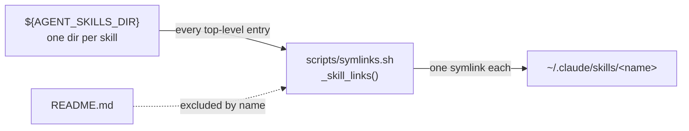
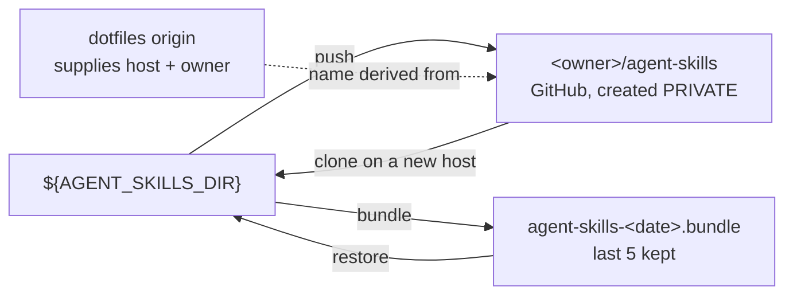

# Claude skills — the global repo and its private mirror

## Why this exists

Skills were in this repo, at `configurations/claude/skills/`. The setup linked them into
`~/.claude/skills/`, as it does for any other managed config. This dotfiles repo is a **public**
GitHub repository, and 11 skills were already pushed to it. This setup exists to prevent that mistake.
Skills carry capability and knowledge. Never put them on a **public** remote. They now live in
`${AGENT_SKILLS_DIR}`. This is a git repo of its own. This repo only *links into* it and never vendors it.

The problem is **visibility, not remotes**. A repo with no remote cannot leak, but it has no backup.
If the disk fails, every skill is lost. The current policy therefore pairs the separate repo with a
**required private GitHub mirror**:

| Aspect | Policy |
| --- | --- |
| Where skills live | `${AGENT_SKILLS_DIR}` (default `${HOME}/gel-ort/agent-skills`), a git repo of its own |
| Remote | **Required**, and named after the dotfiles owner: `<owner>/agent-skills` |
| Visibility on creation | **Always private.** The tooling never creates a public one, and never flips visibility either way |
| Who wires it | `scripts/agent-skills ensure-remote`, called by `setup.sh` (asks first) and `scripts/update-dotfiles` (does not ask) |
| Second backup layer | `git bundle` via `scripts/agent-skills bundle` — unchanged, additional, fully local |
| Unchanged — the taxonomy decisions | A technology variant inside a skill is still a `references/` file, not a new skill. Solana/crypto/hackathon skills stay archived at `${HOME}/gel-ort/claude-skills-archive/` |

## Frontmatter limits

One `SKILL.md` serves two readers: Claude Code and opencode. The binding limit is the **stricter of
the two tools' limits**. Each limit comes from the docs or schema of that tool:

| Field | Claude Code | opencode | Binding limit |
| --- | --- | --- | --- |
| `name` | required | required, `^[a-z0-9]+(-[a-z0-9]+)*$`, **1–64 chars** | opencode's — it is stricter |
| `description` | required | required, **1–1024 chars** | opencode's |
| unknown fields | — | ignored | safe to keep tool-specific extras |

A file that meets the opencode limits also meets the Claude Code limits. When you write or edit a
skill, check against the opencode numbers.

**All 25 skills in the repo are already measured. This is the current state, not a standing TODO:**

| Check | Result |
| --- | --- |
| `name` violations | Zero |
| Longest `description` | `page-load-animations` — 876 chars |
| Runner-up | `frontend-design-guidelines` — 859 chars |
| Third | `brand-design` — 815 chars |
| Headroom | All 25 are under the 1024-char cap; the longest has roughly 15% to spare |

Do not re-measure on a routine pass. Measure again only after you add a `description` or rewrite one
in large part.

## How the mirror name is derived

The name is not hardcoded. `ensure-remote` reads the `origin` of the **dotfiles repo itself**. The path
comes from `DOTFILES_DIR` (default `${HOME}/gel-ort/dotfiles`). The script extracts the host and the
owner. It keeps the same URL *shape*: SSH stays SSH, and HTTPS stays HTTPS:

| dotfiles `origin` | expected agent-skills mirror |
| --- | --- |
| `git@github.com:alice/dotfiles.git` | `git@github.com:alice/agent-skills.git` |
| `https://github.com/bob/dotfiles` | `https://github.com/bob/agent-skills.git` |

If `DOTFILES_DIR` is not a git repo, or has no `origin` that it can parse, `ensure-remote` prints a
warning and stops. It never breaks `init` or any other subcommand because of this.

## Creating the mirror: who asks, who doesn't

`gh` (GitHub CLI) creates the repo. Every package list declares it as a dependency. If `gh` is
missing or not authenticated, the script skips the whole remote step and prints a warning. Dotfiles
keeps working on a host where `gh` is not set up yet.

| Situation | `setup.sh` (`ensure-remote --interactive`) | `scripts/update-dotfiles` (`ensure-remote`) |
| --- | --- | --- |
| Origin already correct | Confirms it, prints visibility, does nothing | Same |
| Origin missing, GitHub repo **exists** | Wires `origin` — no prompt, nothing is created | Same |
| Origin missing, GitHub repo **absent** | Explains why it is needed, then **asks** `[Y/n]`; a "no" is not fatal, and the next run checks again | **Creates it private without asking** (an update run can be unattended), and logs what it did and why |
| Local repo has zero commits | Creates without `--push`; the next `agent-skills commit` is the first push | Same |

`setup.sh` creates the *local* skills repo. On a host where `${AGENT_SKILLS_DIR}` does not exist yet,
`update-dotfiles` skips its `agent-skills-remote` stage with a warning, not a failure. You can also
run that stage alone:

```sh
scripts/update-dotfiles --only=agent-skills-remote
scripts/update-dotfiles --only=agent-skills-remote --dry-run   # prints, changes nothing
```

## Missing remote vs. public remote

The two situations are different. The tooling reports them in different ways:

- **No remote at all** → a real problem. `scripts/agent-skills status` prints a `WARNING`. The next
  `setup.sh` or `update-dotfiles` run fixes it.
- **Remote present but public** → **information, not an alarm.** The user can make that repo public
  on purpose. The "must be private" rule applies to what *this tooling does when it creates the
  repo*. It is not a runtime check that complains about a choice the user made. So `status` prints
  `remote: <url> (public — user's own choice)` and continues.

To check the invariant by hand, run:

```sh
git -C "${AGENT_SKILLS_DIR}" remote get-url origin
# must print the expected private mirror, e.g. git@github.com:<owner>/agent-skills.git
```

## Repo location and layout

```
${AGENT_SKILLS_DIR}                    (default: ${HOME}/gel-ort/agent-skills)
├── README.md                           # not a skill — repo-level note, excluded from symlinking
├── SKILL_ROUTER.md                     # flat file, symlinked as-is (like any top-level entry)
├── backend-development/
│   ├── SKILL.md
│   └── references/…
├── brand-design/ · cso/ · frontend-design-guidelines/ · learn/ · logging-patterns/
├── page-load-animations/ · product-review/ · rfc9457-problem-details/ · roast-my-product/
├── <app>-browse/ · <app>-camera/ · <app>-design-system/   # per-feature skills,
├── <app>-navigation/ · <app>-preview/ · <app>-storage/     # migrated out of an app repo
├── add-script-task/ · add-systemd-service/             # migrated from an ansible repo
└── quick-test.md                                       # migrated from a demo repo
```

Every top-level entry is a skill. Usually it is a directory with `SKILL.md` (and sometimes a
`references/` subtree). Sometimes it is a flat `.md` file (`SKILL_ROUTER.md`, `quick-test.md`).
`README.md` is the one exception. It is repo metadata, not a skill, and `scripts/symlinks.sh` skips it
by name.

## Symlink flow

`scripts/symlinks.sh` does not hardcode a skill list. The function `_skill_links` reads every
top-level entry in `${AGENT_SKILLS_DIR}`. For each entry it writes one
`<abs-path-in-repo>::.claude/skills/<name>` mapping. When you add a new skill to the repo, the next
`install` links it. You do not edit the script. `_active_links` adds these mappings to the same
install, uninstall, and list logic that every other dotfiles symlink uses. It also provides three
skills-only actions. They change nothing else:

```sh
scripts/symlinks.sh skills-install     # (re)plant only ~/.claude/skills/* symlinks
scripts/symlinks.sh skills-uninstall   # remove only those symlinks
scripts/symlinks.sh skills-list        # print only the skills mapping
```

`scripts/agent-skills link` is a thin wrapper around `skills-install`. For daily use, you do not
need to call `symlinks.sh` directly.


```mermaid
flowchart LR
    GLOBAL["${AGENT_SKILLS_DIR}<br/>one dir per skill"]
    SL["scripts/symlinks.sh<br/>_skill_links()"]
    HOME["~/.claude/skills/&lt;name&gt;"]
    RM["README.md"]

    GLOBAL -->|"every top-level entry"| SL -->|"one symlink each"| HOME
    RM -.->|"excluded by name"| SL
```

The script finds skills dynamically and never hardcodes the list. To add a skill, add a directory.
opencode reads `~/.claude/skills/` directly, so the same symlinks serve both tools.

## Remote and backup

There are two independent backup layers: a private GitHub mirror (primary) and local git bundles
(offline fallback).


```mermaid
flowchart LR
    GLOBAL["${AGENT_SKILLS_DIR}"]
    MIRROR["&lt;owner&gt;/agent-skills<br/>GitHub, created PRIVATE"]
    BUNDLE["agent-skills-&lt;date&gt;.bundle<br/>last 5 kept"]
    DFREMOTE["dotfiles origin<br/>supplies host + owner"]

    GLOBAL -->|"push"| MIRROR
    MIRROR -->|"clone on a new host"| GLOBAL
    GLOBAL -->|"bundle"| BUNDLE
    BUNDLE -->|"restore"| GLOBAL
    DFREMOTE -.->|"name derived from"| MIRROR
```

| Caller | When | Prompts? |
| --- | --- | --- |
| `setup.sh` Step 4.5 | new host bootstrap | 🔵 yes — asks before it creates the repo |
| `scripts/update-dotfiles` | every update | 🟢 no — can run unattended |
| `scripts/agent-skills ensure-remote` | manually | `--interactive` turns on the prompt |

## Vendored skills

Some skills are third-party copies, not our own. Each one is a directory in the same repo. The file
`vendor.tsv` at the repo root declares them:

```
# name	url	subpath	ref	extra
security-audit	https://github.com/cloudflare/security-audit-skill.git	skills/security-audit	main	LICENSE
herdr	cmd:herdr --skill	SKILL.md	-	-
```

| Field | Meaning |
| --- | --- |
| `name` | directory in the repo; matches the `name` in the skill's frontmatter |
| `url` | upstream git remote, **or** `cmd:<command>` for a generated skill |
| `subpath` | git: path inside the upstream repo (`.` = repo root). cmd: the file stdout lands in |
| `ref` | git: branch, tag, or commit. A SHA pins it; a branch follows it. cmd: not used (`-`) |
| `extra` | more upstream files to copy with it, comma-separated (`-` = none) |

### Two kinds of upstream

```
 git source                          generated source
 +---------------------+             +---------------------+
 | github.com/... @ref |             | installed binary    |
 +----------+----------+             +----------+----------+
            | git clone --depth 1               | herdr --skill  (stdout)
            v                                   v
     +------+---------------------------------+-+
     |            ${tmp}/staged                 |   <- one staging dir either way
     +--------------------+---------------------+
                          | diff vs. the on-disk copy
                          v
             ${AGENT_SKILLS_DIR}/<name>/
```

A `cmd:` row uses **the installed tool as the upstream**. The skill text is the stdout of that
command. The text therefore updates each time the tool upgrades. This is the purpose of the row. A
skill that matches an old CLI is *worse* than no skill, because it documents flags that the binary no
longer has. `herdr` is the first such row. The 0.7.1-era notes that it replaced described an
`agent start` signature that herdr 0.9.0 had already removed.

A generated skill has no upstream commit. For such a skill, `--check` reports a short
`git hash-object` of the text that the command produced as the version. The script splits the command
on whitespace and runs it directly, with no shell. Use plain arguments only. Do not use pipes, quotes,
or redirection.

### The contract: never edit a vendored skill

Do not edit a vendored skill. `scripts/agent-skills vendor` replaces the directory **wholesale**. The
next sync deletes every local edit. This is intended: a vendored skill stays byte-identical to
upstream, so a re-sync needs no merge. Put anything else that this setup needs in a **separate skill
that references the vendored one**. The `embedded-security*` skills use this pattern. They build on
the conventions of `security-audit` and do not fork it.

Two files survive a re-sync, because they are ours and not upstream's. One is the `VENDORED.md` note
that records the source of the copy. The other is each file that `extra` names (usually `LICENSE`,
kept for attribution).

### Guard against losing work

A wholesale replace can destroy an edit that someone made by mistake. For this reason, `vendor`
**refuses** to overwrite a skill that has uncommitted changes in the agent-skills repo. It reports the
skill and continues. Use `--force` to override the refusal. Because of this guard, an unattended
`update-dotfiles` run cannot discard work without a notice.

```sh
scripts/agent-skills vendor            # sync everything declared
scripts/agent-skills vendor --check    # report drift, change nothing (exit 1 if stale)
scripts/agent-skills vendor <name>     # just one
scripts/agent-skills vendor --force    # overwrite despite local changes
DRY_RUN=1 scripts/agent-skills vendor  # print intended actions
```

### Where it runs

| Caller | When | Behaviour |
| --- | --- | --- |
| `setup.sh` Step 4.5 | full setup, **skipped on `--light`** | pulls vendored skills; this completes a light → full transition |
| `scripts/update-dotfiles` | every update, `--only=agent-skills-vendor` | re-syncs; can run unattended, so the uncommitted-changes guard matters |

A light install links no skills. If a user later runs a full setup, the local skills would exist but
the vendored skills would be missing. The skills tree would look complete, but a declared skill would
be absent. Step 4.5 pulls the vendored skills and closes this gap on the transition run.

🟡 **The script leaves the result uncommitted in the agent-skills repo. This is on purpose.** A
vendored skill is third-party code. A human must review its diff before it enters a private mirror. If
the script committed an upstream change to a *security* skill by itself, a compromised upstream would
enter without review. Pin `ref` to a commit SHA, not a branch, when this risk is more important than
being current.

## Bundle backup discipline

`scripts/agent-skills bundle` runs `git bundle create <dir>/agent-skills-<YYYY-MM-DD>.bundle --all`
on `${AGENT_SKILLS_DIR}`. Then it deletes old bundles in `${AGENT_SKILLS_BUNDLE_DIR}` and keeps the 5
most recent. File names sort in date order, so the script uses a plain `sort`, not a `stat`-based
mtime scan. Run it after each batch of skill edits. There is no automatic trigger, by design. A skill
change is deliberate, so the backup step is also deliberate.

`scripts/agent-skills restore <bundle>` rebuilds the repo from a bundle **and does not record the
bundle as a remote**. It runs `git fetch <bundle-file> 'refs/heads/*:refs/heads/*'`. This is a
one-time fetch with an explicit path, and git never records it as a named remote. The script does not
use `git clone <bundle-file> <dest>`, because that would leave `origin` pointing at the bundle path.
This keeps `origin` free for the private GitHub mirror that `ensure-remote` sets up. After a restore,
`restore` reports whether an `origin` exists. If none exists, it points you to `ensure-remote`. The
command also refuses to run on a `${AGENT_SKILLS_DIR}` that already has commit history, so it cannot
discard work without a notice. To do a full replace, first move the existing repo aside.

On a new host, `setup.sh` (Step 4.5) and `scripts/agent-skills init` create an **empty** repo with
`git init` if the repo does not exist. Then `ensure-remote` sets up the private mirror. It pushes when
the repo has at least one commit. A restore from a bundle is still the offline path. Use it when the
mirror is not reachable, or for a point-in-time copy that you carry by hand (USB, scp). It is no
longer the primary path.

## The `references/` pattern

The move of the repo did not change this pattern. It is still the way to cover technology variants
inside one skill. Do not create a new skill for each technology combination:

```
${AGENT_SKILLS_DIR}/backend-development/
├── SKILL.md                          # framework-independent depth + routing table
└── references/
    ├── frameworks/
    │   ├── loco.md                   # Rust
    │   ├── spring-boot.md            # Java
    │   └── nestjs.md                 # TypeScript
    ├── databases/
    │   ├── postgresql.md
    │   ├── clickhouse.md
    │   └── _template.md              # blank skeleton for the next database
    └── observability/
        ├── opentelemetry.md
        └── _template.md              # blank skeleton for the next tool
```

| Section | Purpose |
| --- | --- |
| When to read | The project signal that points to this file (a dependency, a config key, a docker-compose service name) |
| Setup & dependencies | What to install or configure to use it |
| Directory layout | Where its code and config are in a typical project tree |
| Migration + seed | How this technology works with the schema rules in `SKILL.md`, or an explicit "not applicable" |
| Docker (migrate + seed snippet) | A real `migrate → seed → app` compose fragment, or an explicit "not applicable" |
| Pitfalls | Mistakes that are specific to this technology |

**A new technology never needs a new skill.** Copy the matching `_template.md` and fill it in. Then
add a row to the routing table in `SKILL.md`.

## Provenance — where every current skill came from

| Source | Skills | Notes |
| --- | --- | --- |
| this repo (`configurations/claude/skills/`) | `backend-development`, `brand-design`, `cso`, `frontend-design-guidelines`, `learn`, `logging-patterns`, `page-load-animations`, `product-review`, `rfc9457-problem-details`, `roast-my-product`, `SKILL_ROUTER.md` | The original 11 that leaked to the public remote; moved out, not deleted |
| A mobile app repo (`.claude/skills/`) | six per-feature skills (browse, camera, design-system, navigation, preview, storage) | Untracked in that repo; an identical duplicate under a linked git worktree, and a stray filesystem copy of the same worktree, were removed and not imported again |
| a demo repo (`.claude/skills/quick-test.md`) | `quick-test.md` | Was git-tracked; staged for removal there (`git rm -r --cached`), not committed — the commit in that repo is the user's decision |
| an ansible repo (`.claude/skills/`) | `add-script-task`, `add-systemd-service` | Same as above: git-tracked, staged for removal, not committed |

No name collisions occurred across these four sources. The migration was ready to add a
`<name>-<project>` suffix, but no skill needed it.

## Classification table — domain-agnostic vs. archived

This table applies to the original 11 (from `~/.claude/skills/`, before any of it was tracked in a
repo). Each local skill got one of two decisions. KEEP means domain-agnostic engineering value; the
skill is now in the global repo. ARCHIVE means Solana/crypto/hackathon-specific; the skill moved to
`${HOME}/gel-ort/claude-skills-archive/` and was not deleted. This table is a historical record. The
move out of `dotfiles` did not change it.

| Skill | Decision | Reason |
| --- | --- | --- |
| `brand-design` | KEEP | The brand palette and typography workflow applies to any frontend project, not only crypto |
| `cso` | KEEP | The infrastructure security audit (secrets, dependency supply chain, OWASP, STRIDE) is domain-agnostic |
| `frontend-design-guidelines` | KEEP | General web interface design rules (Tailwind/shadcn defaults; the rules are not crypto-specific) |
| `learn` | KEEP | Management of project learnings across sessions has no product-domain dependency |
| `page-load-animations` | KEEP | The framer-motion production recipes apply to any React/Next.js frontend |
| `product-review` | KEEP | The UX and product-quality review framework is domain-agnostic |
| `roast-my-product` | KEEP | The harsh product critique framework is domain-agnostic |
| `SKILL_ROUTER.md` | KEEP | The router-file pattern has engineering value; the content is cut to route only to kept skills |
| 25 Solana/crypto/hackathon-specific skills (`apply-grant`, `build-*`, `launch-token`, `colosseum-copilot`, …) | ARCHIVE | Limited to one product domain (Solana/crypto); the full list is in the git history of this doc, before this rewrite |

**Totals: 8 kept from that batch (7 skill directories + 1 router file) + 9 migrated from projects
(Provenance table above) = 17 skills in the global repo now, 25 archived.**

## Known caveat: third-party telemetry preamble

Each of the original KEEP skills (and most of the ARCHIVE skills) has a "superstack" preamble block
in its `SKILL.md`. The first time the skill is read, the block reads `~/.superstack/config.json`.
Unless that config says `"telemetryTier":"off"`, the block sends a `curl` POST to an external Convex
endpoint. The POST holds the skill name, phase, platform, and timestamp. The block also appends to a
local `telemetry.jsonl`. On a new machine, this can happen *before* the user answers the consent
prompt in the skill. The team flagged this during the original migration into `dotfiles`. The
decision was to carry the skills over **as-is, preamble included**. This decision also applies to the
separate skills repo. The preamble did not change. VERIFY THIS: check that it is acceptable under the
information-security policy of this machine (vetted plugins only, no unreviewed external calls)
before you use these skills in a work context. This doc records the decision. It is not a security
approval.
