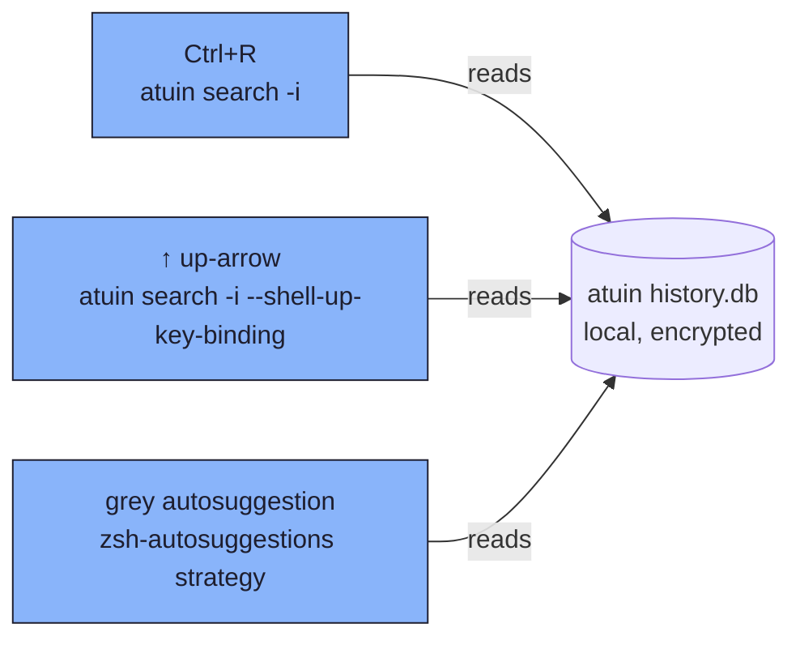
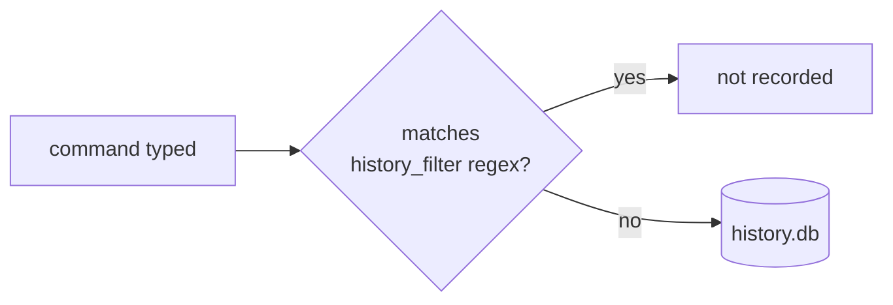

# atuin — encrypted, fuzzy shell history

Replaces the old zsh-histdb + `HISTORY_IGNORE` regex setup. Runs
local-only (`auto_sync = false`) — nothing leaves the machine.

## Policy: no surface is session-scoped

Three different UI surfaces read the same local history DB
(`~/.local/share/atuin/history.db`). All three are pinned to
**global** scope, so a command typed in one tab/session is visible
from every other tab/session/host — never just the one it was typed in.



| Surface | Invocation | Config key(s) read | Value |
| --- | --- | --- | --- |
| Ctrl+R search | `atuin search -i` | `filter_mode` | `"global"` |
| Up-arrow recall | `atuin search -i --shell-up-key-binding` | `filter_mode_shell_up_key_binding` | `"global"` |
| Grey autosuggestion | `_zsh_autosuggest_strategy_atuin` (from `atuin init zsh`) → `ATUIN_QUERY="$1" atuin search --cmd-only --author '$all-user' --limit 1 --search-mode prefix` | `filter_mode` (no override) | `"global"` |

Two extra keys close off the ways search scope could otherwise narrow:

| Key | Value | Why |
| --- | --- | --- |
| `workspaces` | `false` | Disables workspace-scoped filtering (limiting to the current git repo tree) entirely. |
| `[search].filters` | `["global"]` | Only `"global"` is enabled as a cycle-able filter mode, so no keybinding (e.g. the ctrl-r cycle key) can switch search into `session`, `directory`, `host`, `workspace`, or `session-preload` scoping. |

`YOU SHOULD VERIFY` — the filter-mode value list (`global`, `host`,
`session`, `session-preload`, `directory`, `workspace`) and the
`[search].filters` key come from `atuin default-config` on atuin
18.18.1; a future atuin release could add or rename modes.

## Recording-time filter (separate from search scope)

`history_filter` is evaluated when a command is **saved**, not when
it's searched — it never makes search session-scoped, it just keeps
noise/secrets out of the DB in the first place:



Current patterns (leading-token guards for common secret shapes, plus
the two noisiest commands so they don't drown out signal): `^aws `,
`^secret`, `^password`, `^token`, `^api[-_]?key`,
`^export .*(SECRET|TOKEN|API|KEY|PASSWORD|PASS)=`, `^pass `, `^cat `,
`^ls$`, `^ls .*`.

## Fallback: `~/.zsh_history`

zsh's own `~/.zsh_history` file keeps recording independently of
atuin (`setopt` history options in the zsh config aren't disabled by
atuin). If atuin's daemon or DB is ever unavailable, plain zsh
up-arrow/`history` still falls back to that file — which has **no**
regex filtering and **no** global/session distinction; it's simply
whatever the current shell process appended. Don't rely on it for
secret-scrubbing.

## Daemon

```toml
[daemon]
enabled = true
autostart = true
```

The daemon speeds up sync/search but doesn't change scope — the
`filter_mode`/`workspaces`/`[search].filters` keys above are what
govern that.
