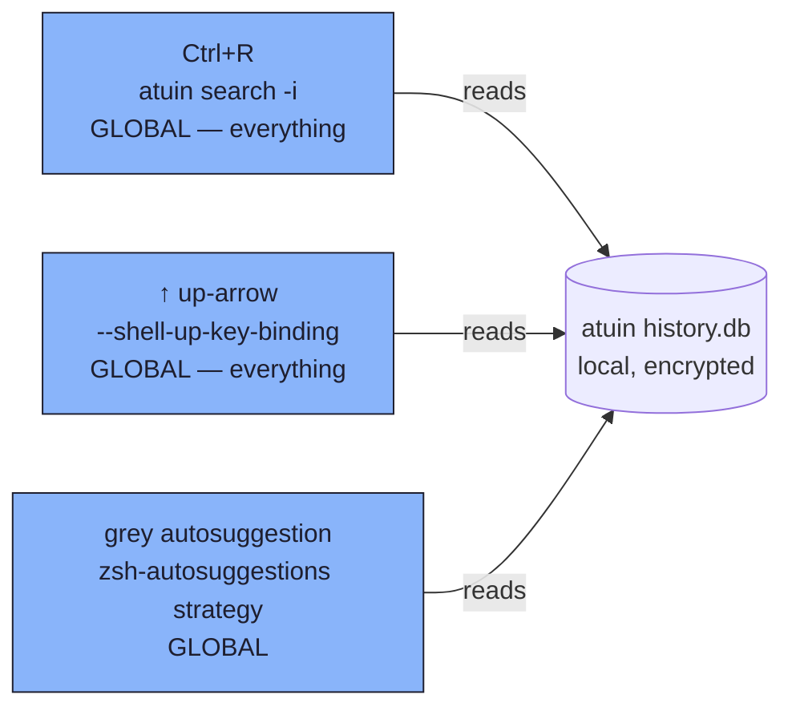
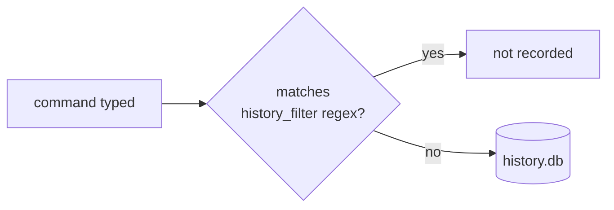

# atuin — encrypted, fuzzy shell history

Replaces the old zsh-histdb + `HISTORY_IGNORE` regex setup. Runs
local-only (`auto_sync = false`) — nothing leaves the machine.

## Policy: no surface may HIDE history

Three different UI surfaces read the same local history DB
(`~/.local/share/atuin/history.db`). All three are **global**: a command typed
in one tab is visible from every other tab/session/host, on every surface.

The ↑ key was narrowed to `session-preload` for two weeks and reverted — see
"Why ↑ is back on `global`" below for the measurement that ended it. Narrowing a
surface is not forbidden outright, but it has to survive this test: **how much
does it hide on a real, long-lived, many-pane session?** Reason about it with
that shape in mind, not a fresh single shell.



| Surface | Invocation | Config key(s) read | Value |
| --- | --- | --- | --- |
| Ctrl+R search | `atuin search -i` | `filter_mode` | `"global"` |
| Up-arrow recall | `atuin search -i --shell-up-key-binding` | `filter_mode_shell_up_key_binding` | `"global"` |
| Grey autosuggestion | `_zsh_autosuggest_strategy_atuin` (from `atuin init zsh`) → `ATUIN_QUERY="$1" atuin search --cmd-only --author '$all-user' --limit 1 --search-mode prefix` | `filter_mode` (no override) | `"global"` |

### Why ↑ is back on `global`

↑ ran `session-preload` from 2026-08-24 to 2026-09-06. Its SQL is

```sql
WHERE session = '<this session>' OR timestamp < <this session's start time>
```

which puts this terminal's own commands at the top by recency, at the price of
hiding what other sessions ran after this one started. That price was estimated
at ~30% when the mode was adopted. Measured again on 2026-09-06, on a shell that
had been open since 2026-09-03:

| Since this session started | Commands |
| --- | --- |
| Total recorded | 865 |
| This session's own | **7** |
| Hidden from ↑ | **858 across 12 sessions (99%)** |

The mode assumes most of your typing happens inside the session you are sitting
in. With herdr keeping a dozen long-lived panes — each its own atuin session —
that assumption is simply false, and the cost grows with both session age and
pane count. A ↑ key that hides 99% of recent history is not a preference, it is
a broken key, so it went back to `global`.

`session-preload` stays in `search.filters`, reachable from the Ctrl+R cycle
key. That is the right home for it: opt in for one search when you know you want
just this pane, instead of narrowing every ↑ press by default.

**Plain `session` remains forbidden**, for the same reason and more so — it also
drops the `OR timestamp <` clause, hiding everything older as well.

## TUI height: inline vs alternate screen

Measured (query-layer innocent: atuin p50=20ms/max=110ms, starship 30ms, no
sqlite lock): the ↑-key delay traced to `inline_height_shell_up_key_binding`
defaulting to `0` (full alternate-screen TUI), while Ctrl+R's
`inline_height` already defaulted to `40` (inline). The alternate-screen
handoff is what's visible as lag under ghostty+herdr. Both are now pinned
to the same inline value so ↑ and Ctrl+R behave identically:

| Key | Value | Surface |
| --- | --- | --- |
| `inline_height` | `40` | Ctrl+R |
| `inline_height_shell_up_key_binding` | `40` | ↑ key |

Two extra keys close off the ways search scope could otherwise narrow:

| Key | Value | Why |
| --- | --- | --- |
| `workspaces` | `false` | Disables workspace-scoped filtering (limiting to the current git repo tree) entirely. |
| `[search].filters` | `["global"]` | Only `"global"` is enabled as a cycle-able filter mode, so no keybinding (e.g. the ctrl-r cycle key) can switch search into `session`, `directory`, `host`, `workspace`, or `session-preload` scoping. |

`YOU SHOULD VERIFY` — the filter-mode value list (`global`, `host`,
`session`, `session-preload`, `directory`, `workspace`) and the
`[search].filters` key come from `atuin default-config` on atuin
18.18.1; a future atuin release could add or rename modes.

## Recording-time filter (separate from search scope)

`history_filter` is evaluated when a command is **saved**, not when
it's searched — it never makes search session-scoped, it just keeps
noise/secrets out of the DB in the first place:



Current patterns (leading-token guards for common secret shapes, plus
the two noisiest commands so they don't drown out signal): `^aws `,
`^secret`, `^password`, `^token`, `^api[-_]?key`,
`^export .*(SECRET|TOKEN|API|KEY|PASSWORD|PASS)=`, `^pass `, `^cat `,
`^ls$`, `^ls .*`.

## Grey autosuggestion: atuin-only, no strategy fallback

`atuin init zsh` sets `ZSH_AUTOSUGGEST_STRATEGY` by *prepending* its own
`atuin` strategy in front of whatever was already set — if
zsh-autosuggestions' default (`history`) was already in place, the result
is `(atuin history)`. `scripts/init-load` overrides this explicitly right
after `eval "$(atuin init zsh)"`:

```sh
ZSH_AUTOSUGGEST_STRATEGY=(atuin)
```

Trade-off (deliberate): if atuin is ever unavailable, the grey suggestion
simply doesn't appear — no silent fallback to plain `history`-based
suggestions, which would read `~/.zsh_history` outside atuin's filtering.

## `HISTORY_IGNORE` (zsh): recall-time mirror of `history_filter`

`history_filter` (above) only stops atuin from *recording* a command.
`~/.zsh_history` still records independently (`setopt` history options
aren't touched by atuin), so `scripts/init-load` sets zsh's own
`HISTORY_IGNORE` to a glob translation of the same rules, applied to
`↑`/`history` on that file too. zsh's `HISTORY_IGNORE` takes **one**
pattern, so every rule folds into a single `(a|b|c)` alternation.

**Deliberately NOT `setopt EXTENDED_GLOB`**: it turns `^` into a glob
operator, which breaks unquoted everyday commands like `git show HEAD^`
/ `git diff HEAD^^` (they fail with "no matches found" — measured, not
assumed: `zsh -f -c 'setopt extended_glob; eval "print -r -- HEAD^"'`
reproduces it). `(a|b|c)` alternation works without EXTENDED_GLOB, so
the one rule that used to need `#` (zero-or-more repetition, for
`api[-_]#key*`) is spelled instead as an explicit alternation —
`(apikey*|api-key*|api_key*)` — with no repetition operator at all.

| `history_filter` regex | `HISTORY_IGNORE` glob | Why the difference |
| --- | --- | --- |
| `^ls$` | `ls` | glob match is whole-string already, no anchors needed |
| `^ls .*` | `ls *` | `.*` (regex) → `*` (glob), both "anything after" |
| `^cat ` | `cat *` | trailing-space token → literal + `*` |
| `^aws ` | `aws *` | same |
| `^pass ` | `pass *` | same |
| `^secret` | `secret*` | prefix match either way |
| `^password` | `password*` | prefix match either way |
| `^token` | `token*` | prefix match either way |
| `^api[-_]?key` | `(apikey*\|api-key*\|api_key*)` | regex `?` (0-or-1 on `[-_]`) has no plain-glob equivalent, so it's spelled out as an explicit alternation instead of the EXTENDED_GLOB-only `#` (0-or-more) operator |
| `^export .*(SECRET\|TOKEN\|API\|KEY\|PASSWORD\|PASS)=` | `export *(SECRET\|TOKEN\|API\|KEY\|PASSWORD\|PASS)=*` | regex `(a\|b)` alternation is native to zsh glob too — no translation needed |

## Daemon

```toml
[daemon]
enabled = true
autostart = true
```

The daemon speeds up sync/search but doesn't change scope — the
`filter_mode`/`workspaces`/`[search].filters` keys above are what
govern that.
