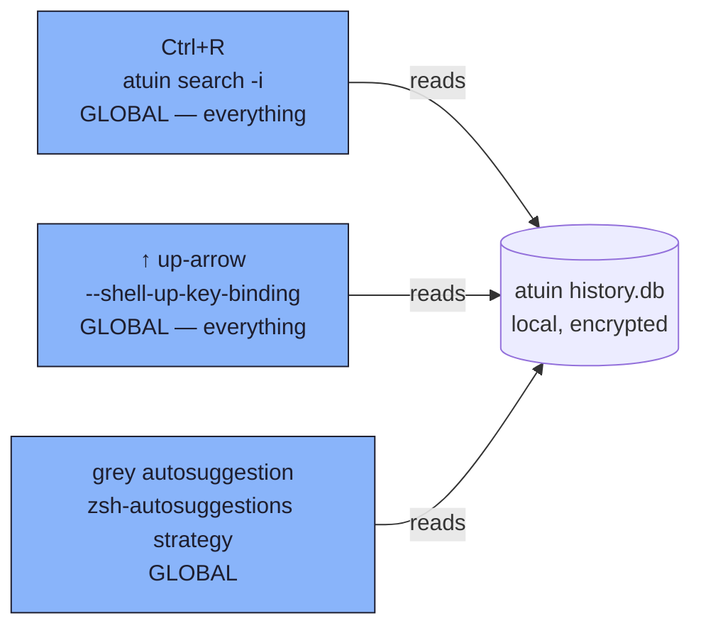
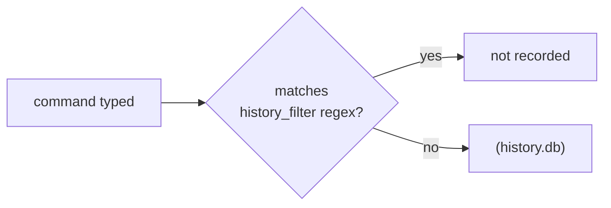

# atuin — encrypted, fuzzy shell history

atuin replaces the old zsh-histdb and `HISTORY_IGNORE` regex setup. It runs only on the local machine
(`auto_sync = false`). No data leaves the machine.

## Policy: no surface may HIDE history

Three UI surfaces read the same local history DB (`~/.local/share/atuin/history.db`). All three are **global**. A
command that you type in one tab is visible from every other tab, session, and host, on every surface.

The ↑ key used `session-preload` for two weeks, and then the setting was reverted. See "Why ↑ is back on `global`"
below for the measurement that ended it. You can narrow a surface, but the change must pass this test: **how much
history does it hide in a real session that is long-lived and has many panes?** Test with that kind of session.
Do not test with a new single shell.


```mermaid
flowchart LR
    DB[("atuin history.db<br/>local, encrypted")]

    CtrlR["Ctrl+R<br/>atuin search -i<br/>GLOBAL — everything"] -->|reads| DB
    UpKey["↑ up-arrow<br/>--shell-up-key-binding<br/>GLOBAL — everything"] -->|reads| DB
    Suggest["grey autosuggestion<br/>zsh-autosuggestions strategy<br/>GLOBAL"] -->|reads| DB

    classDef surface fill:#89b4fa,stroke:#1e1e2e,color:#1e1e2e
    class CtrlR,Suggest,UpKey surface
```

| Surface | Invocation | Config key(s) read | Value |
| --- | --- | --- | --- |
| Ctrl+R search | `atuin search -i` | `filter_mode` | `"global"` |
| Up-arrow recall | `atuin search -i --shell-up-key-binding` | `filter_mode_shell_up_key_binding` | `"global"` |
| Grey autosuggestion | `_zsh_autosuggest_strategy_atuin` (from `atuin init zsh`) → `ATUIN_QUERY="$1" atuin search --cmd-only --author '$all-user' --limit 1 --search-mode prefix` | `filter_mode` (no override) | `"global"` |

### Why ↑ is back on `global`

↑ ran `session-preload` from 2026-08-24 to 2026-09-06. Its SQL is

```sql
WHERE session = '<this session>' OR timestamp < <this session's start time>
```

This query shows the commands of this terminal first, newest first. It hides what other sessions ran after this
session started. When the team adopted the mode, the estimate of the hidden part was ~30%. A new measurement on
2026-09-06 used a shell that was open since 2026-09-03:

| Since this session started | Commands |
| --- | --- |
| Total recorded | 865 |
| This session's own | **7** |
| Hidden from ↑ | **858 across 12 sessions (99%)** |

The mode assumes that you type most commands in the session where you work. herdr keeps a dozen long-lived panes,
and each pane is its own atuin session. For this setup the assumption is false. The hidden part grows with the
session age and with the pane count. A ↑ key that hides 99% of recent history is a broken key, not a preference.
The setting went back to `global`.

`session-preload` stays in `search.filters`. You can reach it with the Ctrl+R cycle key. Use it for one search when
you want only the commands of this pane. Do not use it as the default for every ↑ press.

**Do not use plain `session`.** It has the same problem, and it is worse. It also drops the `OR timestamp <` clause,
so it hides all older history too.

## TUI height: inline vs alternate screen

The measurements show that the query layer is not the cause: atuin p50=20ms, max=110ms; starship 30ms; no sqlite
lock. The delay of the ↑ key came from `inline_height_shell_up_key_binding`. Its default is `0`, which is the full
alternate-screen TUI. The default of `inline_height` for Ctrl+R is already `40`, which is inline. The switch to the
alternate screen shows as lag in ghostty and herdr. Both keys now use the same inline value. The ↑ key and Ctrl+R
now behave the same way:

| Key | Value | Surface |
| --- | --- | --- |
| `inline_height` | `40` | Ctrl+R |
| `inline_height_shell_up_key_binding` | `40` | ↑ key |

Two more keys prevent other ways to narrow the search scope:

| Key | Value | Why |
| --- | --- | --- |
| `workspaces` | `false` | Disables workspace-scoped filtering (limiting to the current git repo tree) entirely. |
| `[search].filters` | `["global"]` | Only `"global"` is enabled as a cycle-able filter mode, so no keybinding (e.g. the ctrl-r cycle key) can switch search into `session`, `directory`, `host`, `workspace`, or `session-preload` scoping. |

`YOU SHOULD VERIFY` — The list of filter-mode values (`global`, `host`, `session`, `session-preload`, `directory`,
`workspace`) and the `[search].filters` key come from `atuin default-config` on atuin 18.18.1. A future atuin
release can add or rename modes.

## Recording-time filter (separate from search scope)

atuin evaluates `history_filter` when it **saves** a command, not when you search. The filter never limits a
search to one session. It keeps noise and secrets out of the DB:


```mermaid
flowchart LR
    CMD[command typed] --> F{"matches<br/>history_filter regex?"}
    F -->|yes| DROP[not recorded]
    F -->|no| DB["(history.db)"]
```

The current patterns guard the first word of common secret shapes. They also match the two noisiest commands, so
that these commands do not hide useful entries: `^aws `,
`^secret`, `^password`, `^token`, `^api[-_]?key`,
`^export .*(SECRET|TOKEN|API|KEY|PASSWORD|PASS)=`, `^pass `, `^cat `,
`^ls$`, `^ls .*`.

## Grey autosuggestion: atuin-only, no strategy fallback

`atuin init zsh` sets `ZSH_AUTOSUGGEST_STRATEGY`. It *adds* its own `atuin` strategy before the existing value. If
the zsh-autosuggestions default (`history`) is already set, the result is `(atuin history)`. `scripts/init-load`
overrides this value directly after `eval "$(atuin init zsh)"`:

```sh
ZSH_AUTOSUGGEST_STRATEGY=(atuin)
```

Trade-off (on purpose): if atuin is not available, the grey suggestion does not appear. There is no silent
fallback to the plain `history` strategy. That strategy reads `~/.zsh_history` and skips the atuin filter.

## `HISTORY_IGNORE` (zsh): recall-time mirror of `history_filter`

`history_filter` (above) stops only atuin from *recording* a command. `~/.zsh_history` records commands on its own,
because atuin does not change the `setopt` history options. For this reason, `scripts/init-load` sets the zsh
variable `HISTORY_IGNORE` to a glob version of the same rules. It applies to `↑` and `history` on that file also.
zsh `HISTORY_IGNORE` takes **one** pattern. The script joins all rules into one `(a|b|c)` alternation.

**Do not use `setopt EXTENDED_GLOB`.** It makes `^` a glob operator. Then common commands without quotes, such as
`git show HEAD^` and `git diff HEAD^^`, fail with "no matches found". This is a measured result, not an
assumption. This command shows it: `zsh -f -c 'setopt extended_glob; eval "print -r -- HEAD^"'`. The `(a|b|c)`
alternation works without EXTENDED_GLOB. One rule needed `#` (zero or more repeats, for `api[-_]#key*`). The
script now writes that rule as an explicit alternation, `(apikey*|api-key*|api_key*)`. It has no repeat operator.

| `history_filter` regex | `HISTORY_IGNORE` glob | Why the difference |
| --- | --- | --- |
| `^ls$` | `ls` | glob match is whole-string already, no anchors needed |
| `^ls .*` | `ls *` | `.*` (regex) → `*` (glob), both "anything after" |
| `^cat ` | `cat *` | trailing-space token → literal + `*` |
| `^aws ` | `aws *` | same |
| `^pass ` | `pass *` | same |
| `^secret` | `secret*` | prefix match either way |
| `^password` | `password*` | prefix match either way |
| `^token` | `token*` | prefix match either way |
| `^api[-_]?key` | `(apikey*\|api-key*\|api_key*)` | regex `?` (0-or-1 on `[-_]`) has no plain-glob equivalent, so it's spelled out as an explicit alternation instead of the EXTENDED_GLOB-only `#` (0-or-more) operator |
| `^export .*(SECRET\|TOKEN\|API\|KEY\|PASSWORD\|PASS)=` | `export *(SECRET\|TOKEN\|API\|KEY\|PASSWORD\|PASS)=*` | regex `(a\|b)` alternation is native to zsh glob too — no translation needed |

## Daemon

```toml
[daemon]
enabled = true
autostart = true
```

The daemon makes sync and search faster. It does not change the scope. The keys `filter_mode`, `workspaces`, and
`[search].filters` above set the scope.
