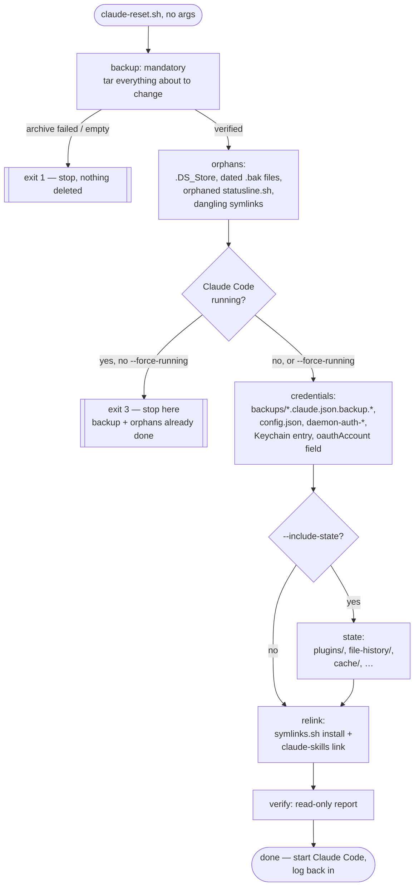

# `~/.claude` reset — what gets touched, what never does

`scripts/claude-reset.sh` cleans up cruft that accumulates under `~/.claude`
and `~/.claude.json`: stray backup files from earlier manual edits, rotated
credential snapshots, an orphaned real copy of a file this repo already
symlinks in, and (opt-in) reproducible caches. It is **fully automatic** —
run with no arguments, it does the whole job with no prompts — and it is
**destructive by default**. `--dry-run` is the only preview mode; there is
no `--apply` flag and nothing asks "are you sure?".

The safety net is not a confirmation prompt, it's three hard rules built
into the script itself:

1. **Every run backs itself up first.** A `.tgz` + manifest, written before
   anything is deleted. If the backup can't be written and verified, the
   script exits `1` and touches nothing else.
2. **`~/.claude/projects` is never a deletion target.** It's only read (to
   back it up) — never in an `rm` path. The script counts memory files
   before and after every run and aborts if the count ever drops.
3. **Credential-touching phases refuse to run while Claude Code is open**
   (exit `3`), because the running app owns and instantly regenerates those
   files — deleting them under it is a no-op at best.

See `scripts/claude-reset.sh --help` for the full flag reference. This doc
is the "why" and the "what's actually in there" behind it.

## Pipeline



`--dry-run` walks the exact same graph but every action node only prints
what it would do.

## Inventory — every entry under `~/.claude`, and what happens to it

Sizes below are what this repo's author measured on one real `~/.claude`
(**~446M total**) at the time this was written — YOU SHOULD VERIFY THIS
against your own `~/.claude` before trusting the numbers, they will drift.

| Entry | Class | Phase | Notes |
| --- | --- | --- | --- |
| `settings.json`, `CLAUDE.md`, `commands/`, `scripts/` | repo symlink | `relink` (repair only) | Point into this repo's `configurations/claude/`. |
| `hooks/herdr-agent-state.sh`, `hooks/herdr-workspace-guard.sh` | repo symlink | `relink` | Same. |
| `skills/*` (19 entries) | repo symlink | `relink` | Planted by `scripts/claude-skills link`. |
| `.DS_Store` | orphan | `orphans` | Finder litter. |
| `CLAUDE.md.bak.20260629-155842`, `settings.json.bak`, `settings.json.bak.20260623-120218` | orphan | `orphans` | Dated backups left by earlier manual edits, superseded by the symlinked originals. |
| `statusline.sh` | orphan (real file) | `orphans` | Unowned real copy — the live one is `settings.json`'s `statusLine`, which points at the symlinked `scripts/statusline.sh`. Content differs from the repo copy; nothing reads this one. |
| `skills/quick-test.md`, `debug/latest` | dangling symlink | `orphans` | Found by scanning, not by name — any future dangling link under `~/.claude` (outside `projects/`) is swept too. |
| `backups/.claude.json.backup.*` (5 seen, rotates 5↔6) | credential | `credentials` | Each ~112KB, each carries the full `oauthAccount` block (email + org UUID). Cleared by glob, not by fixed name, because the count changes while the app runs. |
| `config.json` | credential | `credentials` | `customApiKeyResponses.approved` — an approved API-key fingerprint. Regenerated by the app on next use. |
| `daemon-auth-status.json`, `daemon-auth-cooldown` | credential-adjacent | `credentials` | Auth daemon bookkeeping. |
| macOS Keychain `Claude Code-credentials` (svce) / `emrah` (acct) | credential | `credentials` | Not a file under `~/.claude` at all — see below. |
| `.claude.json` → `oauthAccount` field only | credential | `credentials` | Only this field is stripped via `jq del`; the other ~32 project entries and ~24 `hasTrustDialogAccepted` flags are left alone (rule below). |
| `plugins/` | reproducible cache | `state` (opt-in) | Plugin + marketplace checkouts. No plugins are declared in `settings.json` today, so this is pure cache. |
| `file-history/` (23M), `cache/`, `paste-cache/`, `shell-snapshots/`, `telemetry/`, `jobs/`, `debug/`, `downloads/` | reproducible cache | `state` (opt-in) | Rebuilt on demand; no backup taken (see "why state isn't backed up" below). |
| `sessions/`, `tasks/`, `teams/`, `history.jsonl` (516K) | prompt/session history | `state --include-history` (opt-in, off by default) | The riskier half of `state` — actual conversation/session data, not just cache. |
| `projects/` (241M: 203 transcripts + 69 memory files = 296K) | **untouchable** | `backup` (read + archive only), never a deletion target anywhere | See rule #1. `memory/` is the irreplaceable part; transcripts are large but reconstructible from context, so they're excluded from the default backup — pass `--backup-transcripts` to include them too. |
| `daemon.lock`, `daemon.status.json`, `daemon/`, `session-env/`, `ide/`, `.last-cleanup`, `.last-update-result.json`, `policy-limits.json`, `remote-settings.json`, `stats-cache.json` | live app state | none | Not targeted by any phase — owned entirely by the running app; see "live right now" below for why deleting these under a running Claude Code is pointless. |

## Where credentials actually live (it's not all in this folder)

There is **no** `~/.claude/.credentials.json` on this setup — don't go
looking for one. The OAuth session is split across two places outside a
tidy single file:

- **macOS Keychain**, service `Claude Code-credentials`, account `emrah`
  (`security find-generic-password -s "Claude Code-credentials" -a "$USER"`
  confirms it).
- **`~/.claude.json`**, top-level `oauthAccount` field (email + org UUID).

Preferred path to end a session: **`/logout` from inside Claude Code** —
it's the documented, in-app way to do it. `claude-reset.sh` prints this
suggestion every time the `credentials` phase runs, but does not block the
automatic pipeline on it.

🟡 Whether deleting the Keychain entry by hand **also** revokes the token
server-side is **UNVERIFIED** — YOU SHOULD VERIFY THIS before relying on
manual Keychain deletion alone as a substitute for `/logout`. The script
removes the local entry either way; that stops the *local* app from
presenting it, which is not necessarily the same thing as server-side
revocation.

## "Live right now" — why some things can't just be deleted

This is the part that's easy to get wrong: `~/.claude` isn't a static
folder you can clean up like a Downloads directory. While Claude Code is
open, several files are being actively written by the running process,
and deleting them out from under it either does nothing (they come right
back) or confuses the live session.

Concretely, on this machine, with one Claude Code session open:

| File | What was observed |
| --- | --- |
| `daemon.lock` | Holds the running daemon's PID. The script reads this + `kill -0 <pid>` to decide "is Claude Code running" — it does not go by process name. |
| `daemon.status.json`, `session-env/` | Rewritten continuously by the daemon while it's up. |
| the active session's own transcript under `projects/<cwd-slug>/*.jsonl` | Measured at **1.0MB and growing** during a single session — it's the live conversation log, appended to in real time. |
| `backups/.claude.json.backup.*` | Count observed rotating **5 → 6 → 5** while the app was open — the app itself creates and prunes these. Deleting one while running just gets it recreated on the next save. |

This is exactly why the `credentials` and `state` phases refuse to run
while Claude Code looks alive (exit `3`, override with `--force-running`
if you understand the tradeoff) — but `orphans` doesn't need that guard,
because nothing in its target list is a file the running app touches.

## Backup & restore

Every non-`--dry-run` run writes, **before** touching anything else:

```
${BACKUP_DIR:-$HOME}/claude-reset-backup-<YYYYmmdd-HHMMSS>.tgz
${BACKUP_DIR:-$HOME}/claude-reset-backup-<YYYYmmdd-HHMMSS>.manifest.txt
```

The archive contains every `projects/**/memory/` directory in full (or
the entire `projects/` tree with `--backup-transcripts`), `~/.claude.json`
as it was *before* `oauthAccount` is stripped, `~/.claude/history.jsonl`,
and every single file the `orphans` and `credentials` phases are about to
delete or rewrite this run. The manifest next to it records what went in,
how many files/what size, the timestamp, and the restore command:

```sh
tar xzf claude-reset-backup-<timestamp>.tgz -C "${HOME}"
```

After writing the archive, the script re-opens it with `tar tzf` and
checks the memory-file count inside matches what was on disk — if the
archive is unreadable, empty, or short a file, the run stops with exit
`1` before deleting anything.

**Why `state`'s targets aren't backed up:** `plugins/`, `file-history/`,
and the rest of the `state` phase's targets are
reproducible — plugin checkouts reinstall from their marketplaces,
caches rebuild on next use. Backing up 200+ MB of disposable cache on
every run would defeat the point of a lightweight, always-on-by-default
backup step.

## Requirements

This repo has no requirements-tracking file (no `requirements.md` /
traceability doc) — this doc and the script's own `--help` output are the
spec of record for `claude-reset.sh`'s behavior.
