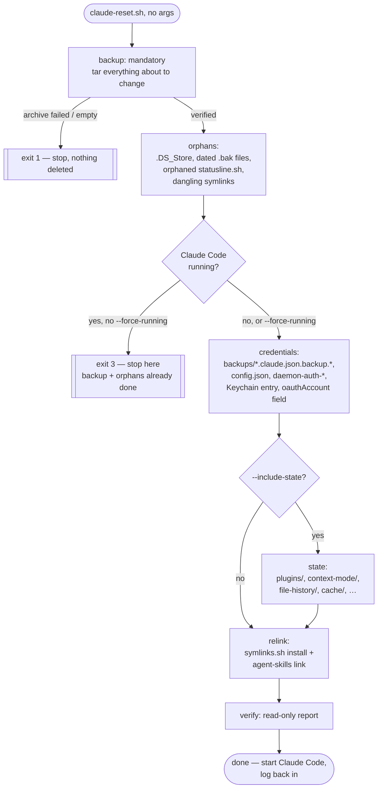

# `~/.claude` reset — what gets touched, what never does

`scripts/claude-reset.sh` removes cruft that collects under `~/.claude` and `~/.claude.json`. The cruft is:

- stray backup files from earlier manual edits
- rotated credential snapshots
- an orphaned real copy of a file that this repo already symlinks in
- (opt-in) reproducible caches

The script is **fully automatic**. When you run it with no arguments, it does the whole job and asks no questions.
It is **destructive by default**. `--dry-run` is the only preview mode. There is no `--apply` flag. Nothing asks
"are you sure?".

The script has no confirmation prompt. Three hard rules in the script protect your data:

1. **Every run makes a backup first.** The backup is a `.tgz` and a manifest. The script writes them before it
   deletes anything. If the script cannot write and verify the backup, it exits `1` and changes nothing else.
2. **`~/.claude/projects` is never a deletion target.** The script only reads it, to back it up. It is never in
   an `rm` path. The script counts memory files before and after every run. It aborts if the count drops.
3. **Credential phases refuse to run while Claude Code is open** (exit `3`). The running app owns these files and
   regenerates them at once. If you delete them while the app runs, at best nothing happens.

For the full flag reference, run `scripts/claude-reset.sh --help`. This doc explains why the script works this
way and what is in `~/.claude`.

## Pipeline


```mermaid
flowchart TD
    START([claude-reset.sh, no args]) --> BACKUP["backup: mandatory<br/>tar everything about to change"]
    BACKUP -->|archive failed / empty| FAIL[[exit 1 — stop, nothing deleted]]
    BACKUP -->|verified| ORPHANS["orphans:<br/>.DS_Store, dated .bak files,<br/>orphaned statusline.sh,<br/>dangling symlinks"]
    ORPHANS --> RUNCHECK{"Claude Code<br/>running?"}
    RUNCHECK -->|yes, no --force-running| STOP[["exit 3 — stop here<br/>backup + orphans already done"]]
    RUNCHECK -->|no, or --force-running| CREDS["credentials:<br/>backups/*.claude.json.backup.*,<br/>config.json, daemon-auth-*,<br/>Keychain entry, oauthAccount field"]
    CREDS --> STATEQ{--include-state?}
    STATEQ -->|yes| STATE["state:<br/>plugins/, context-mode/,<br/>file-history/, cache/, …"]
    STATEQ -->|no| RELINK
    STATE --> RELINK["relink:<br/>symlinks.sh install +<br/>agent-skills link"]
    RELINK --> VERIFY["verify: read-only report"]
    VERIFY --> DONE(["done — start Claude Code,<br/>log back in"])
```

`--dry-run` follows the same graph. Each action node only prints what it would do.

## Inventory — every entry under `~/.claude`, and what happens to it

The sizes below come from one real `~/.claude` (**~446M total**). The author measured it when this doc was
written. YOU SHOULD VERIFY THIS against your own `~/.claude` before you trust the numbers. They will change.

| Entry | Class | Phase | Notes |
| --- | --- | --- | --- |
| `settings.json`, `CLAUDE.md`, `commands/`, `scripts/` | repo symlink | `relink` (repair only) | Point into this repo's `configurations/claude/`. |
| `hooks/context-mode-cache-heal.mjs`, `hooks/herdr-agent-state.sh`, `hooks/herdr-workspace-guard.sh` | repo symlink | `relink` | Same. |
| `skills/*` (19 entries) | repo symlink | `relink` | Planted by `scripts/agent-skills link`. |
| `.DS_Store` | orphan | `orphans` | Finder litter. |
| `CLAUDE.md.bak.20260629-155842`, `settings.json.bak`, `settings.json.bak.20260623-120218` | orphan | `orphans` | Dated backups from earlier manual edits. The symlinked originals replace them. |
| `statusline.sh` | orphan (real file) | `orphans` | Unowned real copy. The live one is the `statusLine` of `settings.json`, which points at the symlinked `scripts/statusline.sh`. Its content differs from the repo copy. Nothing reads it. |
| `skills/quick-test.md`, `debug/latest` | dangling symlink | `orphans` | The script finds them by scan, not by name. It also removes any future dangling link under `~/.claude` (outside `projects/`). |
| `backups/.claude.json.backup.*` (5 seen, rotates 5↔6) | credential | `credentials` | Each ~112KB. Each holds the full `oauthAccount` block (email + org UUID). The script clears them by glob, not by fixed name, because the count changes while the app runs. |
| `config.json` | credential | `credentials` | `customApiKeyResponses.approved` — an approved API-key fingerprint. The app regenerates it on next use. |
| `daemon-auth-status.json`, `daemon-auth-cooldown` | credential-adjacent | `credentials` | Bookkeeping files of the auth daemon. |
| macOS Keychain `Claude Code-credentials` (svce) / `emrah` (acct) | credential | `credentials` | Not a file under `~/.claude`. See below. |
| `.claude.json` → `oauthAccount` field only | credential | `credentials` | `jq del` removes only this field. The other ~32 project entries and ~24 `hasTrustDialogAccepted` flags stay (rule below). |
| `plugins/` (120M) | reproducible cache | `state` (opt-in) | `enabledPlugins` + `extraKnownMarketplaces` in `settings.json` track it. The app reinstalls from there. |
| `context-mode/` (60M) | reproducible cache | `state` (opt-in) | Local index of the MCP plugin. |
| `file-history/` (23M), `cache/`, `paste-cache/`, `shell-snapshots/`, `telemetry/`, `jobs/`, `debug/`, `downloads/` | reproducible cache | `state` (opt-in) | Rebuilt on demand. No backup (see "Why the state targets are not backed up" below). |
| `sessions/`, `tasks/`, `teams/`, `history.jsonl` (516K) | prompt/session history | `state --include-history` (opt-in, off by default) | The riskier half of `state`. It holds real conversation and session data, not only cache. |
| `projects/` (241M: 203 transcripts + 69 memory files = 296K) | **untouchable** | `backup` (read + archive only), never a deletion target anywhere | See rule #1. `memory/` cannot be replaced. Transcripts are large, but you can rebuild them from context. The default backup excludes them. Pass `--backup-transcripts` to include them. |
| `daemon.lock`, `daemon.status.json`, `daemon/`, `session-env/`, `ide/`, `.last-cleanup`, `.last-update-result.json`, `policy-limits.json`, `remote-settings.json`, `stats-cache.json` | live app state | none | No phase targets them. The running app owns them. See "live right now" below for why deleting them under a running Claude Code has no effect. |

## Where credentials actually live (it's not all in this folder)

There is **no** `~/.claude/.credentials.json` on this setup. Do not look for one. The OAuth session is split
across two places. Neither place is one tidy file:

- **macOS Keychain**, service `Claude Code-credentials`, account `emrah`
  (`security find-generic-password -s "Claude Code-credentials" -a "$USER"`
  confirms it).
- **`~/.claude.json`**, top-level `oauthAccount` field (email + org UUID).

To end a session, use **`/logout` from inside Claude Code**. This is the documented, in-app way. Each time the
`credentials` phase runs, `claude-reset.sh` prints this suggestion. The script does not block the automatic
pipeline on it.

🟡 It is **UNVERIFIED** whether a manual delete of the Keychain entry **also** revokes the token on the server.
YOU SHOULD VERIFY THIS before you use manual Keychain deletion instead of `/logout`. The script removes the local
entry either way. This stops the *local* app from presenting the token. It does not necessarily revoke the token
on the server.

## "Live right now" — why some things can't just be deleted

This part is easy to get wrong. `~/.claude` is not a static folder that you can clean like a Downloads
directory. While Claude Code is open, the running process writes several files. If you delete them, they come
back at once, or the live session becomes confused.

The table shows what we observed on this machine with one Claude Code session open:

| File | What was observed |
| --- | --- |
| `daemon.lock` | Holds the PID of the running daemon. The script reads it and runs `kill -0 <pid>` to decide if Claude Code runs. It does not use the process name. |
| `daemon.status.json`, `session-env/` | The daemon rewrites them all the time while it runs. |
| the active session's own transcript under `projects/<cwd-slug>/*.jsonl` | Measured at **1.0MB and growing** in one session. It is the live conversation log. The app appends to it in real time. |
| `backups/.claude.json.backup.*` | The count rotated **5 → 6 → 5** while the app was open. The app creates and prunes these files. If you delete one while the app runs, the app recreates it on the next save. |

For this reason, the `credentials` and `state` phases refuse to run while Claude Code looks alive (exit `3`).
You can override this with `--force-running`. First, make sure you understand the tradeoff. The `orphans` phase
needs no such guard. No target in its list is a file that the running app touches.

## Backup & restore

Every run without `--dry-run` writes these files **before** it changes anything else:

```
${BACKUP_DIR:-$HOME}/claude-reset-backup-<YYYYmmdd-HHMMSS>.tgz
${BACKUP_DIR:-$HOME}/claude-reset-backup-<YYYYmmdd-HHMMSS>.manifest.txt
```

The archive holds these items:

- every `projects/**/memory/` directory in full (or the entire `projects/` tree with `--backup-transcripts`)
- `~/.claude.json` as it was *before* the script strips `oauthAccount`
- `~/.claude/history.jsonl`
- every file that the `orphans` and `credentials` phases will delete or rewrite in this run

The manifest next to the archive records what went in, the file count and size, the timestamp, and the restore
command:

```sh
tar xzf claude-reset-backup-<timestamp>.tgz -C "${HOME}"
```

After the script writes the archive, it opens the archive again with `tar tzf`. It checks that the memory-file
count inside the archive matches the count on disk. If the archive is unreadable, empty, or short of a file, the
run stops with exit `1` before it deletes anything.

**Why the `state` targets are not backed up:** `plugins/`, `context-mode/`, `file-history/`, and the other
targets of the `state` phase are reproducible. Plugins reinstall from `enabledPlugins` in `settings.json`. Caches
rebuild on next use. A backup of 200+ MB of disposable cache on every run would defeat the purpose of a light
backup step that is on by default.

## Requirements

This repo has no requirements-tracking file (no `requirements.md` or traceability doc). This doc and the
`--help` output of the script are the spec of record for the behavior of `claude-reset.sh`.
