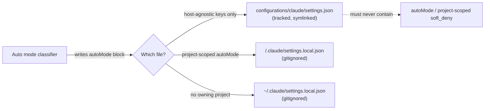

# Claude settings — tracked vs. local

## Why this split exists

`configurations/claude/settings.json` is git-tracked and symlinked to `~/.claude/settings.json`
(hard rule #1). Claude Code's **auto mode** classifier can write an `autoMode` block into whatever
settings file is active — and once, it wrote one scoped to a *different* project (`noturi`:
absolute paths, repo name, project-specific CLI rules) straight into this tracked, host-agnostic
file. That block doesn't belong in a repo shared across hosts and read by every project — it's
volatile, machine/project-local state, not a dotfiles config value.

## Which key goes where

| Location | Scope | Git | Holds |
| --- | --- | --- | --- |
| `configurations/claude/settings.json` (→ `~/.claude/settings.json`) | Host-agnostic, all projects | **Tracked** | `model`, `hooks`, `theme`, `tui`, `statusLine`, `enabledPlugins`, `permissions.defaultMode` |
| `~/.claude/settings.local.json` | User-local, all projects on this machine | Gitignored | `autoMode` when no single project owns it |
| `<project>/.claude/settings.local.json` | Project-local (e.g. `noturi`) | Gitignored (repo `.gitignore` or a global `**/.claude/settings.local.json` pattern) | `autoMode` scoped to that project's environment/soft_deny rules |

Settings load order is user → project → local (later wins), so a project-local
`settings.local.json` layers cleanly on top of the tracked file without touching it.



## Exception to hard rule #13

Hard rule #13 ("Centralized Claude commands and rules are always tracked") governs **commands and
rules** (`.claude/commands/`, the global `CLAUDE.md`) — content meant to be portable across hosts.
`autoMode` is neither: it's a live classifier state block scoped to one project's environment, and
belongs with the other volatile/local overrides in a gitignored `settings.local.json`, not in the
tracked file rule #13 protects.

## The atomic-save / symlink-break failure mode

Claude Code's settings writer does an atomic save (write temp file, rename over target). When the
target is a symlink (`~/.claude/settings.json` → repo file), some code paths rename the temp file
**onto the symlink path**, replacing the symlink itself with a plain file — silently breaking the
link back to the repo. Recurs on any in-app write to settings (theme change, model switch,
permission edit), not just the `autoMode` capture. Splitting volatile/write-prone keys into
`settings.local.json` reduces how often the tracked file gets touched by the app, but does not
fix the underlying symlink-clobbering behavior — check periodically:

```sh
readlink ~/.claude/settings.json   # should resolve into the dotfiles repo checkout
```

If it no longer resolves into the repo, the symlink was clobbered — re-run
`scripts/symlinks.sh install` to restore it (after reconciling any content the plain file gained).
