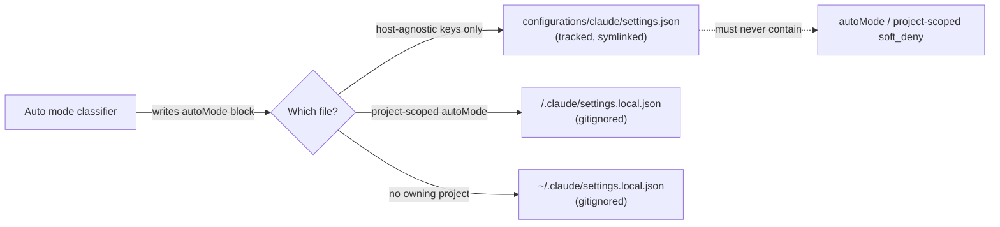
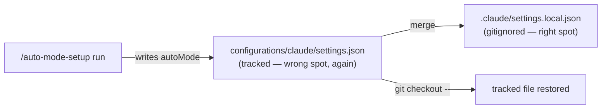

# Claude settings — tracked vs. local

## Why this split exists

`configurations/claude/settings.json` is git-tracked. It is symlinked to `~/.claude/settings.json`
(hard rule #1). The **auto mode** classifier of Claude Code can write an `autoMode` block into the
active settings file. Once, it wrote a block for a *different* project into this tracked file. The block held
absolute paths, a repo name, and project-specific CLI rules.

This tracked file is host-agnostic. Other hosts share it and every project reads it. The `autoMode` block does not
belong in it. The block is volatile state that is local to a machine or project. It is not a dotfiles config value.

## Which key goes where

| Location | Scope | Git | Holds |
| --- | --- | --- | --- |
| `configurations/claude/settings.json` (→ `~/.claude/settings.json`) | Host-agnostic, all projects | **Tracked** | `model`, `hooks`, `theme`, `tui`, `statusLine`, `enabledPlugins`, `permissions.defaultMode` |
| `~/.claude/settings.local.json` | User-local, all projects on this machine | Gitignored | `autoMode` when no single project owns it |
| `<project>/.claude/settings.local.json` | Project-local | Gitignored (repo `.gitignore` or a global `**/.claude/settings.local.json` pattern) | `autoMode` scoped to that project's environment/soft_deny rules |

Settings load in this order: user, project, local. A later file wins. A project-local `settings.local.json`
therefore layers on top of the tracked file and does not change it.


```mermaid
flowchart LR
    CLASS[Auto mode classifier] -->|writes autoMode block| TARGET{Which file?}
    TARGET -->|host-agnostic keys only| TRACKED["configurations/claude/settings.json<br/>(tracked, symlinked)"]
    TARGET -->|project-scoped autoMode| PLOCAL["<project>/.claude/settings.local.json<br/>(gitignored)"]
    TARGET -->|no owning project| ULOCAL["~/.claude/settings.local.json<br/>(gitignored)"]
    TRACKED -.->|must never contain| BAD[autoMode / project-scoped soft_deny]
```

## Exception to hard rule #12

Hard rule #12 ("Centralized Claude commands and rules are always tracked") governs **commands and
rules** (`.claude/commands/`, the global `CLAUDE.md`). These files must be portable across hosts.
`autoMode` is not a command or a rule. It is a live classifier state block for the environment of one project.
Put it with the other volatile or local overrides in a gitignored `settings.local.json`. Do not put it in the
tracked file that rule #12 protects.

## `/auto-mode-setup` reproduces this churn — it's not a one-off

This problem is not a one-time accident. **Every** `/auto-mode-setup` run writes a new `autoMode` block into
the settings file that is active for that project. The block holds the environment, allow, and soft_deny rules
of that project. It happened once for another project. On 2026-08-20 it happened again for this repo
(`raxetul/dotfiles`). The failure class is the same, and the project is different.

This is the **normal behavior of the command**. It is not a fluke. After every `/auto-mode-setup` run, expect
to clean the tracked `configurations/claude/settings.json` again.

| Step | Action |
| --- | --- |
| 1 | `jq -e 'has("autoMode")' configurations/claude/settings.json` — if `true`, the block is in the tracked file. |
| 2 | Merge the block into `.claude/settings.local.json`. Keep its existing keys (`permissions.allow`). |
| 3 | `git checkout -- configurations/claude/settings.json` to remove the block from the tracked file. |
| 4 | Re-verify `jq -e 'has("autoMode")' configurations/claude/settings.json` → `false`. |

For this repo, the target is `.claude/settings.local.json` at the repo root. Do not use
`~/.claude/settings.local.json`. The global gitignore pattern `**/.claude/settings.local.json`
(`~/.gitignore_global:4`) already covers the file. `git check-ignore -v` confirms this. The `.gitignore` of this
repo has no matching line of its own. The global pattern alone protects the file.


```mermaid
flowchart LR
    RUN["/auto-mode-setup run"] -->|writes autoMode| TRACKED2["configurations/claude/settings.json<br/>(tracked — wrong spot, again)"]
    TRACKED2 -->|merge| LOCAL2[".claude/settings.local.json<br/>(gitignored — right spot)"]
    TRACKED2 -->|git checkout --| CLEAN["tracked file restored"]
```

## The atomic-save / symlink-break failure mode

The settings writer of Claude Code does an atomic save. It writes a temp file and renames it over the target.
When the target is a symlink (`~/.claude/settings.json` → repo file), some code paths rename the temp file
**onto the symlink path**. This replaces the symlink with a plain file. The link back to the repo breaks
without a warning. It happens on any in-app write to settings (theme change, model switch, permission edit).
It does not happen only for the `autoMode` capture. Volatile and write-prone keys in `settings.local.json`
reduce how often the app touches the tracked file. They do not fix the symlink-clobbering behavior.
Check the link from time to time:

```sh
readlink ~/.claude/settings.json   # should resolve into the dotfiles repo checkout
```

If the path does not resolve into the repo, the symlink was clobbered. Reconcile any content that the plain
file gained. Then run `scripts/symlinks.sh install` to restore the link.
