# Claude skills — taxonomy, references pattern, archive

## Why this exists

`~/.claude/skills/` accumulates skills from every source that gets installed on this machine —
this repo's own (`backend-development`, `logging-patterns`, `rfc9457-problem-details`, …) and
third-party packs (a Solana/crypto-focused skill pack, in this case). Left unmanaged, that
directory mixes domain-agnostic engineering skills (frontend, security, review, learning) with
skills scoped to one product domain, and grows a new skill for every technology combination a
skill's guidance needs to cover.

This doc records the two decisions that keep that directory sane:

1. **Technology variety is a `references/` file, not a new skill.** A project can run PostgreSQL
   and ClickHouse side by side, or Loco one month and Spring Boot the next — the combinations
   would explode the skill count if each got its own skill. One skill owns the domain-agnostic
   depth (layering, DI, schema discipline); `references/<category>/<technology>.md` owns the
   technology-specific mechanics. See `configurations/claude/skills/backend-development/SKILL.md`
   for the reference implementation of this pattern.
2. **Domain-agnostic skills are tracked in this repo; domain-specific ones are archived outside
   it.** A skill with engineering value independent of any one product domain (frontend/design,
   security, review, learning, a router file) is symlinked in like any other repo-managed config
   (hard rule #12 in the root `CLAUDE.md`). A skill scoped to one product domain (this machine's
   case: Solana/crypto/hackathon workflows) doesn't belong in a general-purpose dotfiles repo — it
   moves to `${HOME}/gel-ort/claude-skills-archive/`, kept (not deleted) in case that domain's work
   resumes.

## The `references/` pattern

```
configurations/claude/skills/backend-development/
├── SKILL.md                          # framework-independent depth + routing table
└── references/
    ├── frameworks/
    │   ├── loco.md                   # Rust
    │   ├── spring-boot.md            # Java
    │   └── nestjs.md                 # TypeScript
    ├── databases/
    │   ├── postgresql.md
    │   ├── clickhouse.md
    │   └── _template.md              # blank skeleton for the next database
    └── observability/
        ├── opentelemetry.md
        └── _template.md              # blank skeleton for the next tool
```

Every reference file follows the same six-section skeleton, so any reference reads the same way
regardless of which technology it covers:

| Section | Purpose |
| --- | --- |
| When to read | The concrete project signal that points here (a dependency, a config key, a docker-compose service name) |
| Setup & dependencies | What to install/configure to use it |
| Directory layout | Where its code/config lives in a typical project tree |
| Migration + seed | How this technology's specifics interact with the schema discipline in `SKILL.md`, or an explicit "not applicable" |
| Docker (migrate + seed snippet) | A concrete `migrate → seed → app` compose fragment, or an explicit "not applicable" |
| Pitfalls | Mistakes specific to this technology |

**Adding a new technology never means adding a new skill.** Copy the matching `_template.md`,
fill it in, add a row to `SKILL.md`'s routing table. Flag anything you're not fully certain of
(exact CLI flags, config key names, package names) rather than guessing — several of the current
reference files carry a "YOU SHOULD VERIFY THIS" note for exactly that reason.

## Skill tree

```mermaid
flowchart TD
    subgraph repo["configurations/claude/skills/ (tracked, symlinked into ~/.claude/skills/)"]
        direction TB
        BD["backend-development\n(layering + schema discipline)"]
        BD --> FW["references/frameworks/\nloco · spring-boot · nestjs"]
        BD --> DB["references/databases/\npostgresql · clickhouse · _template"]
        BD --> OT["references/observability/\nopentelemetry · _template"]
        LP[logging-patterns]
        RFC[rfc9457-problem-details]
        BRAND[brand-design]
        FDG[frontend-design-guidelines]
        PLA[page-load-animations]
        CSO[cso]
        LEARN[learn]
        PR[product-review]
        RMP[roast-my-product]
        ROUTER[SKILL_ROUTER.md]
    end

    subgraph archive["${HOME}/gel-ort/claude-skills-archive/ (untracked, kept not deleted)"]
        direction TB
        SOLANA["Solana build/deploy/launch skills\napply-grant · build-* · launch-token\nscaffold-project · deploy-to-mainnet · debug-program\nsolana-beginner · virtual-solana-incubator"]
        CRYPTOBIZ["Crypto idea/market skills\nfind-next-crypto-idea · validate-idea\ncompetitive-landscape · defillama-research\ncolosseum-copilot · create-pitch-deck\nsubmit-to-hackathon"]
        CRYPTOCONTENT["Crypto-scoped content skills\ndesign-taste · number-formatting\nreview-and-iterate · navigate-skills\nmarketing-video · video-craft"]
        DATA["data/ (shared datasets for the above)"]
    end

    HOME["~/.claude/skills/"] -->|symlink, hard rule #12| repo
    HOME -.->|moved out, not linked| archive
```



## Symlink record

`scripts/symlinks.sh` `COMMON_LINKS` plants one entry per tracked skill (and the router file):

| Repo path | Live path |
| --- | --- |
| `configurations/claude/skills/logging-patterns` | `~/.claude/skills/logging-patterns` |
| `configurations/claude/skills/rfc9457-problem-details` | `~/.claude/skills/rfc9457-problem-details` |
| `configurations/claude/skills/backend-development` | `~/.claude/skills/backend-development` |
| `configurations/claude/skills/brand-design` | `~/.claude/skills/brand-design` |
| `configurations/claude/skills/cso` | `~/.claude/skills/cso` |
| `configurations/claude/skills/frontend-design-guidelines` | `~/.claude/skills/frontend-design-guidelines` |
| `configurations/claude/skills/learn` | `~/.claude/skills/learn` |
| `configurations/claude/skills/page-load-animations` | `~/.claude/skills/page-load-animations` |
| `configurations/claude/skills/product-review` | `~/.claude/skills/product-review` |
| `configurations/claude/skills/roast-my-product` | `~/.claude/skills/roast-my-product` |
| `configurations/claude/skills/SKILL_ROUTER.md` | `~/.claude/skills/SKILL_ROUTER.md` |

`backend-stack-patterns` (the skill `backend-development` replaces) is removed from both the repo
and the symlink mapping — its three per-framework sections became
`references/frameworks/{loco,spring-boot,nestjs}.md` verbatim, with no content dropped.

## Classification table

Every local skill that was under `~/.claude/skills/` and not already repo-tracked was classified
KEEP (domain-agnostic engineering value — moved into this repo) or ARCHIVE (Solana/crypto/
hackathon-specific — moved to `${HOME}/gel-ort/claude-skills-archive/`, not deleted).

| Skill | Decision | Reason |
| --- | --- | --- |
| `brand-design` | KEEP | Brand palette/typography workflow applies to any frontend project, not crypto-specific |
| `cso` | KEEP | Infrastructure security audit (secrets, dependency supply chain, OWASP, STRIDE) is domain-agnostic |
| `frontend-design-guidelines` | KEEP | General web interface design rules (Tailwind/shadcn defaults, but the rules themselves aren't crypto-specific) |
| `learn` | KEEP | Cross-session project-learnings management has no product-domain dependency |
| `page-load-animations` | KEEP | Framer-motion production recipes apply to any React/Next.js frontend |
| `product-review` | KEEP | UX/product-quality review framework is domain-agnostic |
| `roast-my-product` | KEEP | Harsh product critique framework is domain-agnostic |
| `SKILL_ROUTER.md` | KEEP | Router-file pattern itself has engineering value; content trimmed to only route to kept skills |
| `apply-grant` | ARCHIVE | Prepares a Solana Earn grant application specifically |
| `build-data-pipeline` | ARCHIVE | Solana on-chain data pipeline/indexer guidance |
| `build-defi-protocol` | ARCHIVE | Solana DeFi protocol (AMM/lending/vault) guidance |
| `build-mobile` | ARCHIVE | Solana mobile dApp guidance specifically |
| `build-with-claude` | ARCHIVE | Solana MVP step-by-step guidance |
| `colosseum-copilot` | ARCHIVE | Solana hackathon project search/analysis |
| `competitive-landscape` | ARCHIVE | Crypto product competitive mapping, built on Solana-ecosystem catalogs |
| `create-pitch-deck` | ARCHIVE | Pitch deck creation scoped to crypto projects |
| `data` | ARCHIVE | Shared datasets (colosseum/defi/ideas/solana-knowledge) feeding the archived Solana skills |
| `debug-program` | ARCHIVE | Debugging a Solana program/transaction specifically |
| `defillama-research` | ARCHIVE | DeFi protocol/TVL market research |
| `deploy-to-mainnet` | ARCHIVE | Solana devnet→mainnet deployment checklist |
| `design-taste` | ARCHIVE | Description scopes anti-AI-slop review to "crypto UIs" specifically |
| `find-next-crypto-idea` | ARCHIVE | Crypto startup idea discovery/validation |
| `launch-token` | ARCHIVE | Solana token launch (SPL/pump.fun) guidance |
| `marketing-video` | ARCHIVE | Video production described as "for Solana projects" |
| `navigate-skills` | ARCHIVE | Meta-router explicitly scoped to "solana-new skills, repos, and MCPs" |
| `number-formatting` | ARCHIVE | Description scopes number formatting to "crypto/Solana UIs" specifically |
| `review-and-iterate` | ARCHIVE | Description scopes code review to "Solana project code" specifically |
| `scaffold-project` | ARCHIVE | Solana project workspace scaffolding |
| `solana-beginner` | ARCHIVE | Solana fundamentals teaching |
| `submit-to-hackathon` | ARCHIVE | Solana hackathon submission prep |
| `validate-idea` | ARCHIVE | Crypto startup idea validation sprint |
| `video-craft` | ARCHIVE | Companion to the archived `marketing-video`, no domain-agnostic engineering category it fits |
| `virtual-solana-incubator` | ARCHIVE | Solana/SVM/Rust bootcamp curriculum |

**Totals: 8 kept (7 skill directories + 1 router file), 25 archived.**

## Known caveat: third-party telemetry preamble

Every one of the KEEP skills above (and most of the ARCHIVE ones) carries a "superstack" preamble
block in its `SKILL.md` that, on first read of the skill, reads `~/.superstack/config.json` and —
unless that config already says `"telemetryTier":"off"` — sends a `curl` POST (skill name, phase,
platform, timestamp) to an external Convex endpoint and appends to a local `telemetry.jsonl`,
*before* the in-skill consent prompt has necessarily been answered on a fresh machine. This was
flagged during this migration; the explicit decision was to move skills into this repo **as-is,
preamble included** rather than strip it. YOU SHOULD VERIFY whether this is acceptable under this
machine's information-security policy (vetted-plugins-only, no unreviewed external calls) before
relying on these skills in a work context — this doc records the decision, not a security sign-off.
