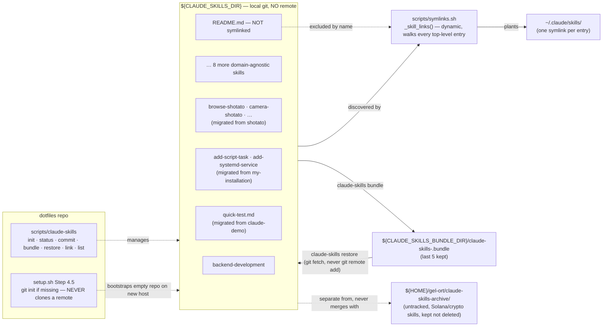

# Claude skills — the remote-less global repo

## Why this exists

Skills used to live inside this repo, at `configurations/claude/skills/`, symlinked into
`~/.claude/skills/` like any other managed config. That broke a hard rule that was never written
down until it was violated: **skills must never be exposed to git remotes, public or private.**
`raxetul/dotfiles` was confirmed to be a **public** GitHub repository, and 11 skills had already
been pushed to it. This doc — and the migration it records — replaces that setup with a
**separate, remote-less local git repository** that this repo only *links into*, never vendors.

The two things that changed and the one thing that didn't:

- **Changed — where skills live.** Not `configurations/claude/skills/` inside `dotfiles` anymore.
  Now `${CLAUDE_SKILLS_DIR}` (default `${HOME}/gel-ort/claude-skills`), a git repo of its own.
- **Changed — how they're backed up.** Not `git push`. `git bundle`, via
  `scripts/claude-skills bundle`, written to `${CLAUDE_SKILLS_BUNDLE_DIR}` (default
  `${HOME}/gel-ort/backups`), retaining the last 5.
- **Unchanged — the taxonomy decisions.** Technology variety inside a skill is still a
  `references/` file, not a new skill (see below). Domain-specific skills (this machine's case:
  Solana/crypto/hackathon) still don't belong in a general-purpose skills store — they stay
  archived, untouched by this migration, at `${HOME}/gel-ort/claude-skills-archive/`.

## Why remote-less, specifically

Versioning skills with git is still valuable — full history, diffs, `git log` on every change to
a skill's guidance. What's not acceptable is a *remote*, because a remote is exactly the mechanism
that leaked 11 skills into a public repo in the first place. So the skills repo is git, deliberately
without a remote:

```sh
git -C "${CLAUDE_SKILLS_DIR}" remote -v   # must always print nothing
```

`scripts/claude-skills status` checks and warns loudly if that ever stops being true. Backups are
`git bundle` files, not a push target — a bundle is a single file that carries full repo history
and can restore a complete clone, with no server, no network call, and no remote left behind (see
"Bundle backup discipline" below for exactly how `restore` avoids leaving one).

## Repo location and layout

```
${CLAUDE_SKILLS_DIR}                    (default: ${HOME}/gel-ort/claude-skills)
├── README.md                           # not a skill — repo-level note, excluded from symlinking
├── SKILL_ROUTER.md                     # flat file, symlinked as-is (like any top-level entry)
├── backend-development/
│   ├── SKILL.md
│   └── references/…
├── brand-design/ · cso/ · frontend-design-guidelines/ · learn/ · logging-patterns/
├── page-load-animations/ · product-review/ · rfc9457-problem-details/ · roast-my-product/
├── browse-shotato/ · camera-shotato/ · design-system-shotato/ · navigation-shotato/
├── preview-shotato/ · storage-shotato/                 # migrated from the shotato project
├── add-script-task/ · add-systemd-service/             # migrated from the my-installation project
└── quick-test.md                                       # migrated from the claude-demo project
```

Every top-level entry is a skill: normally a directory with `SKILL.md` (optionally a `references/`
subtree), occasionally a flat `.md` file (`SKILL_ROUTER.md`, `quick-test.md`). `README.md` is the
one deliberate exception — repo metadata, not a skill, and `scripts/symlinks.sh` skips it by name.

## Symlink flow

`scripts/symlinks.sh` never hardcodes a skill list. A dedicated function, `_skill_links`, walks
every top-level entry currently in `${CLAUDE_SKILLS_DIR}` and emits one
`<abs-path-in-repo>::.claude/skills/<name>` mapping per entry — so dropping a new skill into the
repo is picked up on the next `install`, with no script edit. `_active_links` folds those into the
same install/uninstall/list machinery every other dotfiles symlink uses, plus three skills-scoped
actions that touch nothing else:

```sh
scripts/symlinks.sh skills-install     # (re)plant only ~/.claude/skills/* symlinks
scripts/symlinks.sh skills-uninstall   # remove only those symlinks
scripts/symlinks.sh skills-list        # print only the skills mapping
```

`scripts/claude-skills link` is a thin wrapper over `skills-install`, so day-to-day use never has
to touch `symlinks.sh` directly.



## Bundle backup discipline

`scripts/claude-skills bundle` runs `git bundle create <dir>/claude-skills-<YYYY-MM-DD>.bundle
--all` against `${CLAUDE_SKILLS_DIR}`, then prunes `${CLAUDE_SKILLS_BUNDLE_DIR}` down to the 5
most recent bundles (filenames sort lexically in date order, so this is a plain `sort`, not a
`stat`-based mtime scan). Run it after any batch of skill edits — there's no automatic trigger by
design; a skill change is deliberate enough to deserve a deliberate backup step.

`scripts/claude-skills restore <bundle>` rebuilds the repo from a bundle **without ever adding a
remote**: it runs `git fetch <bundle-file> 'refs/heads/*:refs/heads/*'` — a one-off fetch with an
explicit path argument, which git never records as a named remote — instead of `git clone
<bundle-file> <dest>`, which would leave `origin` pointing at the bundle path. It also refuses to
run against a `${CLAUDE_SKILLS_DIR}` that already has commit history, to avoid silently discarding
work; move the existing repo aside first if a full replace is really intended.

On a brand-new host, `setup.sh` (Step 4.5) and `scripts/claude-skills init` both create the repo
**empty** via `git init` if it doesn't exist yet — never by cloning a remote, because by design
there isn't one. Restoring real content onto a fresh host is a deliberate, manual
`scripts/claude-skills restore <bundle>` from whatever bundle was last backed up, copied over by
hand (USB, scp, whatever out-of-band channel — never a git remote).

## The `references/` pattern

Unaffected by the repo relocation — still the mechanism for covering technology variety inside one
skill instead of spawning a new skill per technology combination:

```
${CLAUDE_SKILLS_DIR}/backend-development/
├── SKILL.md                          # framework-independent depth + routing table
└── references/
    ├── frameworks/
    │   ├── loco.md                   # Rust
    │   ├── spring-boot.md            # Java
    │   └── nestjs.md                 # TypeScript
    ├── databases/
    │   ├── postgresql.md
    │   ├── clickhouse.md
    │   └── _template.md              # blank skeleton for the next database
    └── observability/
        ├── opentelemetry.md
        └── _template.md              # blank skeleton for the next tool
```

| Section | Purpose |
| --- | --- |
| When to read | The concrete project signal that points here (a dependency, a config key, a docker-compose service name) |
| Setup & dependencies | What to install/configure to use it |
| Directory layout | Where its code/config lives in a typical project tree |
| Migration + seed | How this technology's specifics interact with the schema discipline in `SKILL.md`, or an explicit "not applicable" |
| Docker (migrate + seed snippet) | A concrete `migrate → seed → app` compose fragment, or an explicit "not applicable" |
| Pitfalls | Mistakes specific to this technology |

**Adding a new technology never means adding a new skill.** Copy the matching `_template.md`, fill
it in, add a row to `SKILL.md`'s routing table.

## Provenance — where every current skill came from

| Source | Skills | Notes |
| --- | --- | --- |
| `raxetul/dotfiles` (`configurations/claude/skills/`) | `backend-development`, `brand-design`, `cso`, `frontend-design-guidelines`, `learn`, `logging-patterns`, `page-load-animations`, `product-review`, `rfc9457-problem-details`, `roast-my-product`, `SKILL_ROUTER.md` | The original 11 that had leaked to the public remote; moved out, not deleted |
| `~/gel-ort/workspace/shotato` (`.claude/skills/`) | `browse-shotato`, `camera-shotato`, `design-system-shotato`, `navigation-shotato`, `preview-shotato`, `storage-shotato` | Untracked in the shotato repo; an identical duplicate copy under a linked git worktree (`.claude/worktrees/tdd-setup`, plus a stray filesystem copy of that same worktree under `shotato.worktrees/fix-android-nav-bar-insets/`) was removed rather than re-imported |
| `~/gel-ort/github/claude-demo` (`.claude/skills/quick-test.md`) | `quick-test.md` | Was git-tracked; staged for removal there (`git rm -r --cached`), not committed — that repo's own commit is the user's call |
| `~/gel-ort/ops/ansible/my-installation` (`.claude/skills/`) | `add-script-task`, `add-systemd-service` | Same as above: git-tracked, staged for removal, not committed |

No name collisions occurred across these four sources — nothing needed the `<name>-<project>`
disambiguation the migration was prepared to apply.

## Classification table — domain-agnostic vs. archived

Applies to the original 11 (from `~/.claude/skills/` before ANY of it was repo-tracked): every
local skill was classified KEEP (domain-agnostic engineering value — now in the global repo) or
ARCHIVE (Solana/crypto/hackathon-specific — moved to `${HOME}/gel-ort/claude-skills-archive/`, not
deleted). This table is historical record and hasn't changed with the remote-less migration.

| Skill | Decision | Reason |
| --- | --- | --- |
| `brand-design` | KEEP | Brand palette/typography workflow applies to any frontend project, not crypto-specific |
| `cso` | KEEP | Infrastructure security audit (secrets, dependency supply chain, OWASP, STRIDE) is domain-agnostic |
| `frontend-design-guidelines` | KEEP | General web interface design rules (Tailwind/shadcn defaults, but the rules themselves aren't crypto-specific) |
| `learn` | KEEP | Cross-session project-learnings management has no product-domain dependency |
| `page-load-animations` | KEEP | Framer-motion production recipes apply to any React/Next.js frontend |
| `product-review` | KEEP | UX/product-quality review framework is domain-agnostic |
| `roast-my-product` | KEEP | Harsh product critique framework is domain-agnostic |
| `SKILL_ROUTER.md` | KEEP | Router-file pattern itself has engineering value; content trimmed to only route to kept skills |
| 25 Solana/crypto/hackathon-specific skills (`apply-grant`, `build-*`, `launch-token`, `colosseum-copilot`, …) | ARCHIVE | Scoped to one product domain (Solana/crypto); listed in full in this doc's git history prior to this rewrite |

**Totals: 8 kept from that batch (7 skill directories + 1 router file) + 9 migrated from projects
(Provenance table above) = 17 skills currently in the global repo, 25 archived.**

## Known caveat: third-party telemetry preamble

Every one of the original KEEP skills (and most of the ARCHIVE ones) carries a "superstack"
preamble block in its `SKILL.md` that, on first read of the skill, reads
`~/.superstack/config.json` and — unless that config already says `"telemetryTier":"off"` —
sends a `curl` POST (skill name, phase, platform, timestamp) to an external Convex endpoint and
appends to a local `telemetry.jsonl`, *before* the in-skill consent prompt has necessarily been
answered on a fresh machine. This was flagged during the original migration into `dotfiles`; the
explicit decision was to carry skills over **as-is, preamble included**, and that decision carries
forward into this remote-less migration too — nothing about the preamble changed. YOU SHOULD
VERIFY whether this is acceptable under this machine's information-security policy
(vetted-plugins-only, no unreviewed external calls) before relying on these skills in a work
context — this doc records the decision, not a security sign-off.
