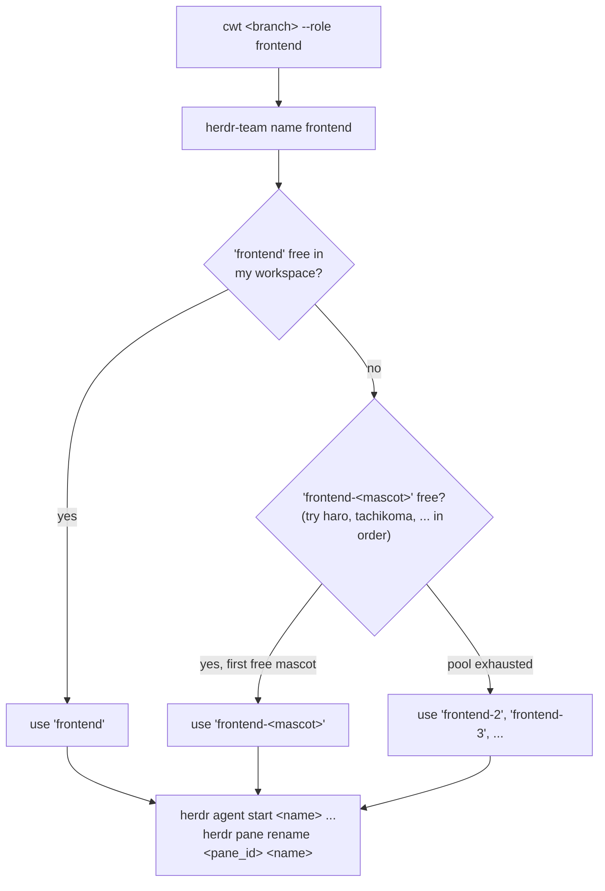
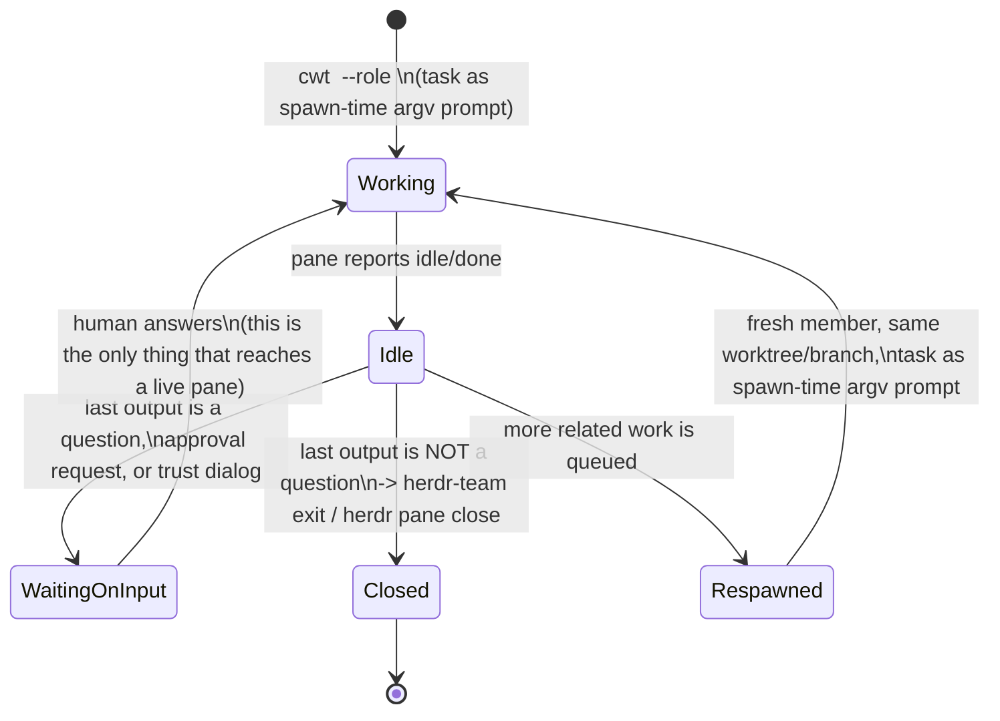
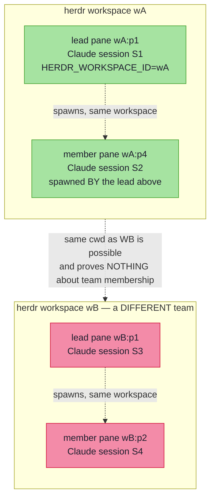

# Parallel Claude sessions with git worktrees

Run several Claude Code sessions at once — each on its own branch, in its
own **worktree** (a second checkout that shares the repo's single `.git`),
arranged by **herdr** as a **team**: the pane you launch from is the team
**leader** on the left, and every new session joins as a team **member**
stacked vertically down the right-hand column. Because each session has its
own working directory, they never clobber each other's edits.

The tool is `scripts/claude-worktree` (on `PATH` as `claude-worktree`, or
the alias **`cwt`**).

## Topology

```mermaid
flowchart TD
    subgraph GIT["one repo · one .git"]
        M["main checkout<br/>dotfiles/ · branch main"]
        W1["../dotfiles.worktrees/feature-x<br/>branch feature-x"]
        W2["../dotfiles.worktrees/review-pr-42<br/>branch review-pr-42"]
    end
    M -. shares .git .-> W1
    M -. shares .git .-> W2

    subgraph TAB["herdr tab — team layout"]
        direction LR
        L["leader<br/>(main · left)"]
        subgraph COL["members · right column (top → bottom)"]
            direction TB
            P1["member: claude<br/>(feature-x)"]
            P2["member: claude<br/>(review-pr-42)"]
            P1 --- P2
        end
        L --- COL
    end
    M --> L
    W1 --> P1
    W2 --> P2
```

- **Team layout** (default): the leader stays on the left; each new member
  joins the vertical stack down the right column. The **first** member splits
  the leader to the **right** (opening the column); each **later** member
  splits **down** off the bottom of that column.
- **`--tab` → new tab**: for when the column gets cramped or the work is
  unrelated — the member gets its own tab instead of joining the column.
- **`--split right|down` → manual override**: a plain split off the *current*
  pane, bypassing the team layout, for when you want to place by hand.

**Focus.** By default the **leader keeps focus** after a member is spawned, so
you go on orchestrating from the left instead of being yanked into each new
session. Use `--focus-member` to jump into the new member, or `--no-focus` to
leave focus on the pane you launched from.

## Commands

| Command | What it does |
| --- | --- |
| `cwt <branch>` | New branch from `HEAD`, worktree at `../<repo>.worktrees/<branch>`, launch Claude as a team member in the right-hand column |
| `cwt <branch> --base <ref>` | Branch off `<ref>` instead of `HEAD` |
| `cwt <branch> --role <name>` | Name the member's herdr agent / pane label after its logical role (`frontend`, `backend`, …) instead of the branch slug — see [Member naming](#member-naming--role--mascot) |
| `cwt <branch> --tab` | Place the session in its own new tab instead of the team column |
| `cwt <branch> --split right\|down` | Override the team layout with a plain split off the current pane |
| `cwt <branch> --focus-member` | Jump into the new member instead of keeping focus on the leader |
| `cwt <branch> --no-focus` | Leave focus on the pane you launched from |
| `cwt <branch> --no-claude` | Just create the worktree; start Claude yourself later |
| `cwt <branch> -- <args>` | Pass extra args through to `claude` |
| `cwt list` | List all worktrees (`git worktree list`) |
| `cwt rm <branch> [--force]` | Remove that worktree (the branch is kept) |

An existing branch is checked out into the worktree; a new name is created
with `-b`. Re-running for the same branch reuses the existing worktree
(idempotent).

## How it's wired

```
cwt feature-x
  │
  ├─ git worktree add -b feature-x  ../<repo>.worktrees/feature-x  HEAD
  │      (plain git — portable, exact path, works without herdr)
  │
  └─ place in the team layout (read `herdr pane layout --pane "$lead_pane"`):
        leader = pane with the smallest x (leftmost) in the LEAD's tab
        right column = panes with x > leader.x ; its bottom = greatest y
        • no right column yet → focus leader,       agent start … --split right
        • column exists       → focus column bottom, agent start … --split down
        then focus the leader again (default) / the member / the origin
      (every agent start is pinned with --workspace "$HERDR_WORKSPACE_ID";
       herdr only PLACES the session; --tab routes it to a fresh tab instead,
       and --split right|down forces a plain split off the current pane)
```

**Workspace anchoring (why members stay in their own project).** herdr's
`--split` and `pane layout --current` resolve against *global focus*, not the
pane you launched from. Spawning a member while focus sits in another project's
workspace would split the member into *that* workspace — the "panes of one
project in another's workspace" leak. The script defeats this by anchoring
every placement to the lead pane's own identity, which herdr exports into each
pane's shell as `HERDR_PANE_ID` / `HERDR_WORKSPACE_ID`: layout is read with
`--pane "$lead_pane"` and each `herdr agent start` is pinned with
`--workspace "$lead_ws"`. A member therefore can never land outside its lead's
workspace, regardless of where focus happens to be at spawn time.

Placement is read from pane **rectangles**, not `pane neighbor` — that command
reports focus-movement targets within the split tree, not spatial adjacency, so
it can't be walked. Reading `x`/`y` from the layout finds the leftmost (leader)
and greatest-`y` right-column (column tail) panes deterministically, from
whichever pane you run `cwt` in. If the layout can't be parsed, it falls back to
a plain split-right (still workspace-pinned) so a member is still placed.

Each member is started under a **unique herdr agent name** — by default its
**role** (`--role frontend` → agent name `frontend`), falling back to the
branch slug with a one-line warning if `--role` is omitted — because herdr
rejects a duplicate name in the workspace. See
[Member naming](#member-naming--role--mascot) for how the name is picked, and
`herdr pane rename` re-labels the pane to match so the border reads the same
name. Claude is still detected as a `claude` agent at runtime via its
integration hooks regardless of that label.

Worktrees are plain git, so `--no-claude` (or running outside herdr) still
leaves a usable checkout — the script prints the `cd … && claude` line.

## Member naming — role + mascot

A member's herdr agent name (and pane label) is its **logical role**, not the
branch slug — the slug still keys the worktree *path*
(`../<repo>.worktrees/<branch>`), it just stopped being the *name*. Free text,
kebab-case, whatever function fits the task:

| Role | Example use |
| --- | --- |
| `frontend` | UI / client-side work |
| `backend` | API / server-side work |
| `embedded` | firmware / MCU work |
| `documentor` | writing or syncing docs |
| `tooling` | scripts, CI, dev tooling — e.g. pane `w3:p4`, renamed to `tooling` |
| `infra` | deployment / infrastructure |
| `test` | test-writing or test-fixing |
| `requirements` | requirements authoring |
| `review` | reviewing someone else's change |

A **second** member doing the same role can't reuse that name (herdr agent
names are unique per workspace), so it gets a mascot suffix instead — drawn
in order from an anime helper-robot/android pool:

```
haro, tachikoma, sumomo, canti, pino, nono, arale, metabee, rokusho,
doraemon, ropponmatsu, logicoma, chachamaru, dorothy, pinoko, atom
```

The pool lives as a single array (`team_mascots`) in `scripts/herdr-team` —
edit it there to add or reorder mascots. Once the pool is exhausted, naming
falls back to a numeric suffix (`<role>-2`, `<role>-3`, …). The existing
first member of a role is **never** retroactively renamed when a second one
arrives.

Allocation is decided in exactly **one** place — `herdr-team name <role>` —
scoped to `${HERDR_WORKSPACE_ID}` (own workspace only, per
[Team scoping](#team-scoping--cwd-is-never-identity)). `claude-worktree
--role <name>` calls it rather than re-deriving the logic itself, so the two
scripts can never disagree on the next free name:



Omitting `--role` still works — `claude-worktree` falls back to the branch
slug — but it prints a one-line warning rather than silently reusing the old
behavior, so a forgotten `--role` is never invisible.

## Cleanup

```sh
cwt rm feature-x          # git worktree remove  (branch kept)
git branch -d feature-x   # delete the branch too, once merged
```

When the Claude process in a pane/tab exits, close that pane/tab in herdr
as usual. `cwt rm` only removes the worktree checkout, never the branch or
its commits.

## Member lifecycle

A member's pane only ever ends its life two ways: closed, or respawned for
the next task. There is no third path where a finished member sits idle
and receives a follow-up message in place — the channel that would need
(`agent send` / `pane send-keys` reaching the running TUI) doesn't work.



Why respawn instead of handing the idle pane its next task in place:

| Channel | Reaches a running/idle member? | Note |
| --- | --- | --- |
| `herdr agent send` / `herdr pane run` | ❌ | writes into the prompt box, Enter never delivered |
| `herdr pane send-keys` (Enter, ctrl+u, escape, backspace, ctrl+c) | ❌ | accepted by herdr, no effect on the TUI — verified 2026-08-04, Claude Code v2.1.220 + herdr; likely a kitty keyboard protocol encoding mismatch |
| close + spawn fresh, task as spawn-time argv prompt | ✅ | only reliable channel for continuation |

Two corollaries this puts on the lead:

- **Close on sight.** A member reporting idle/done with a non-question last
  output is closed immediately (`herdr-team exit <target>`) — never left
  parked waiting for a task that can't reach it anyway.
- **Trust dialogs are the one real exception.** A pane stuck on "do you
  trust this folder" is *not* idle-to-close — it's blocked on input, and
  since that input can't be sent programmatically either, a human has to
  click it. Check `hasTrustDialogAccepted` for the target cwd in
  `~/.claude.json` before spawning to avoid the lock in the first place.

## Team scoping — cwd is never identity

Two independent leads can have the **exact same project** checked out in
**two different herdr workspaces** at once — this has happened for real: two
separate workspaces both had the same project directory open simultaneously.
They are two unrelated leads, never teammates, even though the directory
matches. So "same project" / "same cwd" is never how membership is decided.

What actually defines a team:



- A **lead's identity** is the triple `(HERDR_WORKSPACE_ID, HERDR_PANE_ID,
  Claude session id)`.
- A **team** = one herdr workspace + the panes that lead itself spawned
  inside it. Nothing outside that workspace is a teammate, no matter what
  directory it has open.
- **`scripts/herdr-team`** is the only sanctioned way to list/target
  members — every subcommand filters `herdr agent list` down to
  `workspace_id == $HERDR_WORKSPACE_ID` and refuses to act on anything else:

  | Command | Does |
  | --- | --- |
  | `herdr-team list` | Table of panes in **my own** workspace: pane id, agent name, status, Claude session id, cwd. |
  | `herdr-team send <target> <text>` | `herdr agent send`, but rejects `<target>` if it's not in my workspace. |
  | `herdr-team read <target> [flags]` | `herdr agent read`, same workspace gate. |
  | `herdr-team wait <target> [flags]` | `herdr agent wait`, same workspace gate. |
  | `herdr-team spawn <branch> [flags]` | Delegates straight to `scripts/claude-worktree` (which already anchors placement to my own workspace). |
  | `herdr-team name <role>` | Prints the next free agent name for `<role>` in **my own** workspace — see [Member naming](#member-naming--role--mascot). |
  | `herdr-team exit <target>` | Resolves `<target>` to a pane and closes it — only if it's mine. |

  `<target>` can be a workspace-prefixed id (`w3:p4`) or a bare agent name;
  bare names are resolved and workspace-checked before anything runs.

## Enforcement — herdr-workspace-guard.sh

The `herdr-workspace-guard.sh` PreToolUse hook (see
`configurations/claude/hooks/herdr-workspace-guard.sh`, wired in
`configurations/claude/settings.json`) makes the rule above unbypassable —
even a hand-rolled `herdr …` call gets denied, not just calls through
`herdr-team`:

| Command (run from workspace `w3`) | Result |
| --- | --- |
| `herdr agent send w3:p4 "go"` | ✅ allow — target is in my own workspace |
| `herdr agent send w1:p1 "go"` | ⛔ deny — target belongs to workspace `w1` |
| `herdr agent send some-bare-name "go"` | ⛔ deny if that name resolves outside `w3`; ✅ allow if it resolves inside `w3` |
| `herdr agent start foo --workspace w3 -- claude` | ✅ allow — pinned to my own workspace |
| `herdr agent start foo -- claude` | ⛔ deny — no `--workspace`/`--tab`, would land wherever focus is |
| `herdr agent start foo --workspace w1 -- claude` | ⛔ deny — pinned to a workspace that isn't mine |
| `herdr pane split --pane w3:p4 --direction right` | ✅ allow — explicit, own pane |
| `herdr pane split --direction right` (no pane given) | ⛔ deny — resolves against global focus, not necessarily mine |
| `herdr pane split --current --direction right` | ⛔ deny — `--current` is *also* global focus, not "my pane" |
| `herdr pane move w3:p4 --new-workspace` | ⛔ deny — always; ejects the pane from its workspace outright |
| `herdr tab create --workspace w3` | ✅ allow |
| `herdr tab create` (no `--workspace`) | ⛔ deny |
| `herdr pane list`, `herdr pane layout`, `herdr agent list` | ✅ always allowed — read-only, can't leak anything into another workspace |
| `git commit -m "feat: herdr agent start docs"` | ✅ allowed — not a real invocation, just text |
| `... -- claude "please run herdr agent start"` | ✅ allowed — that's the member's prompt, not a command |

Outside a herdr-managed pane (no `HERDR_ENV`), or without `herdr`/`jq` on
`PATH`, the hook exits immediately and polices nothing — it must never be
the thing that locks up a shell.

## Notes / assumptions

- **herdr must be running** for automatic placement; otherwise the worktree
  is still created and the launch command is printed.
- **The team lives in one tab.** Leader + members share the current tab; the
  members are the right-hand column. Use `--tab` to break a session out into
  its own tab when the column gets crowded.
- Team placement parses `herdr pane layout --pane "$lead_pane"` at
  `.result.layout.panes[].{pane_id,rect}` to find the leader (min `x`) and the
  right column's bottom (max `y` among `x > leader.x`). If a herdr update changes
  that shape, adjust the two `jq` filters in the `team` branch of
  `scripts/claude-worktree`; on any parse failure the script falls back to a
  plain split-right so a member is still placed.
- **Agent names must be unique per workspace** — the script names each member
  after its `--role` (falling back to the branch slug if `--role` is
  omitted), with `herdr-team name <role>` resolving collisions via the mascot
  pool per [Member naming](#member-naming--role--mascot). Re-running `cwt`
  for a branch that already has a live member under that exact name will
  still be rejected by herdr with `agent_name_taken` — pass a different
  `--role` (or none, to fall back to the branch slug) to work around it.
- The new-tab path assumes `herdr tab create` returns a tab id (JSON by
  default — see [herdr CLI contract](#herdr-cli-contract) below) under
  `.result.tab.tab_id` (falls back to herdr's default placement if not).
  Adjust the one `jq` line in `scripts/claude-worktree` if a herdr update
  changes that shape.
- **Pane relabeling assumes `herdr agent start` (JSON by default) returns
  the spawned pane id** under `.result.agent.pane_id`, and that `herdr pane
  rename <pane_id> <name>` exists. If a herdr update changes either shape,
  `rename_started_pane()` in `scripts/claude-worktree` warns and skips the
  rename rather than failing the spawn — the agent name itself is unaffected
  either way, only the pane's visual label.

## herdr CLI contract

Installed version is **herdr 0.7.1** (`herdr --version`). Every subcommand
under `herdr agent …` / `herdr tab …` / `herdr pane …` prints **JSON by
default** — there is no `--json` flag on `agent start`, `tab create`, or any
of the placement commands `scripts/claude-worktree` / `scripts/herdr-team`
use. (`herdr agent explain` is the one exception that *does* take an
optional `--json`.) A prior version of this script passed `--json` to
`agent start` / `tab create` anyway; 0.7.1 doesn't recognize it, so the
command errored and every spawn through `claude-worktree` (and therefore
`herdr-team spawn`) failed outright.

**Before adding any herdr flag to a script, verify it exists**: run
`herdr <command> --help` (or `-h`) and check the printed usage line — never
assume a flag by analogy with another subcommand. The known, verified
subcommand/flag set the two scripts rely on:

| Command | Verified flags |
| --- | --- |
| `herdr agent start <name>` | `--cwd PATH`, `--workspace ID`, `--tab ID`, `--split right\|down`, `--env KEY=VALUE`, `--focus`\|`--no-focus`, `-- <argv...>` |
| `herdr agent list` | (none) |
| `herdr agent get <target>` | (none) |
| `herdr agent read <target>` | `--source visible\|recent\|recent-unwrapped`, `--lines N`, `--format text\|ansi`, `--ansi` |
| `herdr agent send <target> <text>` | (none) |
| `herdr agent rename <target> <name>` | `--clear` |
| `herdr agent focus <target>` | (none) |
| `herdr agent wait <target>` | `--status idle\|working\|blocked\|unknown`, `--timeout MS` |
| `herdr pane list` | `--workspace <workspace_id>` |
| `herdr pane get <pane_id>` | (none) |
| `herdr pane layout` | `--pane ID`\|`--current` |
| `herdr pane rename <pane_id> <name>` | `--clear` |
| `herdr pane close <pane_id>` | (none) |
| `herdr pane split` | `<pane_id>`\|`--pane ID`\|`--current`, `--direction right\|down`, `--ratio FLOAT`, `--cwd PATH`, `--env KEY=VALUE`, `--focus`\|`--no-focus` |
| `herdr pane run <pane_id> <command>` | (none) |
| `herdr pane send-keys <pane_id> <key...>` | (none) |
| `herdr tab create` | `--workspace <workspace_id>`, `--cwd PATH`, `--label TEXT`, `--env KEY=VALUE`, `--focus`\|`--no-focus` |

This table is a convenience cache of what's been checked, not a substitute
for re-running `--help` after a herdr upgrade — `herdr channel set` can move
to a newer minor version whose flags have shifted.
