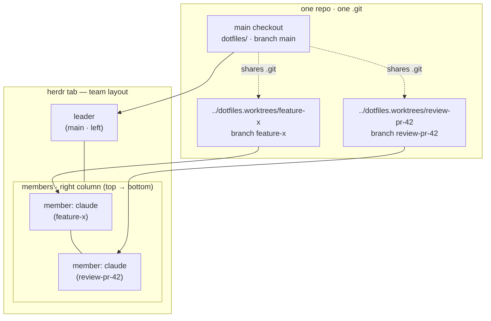
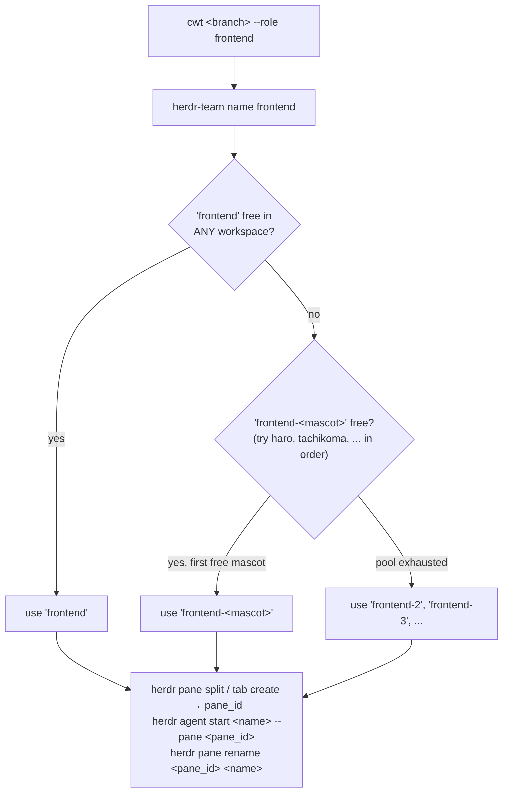
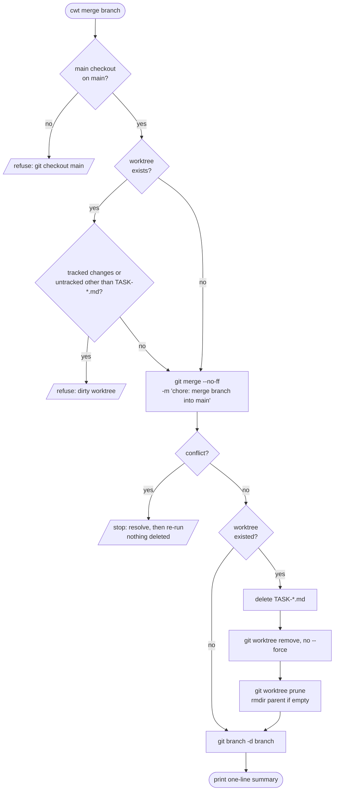
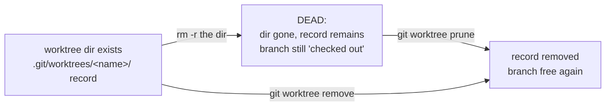
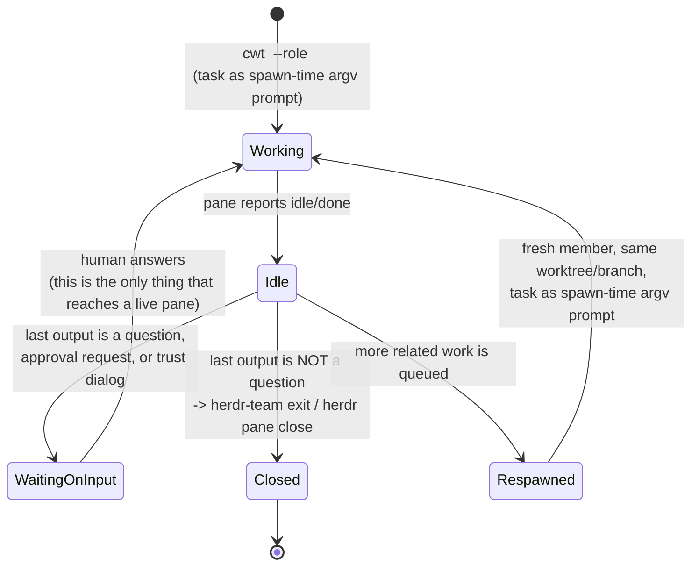
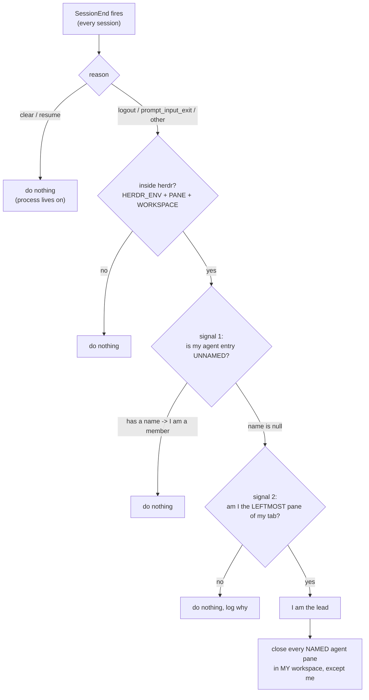
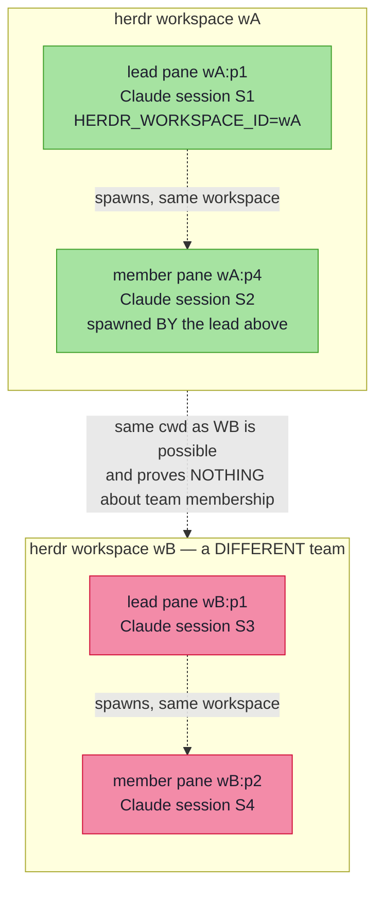

# Parallel Claude sessions with git worktrees

You can run several Claude Code sessions at the same time. Each session has its own branch and its own **worktree**.
A worktree is a second checkout that shares the single `.git` of the repo. **herdr** puts the sessions in a **team**.
The pane you launch from is the team **leader** on the left. Each new session joins as a team **member**.
The members are stacked vertically in the right-hand column. Each session has its own working directory.
Because of this, the sessions do not overwrite the edits of each other.

The tool is `scripts/claude-worktree`. It is on `PATH` as `claude-worktree`, or as the alias **`cwt`**.

## Topology


```mermaid
flowchart TD
    subgraph GIT["one repo · one .git"]
        M["main checkout<br/>dotfiles/ · branch main"]
        W1["../dotfiles.worktrees/feature-x<br/>branch feature-x"]
        W2["../dotfiles.worktrees/review-pr-42<br/>branch review-pr-42"]
    end
    M -.->|"shares .git"| W1
    M -.->|"shares .git"| W2

    subgraph TAB["herdr tab — team layout"]
        direction LR
        L["leader<br/>(main · left)"]
        subgraph COL["members · right column (top → bottom)"]
            direction TB
            P1["member: claude<br/>(feature-x)"]
            P2["member: claude<br/>(review-pr-42)"]
            P1 --- P2
        end
        L --- COL
    end
    M --> L
    W1 --> P1
    W2 --> P2
```

- **Team layout** (default): The leader stays on the left. Each new member joins the vertical stack in the right
  column. The **first** member splits the leader to the **right**. This opens the column. Each **later** member splits
  **down** from the bottom of that column.
- **`--tab` → new tab**: The member gets its own tab instead of a place in the column. The script creates the tab
  inside the workspace of the lead. The tab is pinned, in the same way as a spawn. Two cases make this the **default**
  and not a fallback:
  - The deliverable of the member is a **dependency library** that another member uses. Examples are a shared SDK,
    a HAL, or an internal npm/cargo package. These members run for a long time and other members wait for the
    artifact. They do not belong in the column.
  - The **user asked for a member in a tab**. This choice is sticky. Each later member also goes in a tab until the
    user says otherwise.

  In other cases, use `--tab` when the column is too small or the work is unrelated.
  The tab label is the **branch** slug. The pane and agent keep their **role** name.
- **`--split right|down` → manual override**: This option makes a plain split from the *current* pane. It does not
  use the team layout. Use it when you want to place the pane by hand.

**Focus.** By default, the **leader keeps focus** after the script spawns a member. You continue to orchestrate from
the left. Herdr does not move you into each new session. Use `--focus-member` to go to the new member.
Use `--no-focus` to leave focus on the pane you launched from.

## Commands

| Command | What it does |
| --- | --- |
| `cwt <branch>` | New branch from `HEAD`, worktree at `../<repo>.worktrees/<branch>`, launch Claude as a team member in the right-hand column |
| `cwt <branch> --base <ref>` | Branch off `<ref>` instead of `HEAD` |
| `cwt <branch> --role <name>` | Name the member's herdr agent / pane label after its logical role (`frontend`, `backend`, …) instead of the branch slug — see [Member naming](#member-naming--role--mascot) |
| `cwt <branch> --tab` | Place the session in its own new tab instead of the team column |
| `cwt <branch> --split right\|down` | Override the team layout with a plain split off the current pane |
| `cwt <branch> --focus-member` | Jump into the new member instead of keeping focus on the leader |
| `cwt <branch> --no-focus` | Leave focus on the pane you launched from |
| `cwt <branch> --no-claude` | Just create the worktree; start Claude yourself later |
| `cwt <branch> -- <args>` | Pass extra args through to `claude` |
| `cwt list` | List all worktrees (`git worktree list`) |
| `cwt rm <branch> [--force]` | Remove that worktree (the branch is kept) |
| `cwt merge <branch>` | From the main checkout on `main`: `--no-ff` merge, then remove the worktree folder, its empty parent dir and the branch — see [Merge](#merge--cwt-merge-branch) |

If the branch exists, the script checks it out into the worktree. If the name is new, the script creates the branch
with `-b`. If you run the command again for the same branch, the script reuses the existing worktree (idempotent).

## How it's wired

```
cwt feature-x
  │
  ├─ git worktree add -b feature-x  ../<repo>.worktrees/feature-x  HEAD
  │      (plain git — portable, exact path, works without herdr)
  │
  └─ place in the team layout (read `herdr pane layout --pane "$lead_pane"`):
        leader = pane with the smallest x (leftmost) in the LEAD's tab
        right column = panes with x > leader.x ; its bottom = greatest y
        • no right column yet → pane split --pane <leader> --direction right
        • column exists       → pane split --pane <column bottom> --direction down
        then: agent start <label> --pane <the new pane id> -- claude
        then focus the leader again (default) / the member / the origin
      (every pane is created --no-focus and anchored with an explicit --pane;
       herdr only PLACES the session; --tab routes it to a fresh tab instead,
       and --split right|down forces a plain split off the LEAD's pane)
```

**Two steps since herdr 0.9.0.** In the past, `agent start` created the pane itself (`--cwd` + `--split` +
`--workspace`). In 0.9.0 it creates nothing. It attaches a named agent to an **existing** shell pane. You select
the pane with `--pane`:

| | 0.7.1 | 0.9.0 |
| --- | --- | --- |
| create the pane | — (`agent start --split`) | `pane split --pane <anchor> --direction <d> --cwd <path> --no-focus` → `.result.pane.pane_id` |
| in a new tab | — (`agent start --tab`) | `tab create --workspace <ws> --cwd <path>` → `.result.root_pane.pane_id` (the tab is born with one pane) |
| attach the agent | `agent start <n> --cwd P --workspace W --split right -- claude <args>` | `agent start <n> --kind claude --pane <id> -- <args>` |

If you give a 0.7.1 flag to a 0.9.0 client, the command fails at argument parsing, before it touches the socket.
The error is `unknown option: --cwd`. This is a *different* failure from the stale-server `protocol_mismatch` in
`doc/herdr-upgrade.md`. The two errors look similar, but they have different fixes.

🔴 **Two more 0.9.0 traps on `agent start`. In both cases the pane stays at a bare shell prompt with no agent in it:**

- `--kind <agent>` is now **required**. Without it, herdr exits with `missing required --kind`.
- Everything after `--` is the **argv of the agent, not a command line**. herdr supplies the binary from `--kind`.
  If you write `-- claude --model sonnet`, as in 0.7.1, herdr runs `claude claude --model sonnet`.

Neither error is visible if you discard stderr. The spawn "succeeds". The pane exists in the right place with the
right cwd, but nothing runs in it. For this reason, `attach_member()` captures the stderr of herdr and prints it with
the warning. It does not discard it.

**Workspace anchoring (why members stay in their own project).** The `--split` and `pane layout --current` options of
herdr use *global focus*. They do not use the pane you launched from. Assume that focus is in the workspace of another
project when you spawn a member. Then herdr splits the member into *that* workspace. This is the "panes of one project
in another's workspace" leak. The script prevents this. It anchors each placement to the identity of the lead pane.
herdr exports this identity into the shell of each pane as `HERDR_PANE_ID` / `HERDR_WORKSPACE_ID`. The script reads the
layout with `--pane "$lead_pane"`. It anchors each `herdr pane split` with an explicit `--pane`. It pins
`herdr tab create` with `--workspace "$lead_ws"`. A member cannot land outside the workspace of its lead, wherever
focus is at spawn time.

In 0.9.0 the anchoring is *stronger*. A pane id includes its workspace (`w3:p4`). Because of this,
`agent start … --pane w3:p4` can attach only inside `w3`. There is no unpinned form of `agent start` that uses global
focus. The pane must exist first, and the command that creates it carries the workspace.

The script reads the placement from the pane **rectangles**. It does not use `pane neighbor`. That command reports
focus-movement targets in the split tree. It does not report spatial adjacency, so you cannot walk it. The script
reads `x` and `y` from the layout. It finds the leftmost pane (the leader) and the right-column pane with the
greatest `y` (the column tail). This is deterministic from any pane where you run `cwt`. If the script cannot parse
the layout, it falls back to a plain split-right (still workspace-pinned). A member is then still placed.

The script starts each member under a **unique herdr agent name**. By default the name is the **role**
(`--role frontend` → agent name `frontend`). If you omit `--role`, the script uses the branch slug and prints a
one-line warning. A unique name is necessary because herdr rejects a duplicate name in the workspace. See
[Member naming](#member-naming--role--mascot) for the way the script picks the name. `herdr pane rename` gives the
pane the same label, so the border shows the same name. At runtime, Claude is still detected as a `claude` agent
through its integration hooks, regardless of that label.

Worktrees are plain git. If you use `--no-claude` (or run outside herdr), you still get a usable checkout.
The script prints the `cd … && claude` line.

## Member naming — role + mascot

The herdr agent name (and pane label) of a member is its **logical role**. It is not the branch slug. The slug still
keys the worktree *path* (`../<repo>.worktrees/<branch>`), but it is no longer the *name*. The role is free text in
kebab-case. Use the function that fits the task:

| Role | Example use |
| --- | --- |
| `frontend` | UI / client-side work |
| `backend` | API / server-side work |
| `embedded` | firmware / MCU work |
| `documentor` | writing or syncing docs |
| `tooling` | scripts, CI, dev tooling — e.g. pane `w3:p4`, renamed to `tooling` |
| `infra` | deployment / infrastructure |
| `test` | test-writing or test-fixing |
| `requirements` | requirements authoring |
| `review` | reviewing someone else's change |

A **second** member with the same role cannot use that name again. herdr agent names are unique **globally**, in every
workspace and not only in mine. The second member gets a mascot suffix. The script takes the suffix in order from a
pool of anime helper-robot/android names:

```
haro, tachikoma, sumomo, canti, pino, nono, arale, metabee, rokusho,
doraemon, ropponmatsu, logicoma, chachamaru, dorothy, pinoko, atom
```

The pool is one array (`team_mascots`) in `scripts/herdr-team`. To add or reorder mascots, edit it there. When the
pool is empty, the naming falls back to a numeric suffix (`<role>-2`, `<role>-3`, …). The script **never** renames
the existing first member of a role when a second one arrives.

One place decides the allocation: `herdr-team name <role>`. It scans **all** workspaces, not only
`${HERDR_WORKSPACE_ID}`. herdr agent names are globally unique. A name that another lead uses in its workspace is as
taken as a name in mine. If a spawn ignores this, it fails with `agent_name_taken`. This happened for real:
`documentor` was already live in workspace `w9`. This is the one place where the naming scope is different from
[Team scoping](#team-scoping--cwd-is-never-identity). There, each other `herdr-team` subcommand stays filtered to my
own workspace. `claude-worktree --role <name>` calls `herdr-team name`. It does not derive the logic again. Because of
this, the two scripts always agree on the next free name:


```mermaid
flowchart TD
    A["cwt &lt;branch&gt; --role frontend"] --> B["herdr-team name frontend"]
    B --> C{"'frontend' free in<br/>ANY workspace?"}
    C -- yes --> D["use 'frontend'"]
    C -- no --> E{"'frontend-&lt;mascot&gt;' free?<br/>(try haro, tachikoma, ... in order)"}
    E -- "yes, first free mascot" --> F["use 'frontend-&lt;mascot&gt;'"]
    E -- "pool exhausted" --> G["use 'frontend-2', 'frontend-3', ..."]
    D --> H["herdr pane split / tab create → pane_id<br/>herdr agent start &lt;name&gt; --pane &lt;pane_id&gt;<br/>herdr pane rename &lt;pane_id&gt; &lt;name&gt;"]
    F --> H
    G --> H
```

If you omit `--role`, the command still works. `claude-worktree` falls back to the branch slug. It prints a one-line
warning and does not silently use the old behavior. A forgotten `--role` is always visible.

## Merge — `cwt merge <branch>`

A merge is not finished until the worktree folder is gone from disk. `merge` does both in one command. Run it from the
main checkout. The main checkout must be on `main`. If a step fails, the whole command aborts. Untracked `TASK-*.md`
spawn briefs do not count as dirt. The command deletes them with the worktree.


```mermaid
flowchart TD
    A([cwt merge branch]) --> B{main checkout<br/>on main?}
    B -- no --> X1[/refuse: git checkout main/]
    B -- yes --> C{worktree<br/>exists?}
    C -- yes --> D{tracked changes or<br/>untracked other than TASK-*.md?}
    D -- yes --> X2[/refuse: dirty worktree/]
    D -- no --> E
    C -- no --> E[git merge --no-ff<br/>-m 'chore: merge branch into main']
    E --> F{conflict?}
    F -- yes --> X3[/stop: resolve, then re-run<br/>nothing deleted/]
    F -- no --> G{worktree<br/>existed?}
    G -- no --> K
    G -- yes --> H[delete TASK-*.md]
    H --> I[git worktree remove, no --force]
    I --> J[git worktree prune<br/>rmdir parent if empty]
    J --> K[git branch -d branch]
    K --> L([print one-line summary])
```

If a conflict stops the merge, resolve it by hand and commit the merge. Then run the same command again. The merge is
now a no-op, and the cleanup steps run.

## Cleanup

```sh
cwt rm feature-x          # git worktree remove  (branch kept)
git branch -d feature-x   # delete the branch too, once merged
cwt merge feature-x       # or: merge into main AND remove worktree + branch
```

When the Claude process in a pane/tab exits, close that pane/tab in herdr as usual. `cwt rm` removes only the worktree
checkout. It never removes the branch or its commits.

### Dead worktree records — `/worktree-autoprune`

Assume you delete a worktree directory by hand (`rm -r`, a wiped `*.worktrees/`, a disk cleanup). Git keeps its admin
record under `.git/worktrees/<name>/`. This record is not cosmetic. It keeps the branch marked *checked out
elsewhere*. You can then neither check out nor delete the branch. The ghost stays in `git worktree list` for ever, and
git flags it `prunable`.


```mermaid
flowchart LR
    A["worktree dir exists<br/>.git/worktrees/&lt;name&gt;/ record"] -->|rm -r the dir| B["DEAD:<br/>dir gone, record remains<br/>branch still 'checked out'"]
    B -->|git worktree prune| C["record removed<br/>branch free again"]
    A -->|git worktree remove| C
```

`configurations/claude/hooks/git-worktree-autoprune.sh` does this prune automatically. You wire it **per project**.
It is not global. The script is a shared machine resource. `scripts/symlinks.sh` symlinks it to
`${HOME}/.claude/hooks/`. A project opts in when you run `/worktree-autoprune`. That command merges two hook entries
into the `./.claude/settings.json` of that project:

| Hook event | When it fires |
| --- | --- |
| `SessionStart` | every time a Claude session opens in that project |
| `WorktreeRemove` | the moment a worktree is removed |

The next table shows what the hook touches and what it does not touch:

| Situation | Action |
| --- | --- |
| Record whose directory is gone (`prunable`) | 🟢 pruned |
| Worktree directory still present, clean | 🔴 untouched |
| Worktree directory still present, **dirty / uncommitted** | 🔴 untouched |
| A branch, a commit, a stash | 🔴 never touched |
| `<repo>.worktrees/` parent left empty afterwards | 🟢 `rmdir` (only if empty) |

The last row is the safety argument. **A worktree with uncommitted work is not dead**, because its directory is still
there. The prune cannot reach it. The hook removes only the bookkeeping for a directory that no longer exists.

`DRY_RUN=1` makes the hook report and not act. The hook always exits `0`. A cleanup step then cannot stop a session
from starting:

```sh
echo "{\"cwd\":\"$PWD\"}" | DRY_RUN=1 bash "${HOME}/.claude/hooks/git-worktree-autoprune.sh"
```

The hook reads `git worktree prune --dry-run --verbose` from **stderr**. Git writes the verbose list there, not to
stdout.

## Member lifecycle

The pane of a member ends in only two ways. Either you close it, or you respawn it for the next task. A finished member
cannot stay idle and receive a follow-up message in place. The channel for this does not work. These commands do not
reach the running TUI: `agent send` and `pane send-keys`.


```mermaid
stateDiagram-v2
    [*] --> Working: cwt <branch> --role <name><br/>(task as spawn-time argv prompt)
    Working --> Idle: pane reports idle/done
    Idle --> WaitingOnInput: last output is a question,<br/>approval request, or trust dialog
    WaitingOnInput --> Working: human answers<br/>(this is the only thing that reaches a live pane)
    Idle --> Closed: last output is NOT a question<br/>-> herdr-team exit / herdr pane close
    Idle --> Respawned: more related work is queued
    Respawned --> Working: fresh member, same worktree/branch,<br/>task as spawn-time argv prompt
    Closed --> [*]
```

The next table shows why you respawn and do not give the idle pane its next task in place:

| Channel | Reaches a running/idle member? | Note |
| --- | --- | --- |
| `herdr agent send` / `herdr pane run` | ❌ | writes into the prompt box, Enter never delivered |
| `herdr pane send-keys` (Enter, ctrl+u, escape, backspace, ctrl+c) | ❌ | accepted by herdr, no effect on the TUI — verified 2026-08-04, Claude Code v2.1.220 + herdr; likely a kitty keyboard protocol encoding mismatch |
| close + spawn fresh, task as spawn-time argv prompt | ✅ | only reliable channel for continuation |

This gives the lead two rules:

- **Close on sight.** If a member reports idle/done and its last output is not a question, close it at once
  (`herdr-team exit <target>`). Do not leave it parked. A task cannot reach it.
- **Trust dialogs are the one real exception.** A pane that waits at "do you trust this folder" is *not* idle and
  you must not close it. It is blocked on input. You cannot send that input by program, so a human must click it.
  To prevent the lock, check `hasTrustDialogAccepted` for the target cwd in `~/.claude.json` before you spawn.

## Lead exit tears the team down first

The members of a lead are ordinary Claude sessions in their own panes. herdr has **no parent/child link between
panes**. The team exists only as geometry (leader left, members right). In the past, when the session of the lead
ended, its pane closed and the members stayed. They were live Claude processes that nobody orchestrated, and they
held workspace layout.

`configurations/claude/hooks/herdr-team-teardown.sh` closes the members first. It is a Claude Code **`SessionEnd`**
hook. It is wired in `configurations/claude/settings.json`. `scripts/symlinks.sh` symlinks it to `~/.claude/hooks/`.

### The lead check is the whole design

The hook fires in **every** Claude session, members included. The costly failure is not "a member stays open". The
costly failure is that a *member* decides it is the lead. It then closes its lead and its siblings. For this reason,
two **independent** signals must both agree:


```mermaid
flowchart TD
    A["SessionEnd fires<br/>(every session)"] --> R{"reason"}
    R -->|clear / resume| STOP1["do nothing<br/>(process lives on)"]
    R -->|logout / prompt_input_exit / other| E{"inside herdr?<br/>HERDR_ENV + PANE + WORKSPACE"}
    E -->|no| STOP2["do nothing"]
    E -->|yes| S1{"signal 1:<br/>is my agent entry UNNAMED?"}
    S1 -->|"has a name -> I am a member"| STOP3["do nothing"]
    S1 -->|"name is null"| S2{"signal 2:<br/>am I the LEFTMOST pane of my tab?"}
    S2 -->|no| STOP4["do nothing, log why"]
    S2 -->|yes| M["I am the lead"]
    M --> C["close every NAMED agent pane<br/>in MY workspace, except me"]
```

| Signal | Lead | Member | Why it discriminates |
| --- | --- | --- | --- |
| `.name` in `herdr agent list` | `null` | `<role>` | only `agent start <label>` sets a name |
| Pane geometry | leftmost (min `rect.x`) | `x > leader.x` | how `claude-worktree` finds the leader |

If either signal fails, the hook does **nothing**. The hook fails safe. It leaves panes open and never closes the
pane of someone else. The redundancy is real. If you disable signal 1, signal 2 still stops a member that exits.

### What counts as a member

A member is an agent in **my** workspace, with a pane id that is not mine, **and with a name**.

| Pane | Torn down? | Why |
| --- | --- | --- |
| Member spawned by `claude-worktree` / `herdr-team spawn` | ✅ | named agent in my workspace |
| A pane a human opened and ran `claude` in | ❌ | no agent name — not a spawned member |
| Plain shell pane | ❌ | never appears in `herdr agent list` at all |
| Named member in **another** workspace | ❌ | workspace-scoped, then re-checked against the `<ws>:` id prefix |

### SessionEnd reasons

The enum of Claude Code is `clear | resume | logout | prompt_input_exit | other`.

| Reason | Process going away? | Teardown |
| --- | --- | --- |
| `clear` (`/clear`) | no | ❌ skipped |
| `resume` | no | ❌ skipped |
| `logout` | yes | ✅ |
| `prompt_input_exit` | yes | ✅ |
| `other` | yes | ✅ |

### Knobs

| Setting | Effect |
| --- | --- |
| `HERDR_TEAM_TEARDOWN=all` | close every member (**default**) |
| `HERDR_TEAM_TEARDOWN=idle` | keep members whose status is `working` |
| `HERDR_TEAM_TEARDOWN=off` | do nothing |
| `DRY_RUN=1` | log the decisions, close nothing |

Each run appends to `${XDG_STATE_HOME:-~/.local/state}/dotfiles/herdr-team-teardown.log`. This includes the skips and
their reasons. The hook **always exits 0**. A cleanup step must never be the reason that a session cannot quit.

### Tests

`configurations/claude/hooks/tests/herdr-team-teardown.test.sh` stubs `herdr` (fixture `agent list` / `pane layout`,
recorded `pane close`). It asserts 13 cases. The lead tears down on each exit reason. The `idle` mode spares a working
member. The hook closes **nothing** in these cases: `clear`/`resume`, a member that exits, a non-leftmost unnamed pane,
a member of another workspace, an unnamed sibling, or a session outside herdr.

## Team scoping — cwd is never identity

Two independent leads can have the **exact same project** checked out in **two different herdr workspaces** at the
same time. This has happened for real: two separate workspaces had the same project directory open together. They are
two unrelated leads. They are never teammates, even when the directory is the same. For this reason, "same project" or
"same cwd" never decides membership.

This is what defines a team:


```mermaid
flowchart TD
    subgraph WA["herdr workspace wA"]
        direction TB
        LA["lead pane wA:p1<br/>Claude session S1<br/>HERDR_WORKSPACE_ID=wA"]
        MA["member pane wA:p4<br/>Claude session S2<br/>spawned BY the lead above"]
        LA -. "spawns, same workspace" .-> MA
    end

    subgraph WB["herdr workspace wB — a DIFFERENT team"]
        direction TB
        LB["lead pane wB:p1<br/>Claude session S3"]
        MB["member pane wB:p2<br/>Claude session S4"]
        LB -. "spawns, same workspace" .-> MB
    end

    WA -. "same cwd as WB is possible<br/>and proves NOTHING about team membership" .-> WB

    classDef team fill:#a6e3a1,stroke:#40a02b,color:#1e1e2e;
    classDef otherteam fill:#f38ba8,stroke:#d20f39,color:#1e1e2e;
    class LA,MA team
    class LB,MB otherteam
```

- The **identity of a lead** is the triple `(HERDR_WORKSPACE_ID, HERDR_PANE_ID, Claude session id)`.
- A **team** is one herdr workspace plus the panes that the lead itself spawned in it. Nothing outside that workspace
  is a teammate, whatever directory it has open.
- **`scripts/herdr-team`** is the only approved way to list or target members. Each subcommand filters
  `herdr agent list` down to `workspace_id == $HERDR_WORKSPACE_ID`. It refuses to act on anything else:

  | Command | Does |
  | --- | --- |
  | `herdr-team list` | Table of panes in **my own** workspace: pane id, agent name, status, Claude session id, cwd. |
  | `herdr-team send <target> <text>` | `herdr agent send`, but rejects `<target>` if it's not in my workspace. |
  | `herdr-team read <target> [flags]` | `herdr agent read`, same workspace gate. |
  | `herdr-team wait <target> [flags]` | `herdr agent wait`, same workspace gate. |
  | `herdr-team spawn <branch> [flags]` | Delegates straight to `scripts/claude-worktree` (which already anchors placement to my own workspace). |
  | `herdr-team name <role>` | Prints the next free agent name for `<role>`, scanning **all** workspaces (agent names are global) — see [Member naming](#member-naming--role--mascot). |
  | `herdr-team exit <target>` | Resolves `<target>` to a pane and closes it — only if it's mine. |

  `<target>` can be a workspace-prefixed id (`w3:p4`) or a bare agent name. The script resolves a bare name and checks
  its workspace before it runs anything.

  `herdr-team spawn` delegates directly to `scripts/claude-worktree`. It has no implementation of its own. For this
  reason, the two scripts have the same spawn-path bugs and the same fixes. The `--json`-flag fix and the
  `herdr-workspace-guard.sh` normalization fixes below applied to `claude-worktree`. They also applied to
  `herdr-team spawn` in the same change.

## Enforcement — herdr-workspace-guard.sh

The `herdr-workspace-guard.sh` PreToolUse hook makes the rule above impossible to bypass. See
`configurations/claude/hooks/herdr-workspace-guard.sh`. It is wired in `configurations/claude/settings.json`. The hook
denies even a hand-written `herdr …` call, not only the calls through `herdr-team`:

| Command (run from workspace `w3`) | Result |
| --- | --- |
| `herdr agent send w3:p4 "go"` | ✅ allow — target is in my own workspace |
| `herdr agent send w1:p1 "go"` | ⛔ deny — target belongs to workspace `w1` |
| `herdr agent send some-bare-name "go"` | ⛔ deny if that name resolves outside `w3`; ✅ allow if it resolves inside `w3` |
| `herdr agent start foo --pane w3:p4 -- claude` | ✅ allow — the 0.9.0 form; a pane id carries its workspace |
| `herdr agent start foo --pane w1:p1 -- claude` | ⛔ deny — that pane is in workspace `w1` |
| `herdr agent start foo --pane p4 -- claude` | ⛔ deny — a bare pane id resolves globally; resolved and workspace-checked, unresolvable → deny |
| `herdr agent start foo --workspace w3 -- claude` | ✅ allow — the pre-0.9.0 form, still accepted |
| `herdr agent start foo -- claude` | ⛔ deny — no `--pane`/`--workspace`/`--tab`, would land wherever focus is |
| `herdr agent start foo --workspace w1 -- claude` | ⛔ deny — pinned to a workspace that isn't mine |
| `herdr pane split --pane w3:p4 --direction right` | ✅ allow — explicit, own pane |
| `herdr pane split --direction right` (no pane given) | ⛔ deny — resolves against global focus, not necessarily mine |
| `herdr pane split --current --direction right` | ⛔ deny — `--current` is *also* global focus, not "my pane" |
| `herdr pane move w3:p4 --new-workspace` | ⛔ deny — always; ejects the pane from its workspace outright |
| `herdr tab create --workspace w3` | ✅ allow |
| `herdr tab create` (no `--workspace`) | ⛔ deny |
| `herdr pane list`, `herdr pane layout`, `herdr agent list` | ✅ always allowed — read-only, can't leak anything into another workspace |
| `git commit -m "feat: herdr agent start docs"` | ✅ allowed — not a real invocation, just text |
| `... -- claude "please run herdr agent start"` | ✅ allowed — that's the member's prompt, not a command |

Outside a herdr-managed pane (no `HERDR_ENV`), or without `herdr`/`jq` on `PATH`, the hook exits at once. It polices
nothing. The hook must never lock up a shell.

### Accepted `--workspace` / `--pane` / `--tab` forms

The hook **normalizes** these values before it compares them to the own workspace, pane, or tab of the caller. The
values are the `--workspace`/`--tab`/`--pane` values (on `agent start`, `tab create`, `pane move --new-tab`) and each
send/read/focus/… target. First, the hook strips one layer of surrounding quotes. Then it resolves a known
`$VAR`/`${VAR}` reference to the value in this shell. A literal id and the env-var form are both valid:

| Form | Example | Accepted? |
| --- | --- | --- |
| Literal id | `--workspace w3` | ✅ |
| Unbraced env var | `--workspace $HERDR_WORKSPACE_ID` | ✅ |
| Braced env var | `--workspace "${HERDR_WORKSPACE_ID}"` | ✅ |
| Single-quoted env var | `--workspace '${HERDR_WORKSPACE_ID}'` | ✅ |
| Embedded in a compound target | `herdr agent send "${HERDR_WORKSPACE_ID}:p1" hi` | ✅ (resolves to `w3:p1`) |
| Any other/unknown `$VAR` | `--workspace $SOME_OTHER_VAR` | ⛔ deny — left unresolved, can't match anything real (fail-closed, never upgraded to allow) |

The hook resolves only `HERDR_WORKSPACE_ID`, `HERDR_PANE_ID`, and `HERDR_TAB_ID`. The same normalization runs for each
`--workspace`/`--tab`/target argument that the guard checks. It does not run only for `agent start`.

### Command-position scope

The hook recognizes a `herdr …` invocation only where it can run as a command. It never recognizes one inside
narrative text. These are the positions:

- the start of the string
- right after a shell separator (`;` `&` `|` `&&` `||`)
- right after a subshell or command-substitution opener (`(` or a backtick). This includes `$(`, and so also
  `VAR="$(herdr …)"` assignments, because `herdr` starts right after that `(`.
- right after a command-group opener `{ `. The trailing space is required. Because of it, the opener cannot be
  confused with a parameter expansion such as `${HERDR_WORKSPACE_ID}`, which has no space after its `{`.
- right after the keyword `then`, `do`, or `else`

Before the hook scans, it strips everything after the ` -- ` prompt-tail separator of the member. A prompt that
mentions `herdr agent start` is then never mistaken for a real invocation.

### Preprocessing — two things the raw command string gets wrong

The hook normalizes the command text two times before the checks above run. Both steps exist because the guard
was found **failing closed**. This is the worse failure. A guard that denies correct usage teaches you to avoid it.

| Step | Fixes |
| --- | --- |
| **Here-document bodies are dropped** (the opening line is kept — a real command can share it) | A heredoc carries data, not shell. The guard denied documentation, a commit message, or a script that only *mentioned* a policed call. Markdown backticks made this worse: `` ` `` is one of the clause separators, so a backticked `herdr tab create` in prose landed at a command position and matched. |
| **Backslash-newline continuations are joined** | The clause loop reads **one line at a time**. A command split across lines had its verb and its flags in different clauses. The guard denied a correctly pinned `agent start … \` + `--workspace "${HERDR_WORKSPACE_ID}"` for "no `--workspace`". The clause with the verb did not have one. |

The join uses `awk`, not `sed -e ':a' -e '/\\$/{N;…;ta}'`. BSD sed (macOS) rejects a brace block in a single `-e`. It
aborts under `set -e`, and this silently disables the whole guard. If the preprocessing gives empty text, the guard
scans the raw command. A failure then cannot blank the input and allow everything.

**Regression suite:** `configurations/claude/hooks/tests/herdr-workspace-guard.test.sh` has 22 cases. They cover both
halves. Real leaks must still deny. Text that only mentions a policed call must allow. Run the suite after you change
the guard.

## Notes / assumptions

- **herdr must run** for automatic placement. If it does not run, the script still creates the worktree and prints the
  launch command.
- **The team lives in one tab.** The leader and the members share the current tab. The members are the right-hand
  column. Use `--tab` to move a session to its own tab when the column is too full.
- Team placement parses `herdr pane layout --pane "$lead_pane"` at `.result.layout.panes[].{pane_id,rect}`. It finds
  the leader (min `x`) and the bottom of the right column (max `y` among `x > leader.x`). If a herdr update changes
  that shape, adjust the two `jq` filters in the `team` branch of `scripts/claude-worktree`. If the parse fails, the
  script falls back to a plain split-right, so a member is still placed.
- **Agent names must be unique globally, in every workspace.** The script names each member after its `--role`. If
  you omit `--role`, it uses the branch slug. `herdr-team name <role>` resolves name collisions with the mascot pool,
  as in [Member naming](#member-naming--role--mascot). It scans all workspaces and not only mine. Assume that you run
  `cwt` again for a branch that already has a live member with that exact name (in *any* workspace). herdr still
  rejects it with `agent_name_taken`. To work around this, pass a different `--role`, or none to fall back to the
  branch slug.
- The new-tab path assumes that `herdr tab create` returns the first pane of the tab (JSON by default — see
  [herdr CLI contract](#herdr-cli-contract) below) under `.result.root_pane.pane_id`. The split path assumes that
  `herdr pane split` returns `.result.pane.pane_id`. If either value is empty, the script reports it. For the tab path,
  the script then falls back to a split off the lead pane. It never falls back to an unpinned spawn. If a herdr update
  changes the shapes, adjust those two `jq` lines in `scripts/claude-worktree`.
- **Pane relabeling assumes that `herdr pane rename <pane_id> <name>` exists.** The script does not have to parse the
  pane id out of the `agent start` output. The script creates the pane itself, so it already knows the id. If the
  rename fails, the script ignores the error. The agent name is not changed. Only the visual label of the pane is
  affected.
- `agent start` returns non-zero when herdr cannot confirm within its 30 s startup window that the agent is ready.
  A **trust prompt** ("do you trust this folder", which each fresh worktree path causes) does exactly that. The script
  warns and continues. The member is live and needs only a human to answer the prompt. It is wrong to treat this as
  a failure.

## herdr CLI contract

The installed version is **herdr 0.9.0** (`herdr --version`). Each subcommand under `herdr agent …` /
`herdr tab …` / `herdr pane …` prints **JSON by default**. There is no `--json` flag on `agent start`, `tab create`,
or any of the placement commands that `scripts/claude-worktree` / `scripts/herdr-team` use. (`herdr agent explain` is
the one exception. It *does* take an optional `--json`.) An earlier version of this script passed `--json` to
`agent start` / `tab create`. herdr does not recognize it, so the command failed. Each spawn through `claude-worktree`
(and so `herdr-team spawn`) failed completely.

🔴 **0.9.0 removed `--cwd`, `--split`, `--workspace` and `--tab` from `agent start`.** It now attaches to an existing
pane and takes `--pane` instead. This is the same class of breakage as the `--json` one above. It is the reason for the
two-step spawn. See [How it's wired](#how-its-wired). This is a *client* change. It fails at argument parsing with
`unknown option: --cwd`. This is different from the stale-server `protocol_mismatch` in `doc/herdr-upgrade.md`.

**Before you add a herdr flag to a script, verify that it exists.** Run `herdr <command> --help` (or `-h`) and check
the printed usage line. Do not assume a flag by analogy with another subcommand. The workspace guard denies `--help`
on a *policed* subcommand, because it parses as an unpinned call. For those subcommands, read `herdr --skill`. It
prints the current CLI contract in full. This is the known, verified set of subcommands and flags that the two scripts
use:

| Command | Verified flags |
| --- | --- |
| `herdr agent start <name>` | `--kind KIND` (**required**), `--pane ID`, `-- <agent argv...>` (the agent's own args — herdr adds the binary) — **no** `--cwd`/`--split`/`--workspace`/`--tab` since 0.9.0 |
| `herdr agent prompt <target> <text>` | `--wait`, `--timeout MS`, `--until STATE` — sends text **and** Enter as one submission |
| `herdr agent list` | (none) |
| `herdr agent get <target>` | (none) |
| `herdr agent read <target>` | `--source visible\|recent\|recent-unwrapped`, `--lines N`, `--format text\|ansi`, `--ansi` |
| `herdr agent send <target> <text>` | (none) |
| `herdr agent rename <target> <name>` | `--clear` |
| `herdr agent focus <target>` | (none) |
| `herdr agent wait <target>` | `--until idle\|working\|blocked\|done`, `--timeout MS` (milliseconds). Without `--until` it waits for the first settled `idle`/`done`/`blocked` — 0.7.1's mandatory `--status` is gone |
| `herdr pane list` | `--workspace <workspace_id>` |
| `herdr pane get <pane_id>` | (none) |
| `herdr pane layout` | `--pane ID`\|`--current` |
| `herdr pane rename <pane_id> <name>` | `--clear` |
| `herdr pane close <pane_id>` | (none) |
| `herdr pane split` | `<pane_id>`\|`--pane ID`\|`--current`, `--direction right\|down`, `--ratio FLOAT`, `--cwd PATH`, `--env KEY=VALUE`, `--focus`\|`--no-focus` |
| `herdr pane run <pane_id> <command>` | (none) |
| `herdr pane send-keys <pane_id> <key...>` | (none) |
| `herdr tab create` | `--workspace <workspace_id>`, `--cwd PATH`, `--label TEXT`, `--env KEY=VALUE`, `--focus`\|`--no-focus`. Returns the tab at `.result.tab.tab_id` **and its first pane** at `.result.root_pane.pane_id` |

This table is a convenience cache of what the team checked. It does not replace `--help`. Run `--help` again after a
herdr upgrade. `herdr channel set` can move to a newer minor version with different flags.
