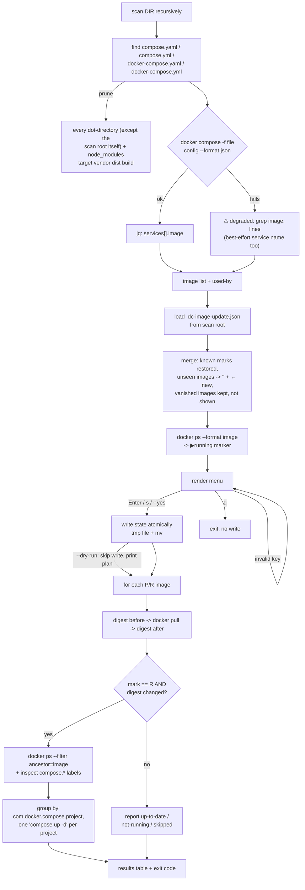

# dc-image-update — docker compose image pull/recreate helper

`dc-image-update` is an interactive zsh script. It scans a directory for docker compose files and lists every
service image. You mark each image for `pull` or `pull + recreate`. The script remembers your marks between runs.
When you apply, it pulls the marked images. Then it recreates only the **running** containers whose image digest
changed.

The script has no file extension on purpose. The shellcheck pre-commit glob in this repo is
`{scripts/*.sh,setup.sh}`, and shellcheck does not understand zsh (SC1071). A `.sh` name would fail the commit.
`scripts/` is linked as one directory onto `~/.scripts` (`scripts::.scripts` in `scripts/symlinks.sh`). When the
file is executable, it is on `PATH` and needs no other setup. `init-load`, `herdr-team`, and `claude-worktree` use
the same pattern.

**Dependency note:** `docker` is required, but this repo does **not** install it. See
[packages-native.md](packages-native.md) for the reason it is commented out in `packages/apt.list`. Rooted docker,
rootless docker, and Docker Desktop are a choice for each user. `jq` is already in every package list. If either
tool is missing, the script exits with code 3 before it does anything else.

## Flow



## Scan pruning

The scan prunes every **dot-directory**, except the scan root itself. For example, `dc-image-update ~/.config`
still scans `~/.config`. It does not enter dot-directories *below* it.

This is one general rule, not a list of names. It covers `.git`, `.venv`, and `.cache`. It also covers old or backup
trees such as `.old/` or `.b-hidden/`. Those trees can show ghost images from compose files that nobody runs
now.

A short list of names also prunes common directories that are not hidden and are never worth scanning:
`node_modules`, `target`, `vendor`, `dist`, `build`.

## Marks

You assign a mark to each **image**, not to each compose service. One image can be used by several services in
several compose files. It has one mark.

| Mark  | Meaning                                                                                |
| ----- | --------------------------------------------------------------------------------------- |
| `[P]` | pull only                                                                                |
| `[R]` | pull, then recreate every **running** container using that image, but only if the pull actually changed the digest |
| `[ ]` | do nothing                                                                               |

The recreate scope is the **running containers** on purpose. The script finds them with `docker ps` and the
`com.docker.compose.*` labels. It does not use every service in the compose file. A compose file can define
services that are not up. The script does not change those services.

## Menu keys

| Input          | Effect                                                              |
| -------------- | -------------------------------------------------------------------- |
| `<n>`          | cycle row `n`: `[ ]` → `[P]` → `[R]` → `[ ]`                          |
| `p<spec>`      | set rows in `<spec>` to `[P]` — `p3`, `p1-4`, `p1,3,5`                |
| `r<spec>`      | set rows in `<spec>` to `[R]`                                         |
| `x<spec>`      | clear rows in `<spec>` (`[ ]`)                                       |
| `a`            | mark every row `[R]`                                                  |
| `c`            | clear every row                                                       |
| `<Enter>`      | save marks, then apply                                                 |
| `s`            | save marks only, do not apply                                          |
| `q`            | quit without saving (confirms first if there are unsaved changes)      |
| anything else  | prints an error line and redraws the menu — the menu never exits on a bad key |

## State file

`<scan-root>/.dc-image-update.json`, written with `jq` (never hand-built
strings), atomically (temp file + `mv`):

```json
{
  "version": 1,
  "updated_at": "2026-08-19T09:12:33Z",
  "marks": { "nginx:latest": "R", "postgres:16": "P", "redis:7": "" }
}
```

- If the compose file of a tracked image disappears, the image keeps its entry. The menu does not show the entry,
  and the script does not delete it. The mark returns when the compose file returns. The scan summary shows how
  many entries are "absent".
- A new image gets the mark `""`. The menu shows `← new` until you save the marks.
- If `version` is not `1`, the script shows a warning. It then migrates the marks as well as it can. It does not
  drop any mark silently.

## Flags

```
dc-image-update [DIR] [--dry-run] [--yes|-y] [--help]
```

| Flag              | Behavior                                                                          |
| ----------------- | ---------------------------------------------------------------------------------- |
| `DIR`             | scan root; defaults to `$PWD`                                                      |
| `--dry-run`       | print the plan; never runs `docker pull`/`docker compose up`; never writes state, even on Enter/`s` (env `DRY_RUN=1` is equivalent, matching the `packages/custom-install/*` hook convention) |
| `--yes` / `-y`    | skip the menu, apply whatever marks are already on disk (cron/automation)           |
| `--help` / `-h`   | usage + this reference                                                             |

**Non-interactive stdin:** if stdin is not a TTY and you did not pass `--yes`, the menu reads commands from stdin,
one line at a time. The fixture tests below use this method. For example, they pipe `r1`, `p2`, and then an empty
line for Enter. The script handles two edge cases on purpose:

- The **first** read gets EOF and nothing was piped in. This happens when stdin comes from `/dev/null`, as with a
  timer unit. The script acts as if you passed `--yes`.
- EOF occurs **after** the script read at least one command. The script saves the marks set so far and exits, as if
  you typed `s`. It does not discard the marks silently.

## Exit codes

| Code | Meaning                                             |
| ---- | ---------------------------------------------------- |
| 0    | success, or user quit (`q`) without applying          |
| 1    | at least one `pull` or `up` (recreate) failed          |
| 2    | usage error — bad flag, `DIR` is not a directory       |
| 3    | a required dependency (`docker` or `jq`) is missing    |

## Shell-strictness note

The zsh option set closest to bash `set -euo pipefail` is `setopt err_exit no_unset pipe_fail`. This script sets
only `emulate -L zsh; setopt pipe_fail`. It does not set `err_exit`, `err_return`, or `no_unset`, and this is on
purpose:

- A failed `docker pull` for one image must **not** stop the run. The script must try every other marked image. It
  shows the failure in the results table and exits with a non-zero code at the end. The errexit rule stops at the
  first non-zero status, so it conflicts with this requirement. The script checks every risky command explicitly.
- `no_unset` makes a bare `$1` an error when a function gets fewer arguments. This conflicts with the small helper
  functions in the script. The script uses `"${1:-}"` where a default is correct.

## Requirements

This repository has no requirements file (no `docs/requirements/` or similar) at the time of writing. There is
nothing to update in lockstep. This note follows the "keep requirements & docs in sync" rule.
