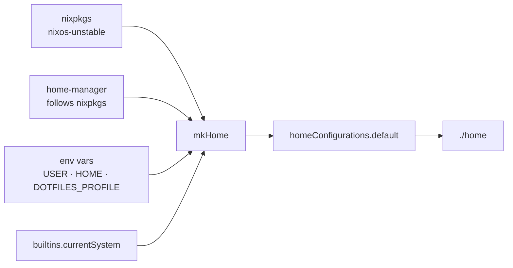

# flake

## Purpose

Single entry point for the whole repo. Declares the two inputs that
everything else builds on (`nixpkgs` + `home-manager`), the impure
binding that lets `setup.sh` resolve `system`/`USER`/`HOME` at
evaluation time, and one `homeConfiguration` named `default` that
every host activates.

## My preferences (why it's configured this way)

- **Two inputs only.** Pulling in flake-utils / flake-parts /
  home-manager-extras adds a moving piece for almost no benefit on a
  single-output repo.
- **`nixos-unstable`, not a release channel.** Day-to-day this is
  fine; package availability beats stability margin for an
  end-user workstation. Risk is bounded by `flake.lock` — a bad bump
  reverts cleanly.
- **`home-manager` follows nixpkgs.** Avoids the double-nixpkgs
  problem where HM modules see a different lib than your user
  packages.
- **One config name (`default`).** `setup.sh` always activates
  `homeConfigurations.default`; multi-host divergence is handled
  via the `system` + `profile` specialArgs, not via separate
  configurations.
- **Impure evaluation is required.** `currentSystem`, `USER`, and
  `HOME` are read from the environment at eval time. The price is
  passing `--impure` everywhere; the payoff is one repo that works
  unchanged on Linux + macOS + multiple user accounts.

## Options enabled

- `inputs.nixpkgs.url = "github:NixOS/nixpkgs/nixos-unstable"`.
- `inputs.home-manager.url = "github:nix-community/home-manager"`
  with `inputs.nixpkgs.follows = "nixpkgs"`.
- `mkHome { system, username, homeDirectory, profile }` — factory
  exposed under `lib.mkHome` so power users can build an
  arbitrary identity.
- `extraSpecialArgs = { inherit profile system; }` — both args are
  consumed by `home/default.nix` (system) and `home/linux.nix`
  (profile).
- `currentSystem` / `currentUser` / `currentHome` / `currentProfile`
  all resolved impurely via `builtins.currentSystem`,
  `builtins.getEnv "USER"`, `builtins.getEnv "HOME"`,
  `builtins.getEnv "DOTFILES_PROFILE"`.
- `config.allowUnfree = true` — some font and tool packages are
  unfree (e.g. JetBrains Mono Nerd Font).

## Diagram

## Related

- [home/default.nix](../home/default.nix) — what the flake actually
  imports. Dispatch into Linux / macOS happens there.
- [setup.sh](../setup.sh) — sets `DOTFILES_PROFILE` and runs
  `nix run --impure home-manager/master -- switch --impure
  --flake .#default`.
- [doc/home-default.md](home-default.md) — the dispatcher view.
