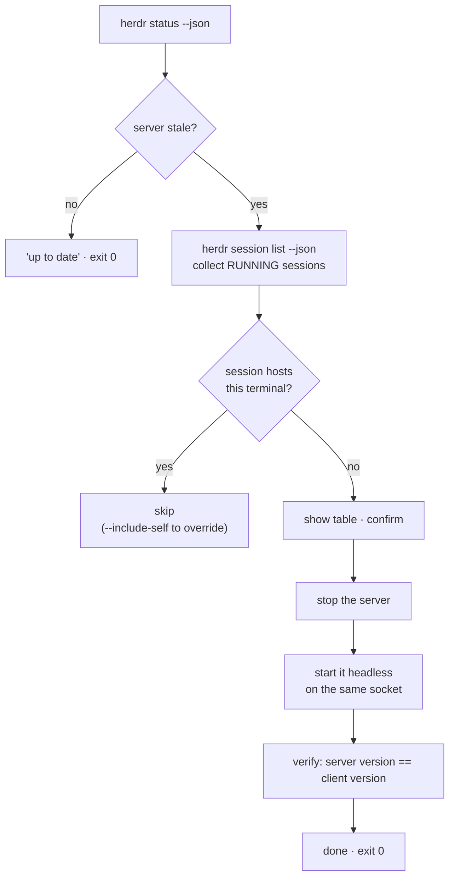

# herdr — upgrading the running server

Installing a new herdr binary does not upgrade the herdr server that is already
running. The two are separate things with separate lifecycles, and this repo
keeps them in separate places:

| Concern | Owner | Trigger |
| --- | --- | --- |
| install / upgrade the **binary** | `scripts/update-dotfiles` → `packages/Brewfile` (macOS), `packages/script-install.list` (Linux) | `/update` |
| warn that the **server** is now stale | `packages/custom-install/herdr/after.sh` | automatically, at the end of the same `/update` run |
| restart the **server** + its sessions | `scripts/herdr-upgrade` | by hand, when you are ready to lose your panes |

The split exists because the third step is destructive: stopping a session
exits every process in its panes. That must never happen as a side effect of an
update run, so the update path only *tells you*, and you run the restart.

## The split state

Between the package upgrade and the restart, the machine runs two versions at
once — the binary you type and the process you are typing into:

```mermaid
flowchart LR
    subgraph after["after `/update`, before `herdr-upgrade`"]
        CLI["`herdr` CLI<br/>0.9.0 · protocol 22"]
        SRV["running server<br/>0.7.1 · protocol 14"]
        PANE["your panes<br/>(alive, served by 0.7.1)"]
    end
    CLI -- "socket API" --> SRV
    SRV --> PANE
    CLI -. "protocol_mismatch" .-> SRV
```

Panes keep working — the server serves them with its own code. What breaks is
the **socket API**, because the new client speaks a protocol generation the old
server does not know:

```
$ herdr agent list
{"error":{"code":"protocol_mismatch","message":"client protocol 22 is newer
 than server protocol 14; restart the Herdr server before using this command."}}
```

That takes `scripts/herdr-team` and `scripts/claude-worktree` down with it, since
both drive herdr over that API. 🔴 In other words: **you cannot spawn team
members until the server is restarted.**

`herdr status --json` is the exception — it is readable across the mismatch, and
is what both the hook and the script use to detect the situation:

```json
{"client":{"version":"0.9.0"},"server":{"version":"0.7.1"},
 "update":{"restart_needed":true,"server_binary_stale":true}}
```

## What `herdr-upgrade` does



Per session, the cycle is stop-then-start on the **same socket path**, which is
what makes the session come back under its own name:

```
+------------------+     stop      +--------+     start     +------------------+
| server (old)     | ------------> | (down) | ------------> | server (new)     |
| panes: ALIVE     | panes die here|        |  same socket  | panes: EMPTY     |
+------------------+               +--------+               +------------------+
```

### Two mechanisms worth not rediscovering

| Problem | What the script uses | Why not the obvious thing |
| --- | --- | --- |
| stopping a session | `herdr session stop <name>`, falling back to `HERDR_SOCKET_PATH=<sock> herdr server stop` | `session stop` is itself a socket-API call and can be refused with `protocol_mismatch`. The socket-scoped `server stop` is version-independent, and is the escape hatch herdr's own error message names |
| starting it again | `HERDR_SOCKET_PATH=<sock> herdr server` under `nohup` | `herdr session attach <NAME>` is foreground-only with no detach flag, and needs a tty. `herdr server` is the headless form and needs neither |

### Flags

| Flag | Effect |
| --- | --- |
| `-n`, `--dry-run` | print every action, change nothing (`DRY_RUN=1` is equivalent) |
| `-y`, `--yes` | skip the confirmation prompt — panes still die |
| `--include-self` | also restart the session hosting this terminal; refused from inside it |
| `--no-restart` | stop the stale servers, do not start them again |
| `-h`, `--help` | usage |

| Exit code | Meaning |
| --- | --- |
| 0 | nothing to do, or the restart cycle completed |
| 1 | usage error, or a missing dependency (`herdr`, `jq`) |
| 2 | declined at the confirmation prompt |
| 3 | at least one session did not come back |

Log: `~/.local/state/dotfiles/herdr-upgrade.log` (the detached servers' stdout).

## 🔴 Restarting does not restore panes

herdr's own wording is `Stopping exits pane processes.` The session comes back
under its name, **empty**. Shells, editors and agent sessions inside it are
gone; unsaved work is lost. The script asks before every stop for this reason,
and `--yes` does not make it any less destructive — it only removes the prompt.

This is also why `--include-self` is refused from inside the session it targets:
the stop would kill the script between the stop and the start, leaving that
session down with nothing left running to bring it back.

## 🟡 The shadow-binary trap

A second herdr binary elsewhere on PATH will silently undo the whole exercise —
the server restarts, and comes straight back on the *old* version. On this
machine that was a leftover self-install:

| Path | Version | How it got there |
| --- | --- | --- |
| `/opt/homebrew/bin/herdr` | 0.9.0 | `packages/Brewfile` — the managed one |
| `~/.local/bin/herdr` | 0.7.1 | an earlier `herdr update` / `install.sh` run |

`herdr-upgrade` reports any such binary before it touches anything, and verifies
the version each session actually came back on. It never deletes one: removing a
binary the user installed by hand is their call, not the script's.

## Related

* [herdr.md](herdr.md) — keybindings and the `ctrl+alt` navigation layer.
* [claude-worktrees.md](claude-worktrees.md) — `claude-worktree` / `herdr-team`,
  the socket-API consumers that stop working during a version split.
* [`packages/custom-install/README.md`](../packages/custom-install/README.md) —
  the `before.sh` / `after.sh` contract the warning hook implements.
