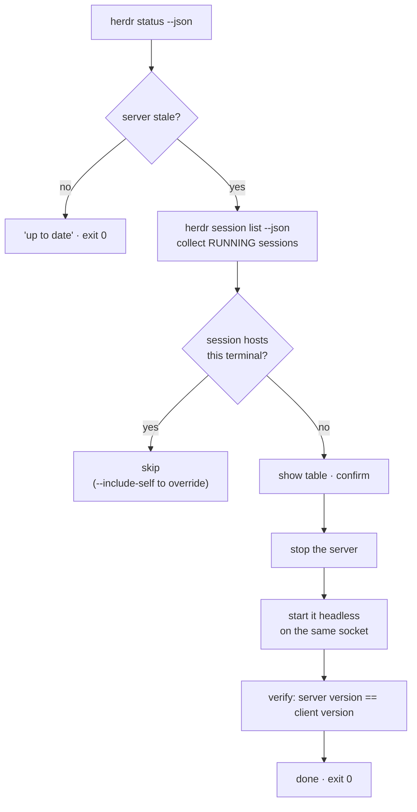

# herdr — upgrading the running server

A new herdr binary does not upgrade the herdr server that is already running.
The binary and the server are two separate things. They have separate
lifecycles. This repo keeps them in separate places:

| Concern | Owner | Trigger |
| --- | --- | --- |
| install / upgrade the **binary** | `scripts/update-dotfiles` → `packages/Brewfile` (macOS), `packages/script-install.list` (Linux) | `/update` |
| warn that the **server** is now stale | `packages/custom-install/herdr/after.sh` | automatically, at the end of the same `/update` run |
| restart the **server** + its sessions | `scripts/herdr-upgrade` | by hand, when you are ready to lose your panes |

The third step is destructive. When you stop a session, every process in its
panes exits. This must never happen as a side effect of an update run. For this
reason, the update path only *tells you*. You run the restart.

## The split state

After the package upgrade and before the restart, the machine runs two versions
at the same time. These are the binary you type and the process you type into:

```mermaid
flowchart LR
    subgraph after["after `/update`, before `herdr-upgrade`"]
        CLI["`herdr` CLI<br/>0.9.0 · protocol 22"]
        SRV["running server<br/>0.7.1 · protocol 14"]
        PANE["your panes<br/>(alive, served by 0.7.1)"]
    end
    CLI -- "socket API" --> SRV
    SRV --> PANE
    CLI -. "protocol_mismatch" .-> SRV
```

The panes keep working. The server serves them with its own code. The **socket
API** breaks. The new client uses a protocol generation that the old server
does not know:

```
$ herdr agent list
{"error":{"code":"protocol_mismatch","message":"client protocol 22 is newer
 than server protocol 14; restart the Herdr server before using this command."}}
```

`scripts/herdr-team` and `scripts/claude-worktree` also stop working. Both use
that API to control herdr. 🔴 **You cannot spawn team members until you restart
the server.**

`herdr status --json` is the exception. You can read it across the mismatch.
The hook and the script both use it to detect this state:

```json
{"client":{"version":"0.9.0"},"server":{"version":"0.7.1"},
 "update":{"restart_needed":true,"server_binary_stale":true}}
```

## What `herdr-upgrade` does


```mermaid
flowchart TD
    A["herdr status --json"] --> B{"server stale?"}
    B -- no --> Z["'up to date' · exit 0"]
    B -- yes --> C["herdr session list --json<br/>collect RUNNING sessions"]
    C --> D{"session hosts<br/>this terminal?"}
    D -- yes --> E["skip<br/>(--include-self to override)"]
    D -- no --> F["show table · confirm"]
    F --> G["stop the server"]
    G --> H["start it headless<br/>on the same socket"]
    H --> I["verify: server version == client version"]
    I --> Z2["done · exit 0"]
```

For each session, the script stops the server and then starts it again on the
**same socket path**. This is why the session comes back under its own name:

```
+------------------+     stop      +--------+     start     +------------------+
| server (old)     | ------------> | (down) | ------------> | server (new)     |
| panes: ALIVE     | panes die here|        |  same socket  | panes: EMPTY     |
+------------------+               +--------+               +------------------+
```

### Two mechanisms to keep in mind

| Problem | What the script uses | Why not the obvious thing |
| --- | --- | --- |
| stopping a session | `herdr session stop <name>`, falling back to `HERDR_SOCKET_PATH=<sock> herdr server stop` | `session stop` is itself a socket-API call and can be refused with `protocol_mismatch`. The socket-scoped `server stop` is version-independent, and is the escape hatch herdr's own error message names |
| starting it again | `HERDR_SOCKET_PATH=<sock> herdr server` under `nohup` | `herdr session attach <NAME>` is foreground-only with no detach flag, and needs a tty. `herdr server` is the headless form and needs neither |

### Flags

| Flag | Effect |
| --- | --- |
| `-n`, `--dry-run` | print every action, change nothing (`DRY_RUN=1` is equivalent) |
| `-y`, `--yes` | skip the confirmation prompt — panes still die |
| `--include-self` | also restart the session hosting this terminal; refused from inside it |
| `--no-restart` | stop the stale servers, do not start them again |
| `-h`, `--help` | usage |

| Exit code | Meaning |
| --- | --- |
| 0 | nothing to do, or the restart cycle completed |
| 1 | usage error, or a missing dependency (`herdr`, `jq`) |
| 2 | declined at the confirmation prompt |
| 3 | at least one session did not come back |

Log: `~/.local/state/dotfiles/herdr-upgrade.log` (the detached servers' stdout).

## 🔴 A restart does not restore panes

herdr's own wording is `Stopping exits pane processes.` The session comes back
under its name, **empty**. The shells, editors and agent sessions inside it are
gone. You lose unsaved work. For this reason, the script asks before every
stop. The `--yes` flag does not make the restart less destructive. It only
removes the prompt.

`--include-self` is refused from inside the session it targets. The stop would
kill the script between the stop and the start. Then that session stays down,
and no process remains to bring it back.

## 🟡 The shadow-binary trap

Do not keep a second herdr binary elsewhere on PATH. It silently undoes the
whole procedure. The server restarts and comes straight back on the *old*
version. On this machine, a leftover self-install caused this:

| Path | Version | How it got there |
| --- | --- | --- |
| `/opt/homebrew/bin/herdr` | 0.9.0 | `packages/Brewfile` — the managed one |
| `~/.local/bin/herdr` | 0.7.1 | an earlier `herdr update` / `install.sh` run |

`herdr-upgrade` reports any such binary before it changes anything. It also
verifies the version that each session actually came back on. It never deletes
a binary. The user installed that binary by hand, so the user decides whether
to remove it.

## Related

* [herdr.md](herdr.md) — keybindings and the `ctrl+alt` navigation layer.
* [claude-worktrees.md](claude-worktrees.md) — `claude-worktree` / `herdr-team`,
  the socket-API consumers that stop working during a version split.
* [`packages/custom-install/README.md`](../packages/custom-install/README.md) —
  the `before.sh` / `after.sh` contract the warning hook implements.
