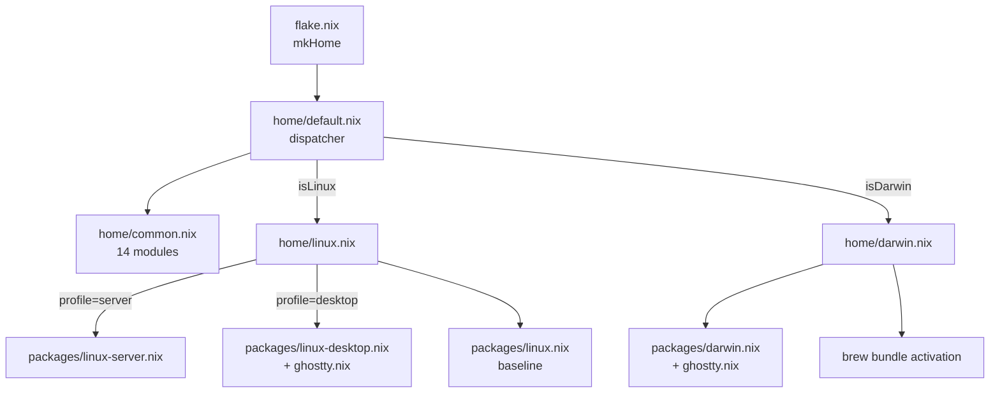

# home/default.nix — the dispatcher

## Purpose

Picks platform-specific bundles by string-suffixing `system`. Every
host loads `./common.nix`; Linux hosts add `./linux.nix`, macOS hosts
add `./darwin.nix`. Profile-based filtering (server vs desktop)
happens one level deeper, inside `./linux.nix`.

This file is the only place where OS detection is allowed. Every
module further down the tree that needs to know the platform
**must** accept `system` and derive `isDarwin`/`isLinux` itself via
`lib.hasSuffix` — see `home/modules/gpg.nix` for the reference
implementation.

## My preferences (why it's configured this way)

- **`lib.hasSuffix` over `pkgs.stdenv.isDarwin`.** The system arg is
  the canonical source; `pkgs.stdenv.*` couples OS detection to the
  pkgs set the module receives, which complicates `_module.args`
  passing.
- **No `pkgs` import here.** The dispatcher is a pure routing layer;
  introducing `pkgs` would mean the platform import list could depend
  on package set state. Keep it dumb.
- **Common-first, then platform, then profile.** The order matters
  because Home Manager evaluates imports left-to-right; the common
  layer establishes baseline defaults (LANG, LC_COLLATE, scripts/,
  zsh/bash/git/…) that platform-specific imports may override.

## Options enabled

`home/default.nix`:
- `isDarwin = lib.hasSuffix "darwin" system`.
- `isLinux  = lib.hasSuffix "linux"  system`.
- `imports = [ ./common.nix ] ++ optional isDarwin ./darwin.nix ++ optional isLinux ./linux.nix`.

`home/common.nix`:
- Imports 14 user-facing modules + `modules/packages/common.nix` +
  `modules/scripts.nix`.
- `programs.home-manager.enable = true`.
- `home.sessionVariables.LANG = "tr_TR.UTF-8"`,
  `LC_COLLATE = "C"`. EDITOR is **not** set here — `editor.nix`
  owns it via `programs.neovim.defaultEditor = true`.

`home/darwin.nix`:
- Imports `modules/packages/darwin.nix` + `modules/ghostty.nix`.
- `home.activation.ghosttyMacosNotice` — warns if the legacy
  `~/Library/Application Support/com.mitchellh.ghostty/config` is a
  regular file, but never deletes it.
- `home.activation.brewBundle` — replays
  `configurations/brew/Brewfile` every switch.

`home/linux.nix`:
- Asserts `profile ∈ { "server", "desktop" }`.
- Imports `modules/packages/linux.nix` baseline.
- On `server` adds `modules/packages/linux-server.nix`.
- On `desktop` adds `modules/packages/linux-desktop.nix` +
  `modules/ghostty.nix`.

## Diagram

## Related

- [flake.nix](../flake.nix) — sets `extraSpecialArgs.system` and
  `.profile`.
- [setup.sh](../setup.sh) — sets `DOTFILES_PROFILE` before invoking
  home-manager.
- [doc/flake.md](flake.md) — input view.
- Every `doc/modules-*.md` — the leaves of this tree.
