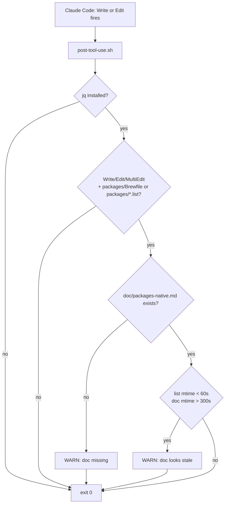

# post-tool-use.sh hook

## Purpose

Catches doc rot at edit time. Registered as a Claude Code
`PostToolUse` hook in `.claude/settings.json`, filtered to
`Write|Edit`. When the agent edits a file under `packages/`
(`Brewfile` or `*.list`), this hook checks that
`doc/packages-native.md` was also touched recently. If the doc
hasn't been edited in the last 5 minutes while the list was edited
in the last 60 seconds, it warns to stderr — enforces
[CLAUDE.md §4](../../CLAUDE.md).

## Inputs

Reads the Claude Code hook payload from **stdin** (JSON). Relevant
fields:

| Field                       | Used for                                                |
| --------------------------- | ------------------------------------------------------- |
| `.tool_name`                | Filter to `Write` / `Edit` / `MultiEdit`.               |
| `.tool_input.file_path`     | Match against `packages/Brewfile` or `packages/*.list`. |
| `.cwd`                      | Resolve repo root.                                      |

## Behavior

1. `jq` parses the JSON payload. Missing `jq` ⇒ exits 0 (advisory;
   never break a tool call over a missing dependency).
2. Filters by tool name (`Write`/`Edit`/`MultiEdit`) and by path
   suffix (`*/packages/Brewfile` or `*/packages/*.list`).
3. Resolves repo root from `.cwd` or `git rev-parse --show-toplevel`.
4. If `doc/packages-native.md` is **missing**, prints a `WARN` to
   stderr citing CLAUDE.md §4.
5. If the doc exists but **mtime > 5 min old** while the list's
   mtime is **< 60 s old**, prints a `WARN` that the doc looks
   stale.

All exits are `0` — this hook is advisory, never blocking.

## Hard rules

- Never blocks a tool call.
- Never modifies files. It only reads stat info and prints warnings.
- Never assumes the hook system runs with cwd at repo root —
  resolves repo root from the payload's `.cwd` field or from
  `git rev-parse --show-toplevel`.

## Diagram

## Related

- [.claude/settings.json](../../.claude/settings.json) — registers
  this hook for the `PostToolUse` event with matcher `Write|Edit`.
- the `doc-author` skill in `${AGENT_SKILLS_DIR}/doc-author/SKILL.md` (global repo, not vendored here)
  — the authoring rules this hook is trying to enforce.
- [CLAUDE.md §4](../../CLAUDE.md) — the project rule the hook
  enforces.
