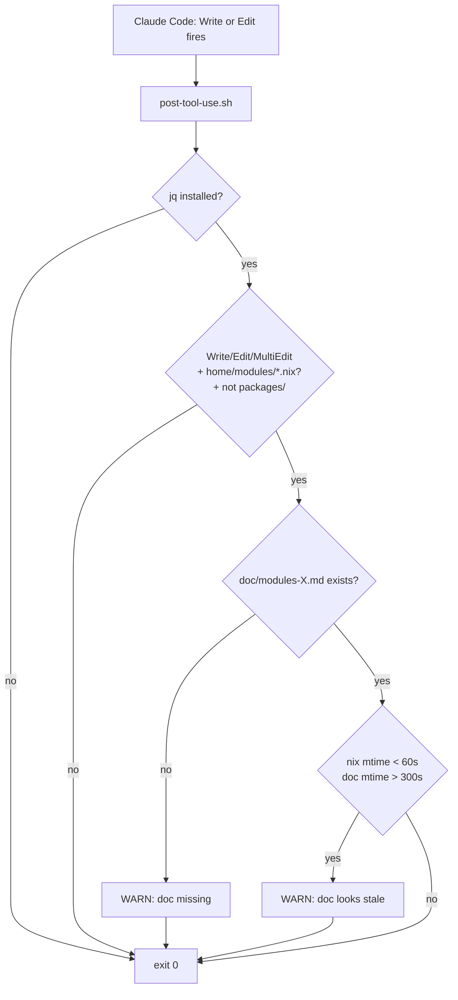

# post-tool-use.sh hook

## Purpose

Catches doc rot at edit time. Registered as a Claude Code
`PostToolUse` hook in `.claude/settings.json`, filtered to
`Write|Edit`. When the agent edits a file under
`home/modules/*.nix`, this hook checks that the matching
`doc/modules-<name>.md` was also touched recently. If the doc
hasn't been edited in the last 5 minutes while the nix file was
edited in the last 60 seconds, it warns to stderr.

## Inputs

Reads the Claude Code hook payload from **stdin** (JSON). Relevant
fields:

| Field                       | Used for                                                |
| --------------------------- | ------------------------------------------------------- |
| `.tool_name`                | Filter to `Write` / `Edit` / `MultiEdit`.               |
| `.tool_input.file_path`     | Match against `home/modules/*.nix`.                     |
| `.cwd`                      | Resolve repo root.                                      |

## Behavior

1. `jq` parses the JSON payload. Missing `jq` ⇒ exits 0
   (advisory; never break a tool call over a missing dependency).
2. Filters by tool name (`Write`/`Edit`/`MultiEdit`) and by path
   suffix (`*/home/modules/*.nix`). Excludes
   `home/modules/packages/*` (those have separate
   `doc/packages-*.md` files, not 1:1 with module names).
3. Computes `doc/modules-<name>.md` from the edited file's
   basename.
4. If the doc file is **missing**, prints a `WARN` to stderr
   suggesting `.claude/skills/doc-author/SKILL.md`.
5. If the doc exists but **mtime > 5 min old** while the nix file's
   mtime is **< 60 s old**, prints a `WARN` that the doc looks
   stale.

All exits are `0` — this hook is advisory, never blocking.

## Hard rules

- Never blocks a tool call.
- Never modifies files. It only reads stat info and prints warnings.
- Never assumes the hook system runs with cwd at repo root —
  resolves repo root from the payload's `.cwd` field or from
  `git rev-parse --show-toplevel`.

## Diagram

## Related

- [.claude/settings.json](../../.claude/settings.json) — registers
  this hook for the `PostToolUse` event with matcher `Write|Edit`.
- [.claude/skills/doc-author/SKILL.md](../../.claude/skills/doc-author/SKILL.md)
  — the rules this hook is trying to enforce.
