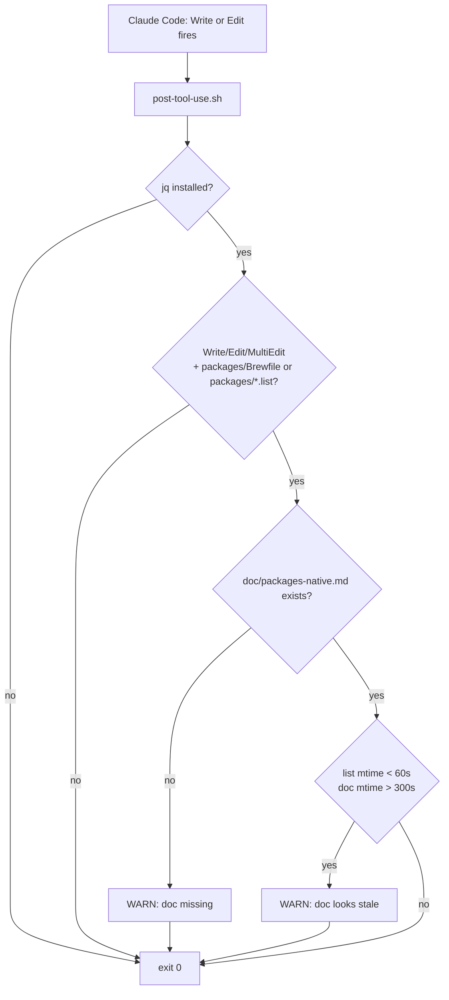

# post-tool-use.sh hook

## Purpose

This hook finds out-of-date docs when a file is edited. It is a Claude Code `PostToolUse` hook, registered in
`.claude/settings.json` with the filter `Write|Edit`. When the agent edits a file under `packages/`
(`Brewfile` or `*.list`), the hook checks that `doc/packages-native.md` also changed recently.
The hook prints a warning to stderr in this case: the list changed in the last 60 seconds, and the doc did not
change in the last 5 minutes. This enforces [CLAUDE.md §4](../../CLAUDE.md).

## Inputs

The hook reads the Claude Code hook payload (JSON) from **stdin**. These fields are used:

| Field                       | Used for                                                |
| --------------------------- | ------------------------------------------------------- |
| `.tool_name`                | Filter to `Write` / `Edit` / `MultiEdit`.               |
| `.tool_input.file_path`     | Match against `packages/Brewfile` or `packages/*.list`. |
| `.cwd`                      | Resolve repo root.                                      |

## Behavior

1. `jq` parses the JSON payload. If `jq` is missing, the hook exits with 0. The hook is advisory. A missing
   dependency must not break a tool call.
2. The hook filters by tool name (`Write`/`Edit`/`MultiEdit`) and by path suffix (`*/packages/Brewfile` or
   `*/packages/*.list`).
3. The hook finds the repo root from `.cwd` or from `git rev-parse --show-toplevel`.
4. If `doc/packages-native.md` is **missing**, the hook prints a `WARN` to stderr. The `WARN` cites CLAUDE.md §4.
5. If the doc exists and its **mtime is more than 5 min old**, and the list **mtime is less than 60 s old**,
   the hook prints a `WARN`. The `WARN` says that the doc looks stale.

All exits are `0`. The hook is advisory. It never blocks.

## Hard rules

- Do not block a tool call.
- Do not change files. The hook only reads stat information and prints warnings.
- Do not assume that the hook system runs with the cwd at the repo root. The hook finds the repo root from the
  `.cwd` field of the payload or from `git rev-parse --show-toplevel`.

## Diagram

```mermaid
graph TD
    PT[Claude Code: Write or Edit fires] --> H[post-tool-use.sh]
    H --> JQ{jq installed?}
    JQ -->|no| OK[exit 0]
    JQ -->|yes| FILT{Write/Edit/MultiEdit<br/>+ packages/Brewfile or packages/*.list?}
    FILT -->|no| OK
    FILT -->|yes| DOC{doc/packages-native.md exists?}
    DOC -->|no| WARN1[WARN: doc missing]
    DOC -->|yes| ST{list mtime < 60s<br/>doc mtime > 300s}
    ST -->|yes| WARN2[WARN: doc looks stale]
    ST -->|no| OK
    WARN1 --> OK
    WARN2 --> OK
```

## Related

- [.claude/settings.json](../../.claude/settings.json) — registers
  this hook for the `PostToolUse` event with matcher `Write|Edit`.
- the `doc-author` skill in `${AGENT_SKILLS_DIR}/doc-author/SKILL.md` (global repo, not vendored here)
  — the authoring rules that this hook helps to enforce.
- [CLAUDE.md §4](../../CLAUDE.md) — the project rule that the hook
  enforces.
