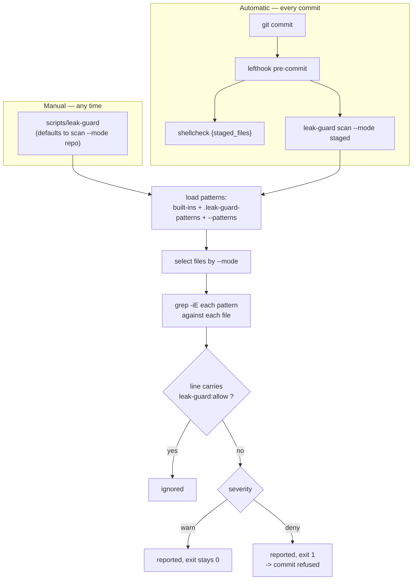
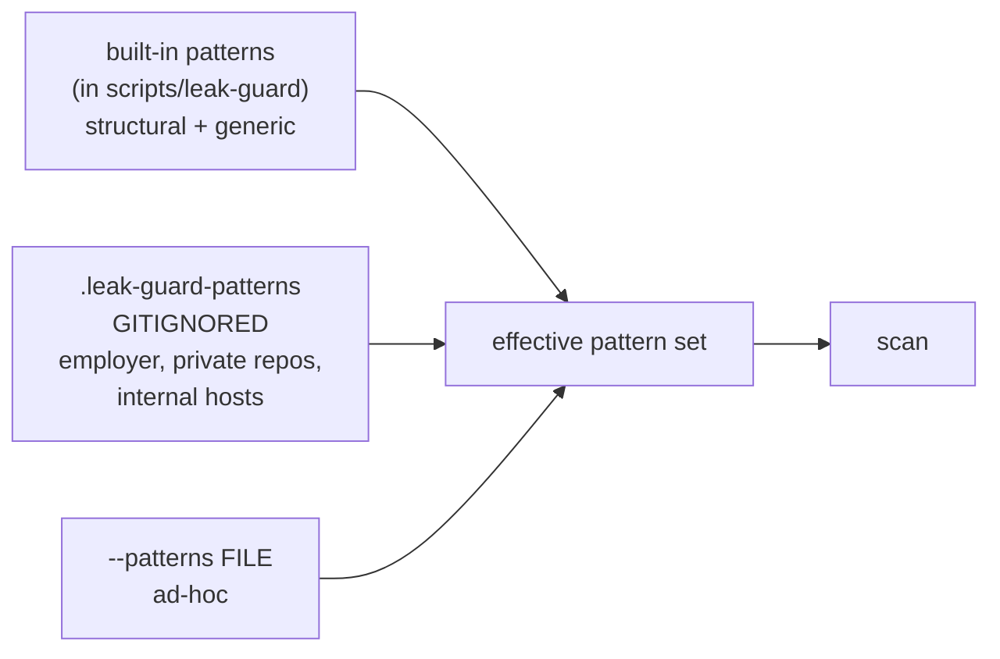

# leak-guard — keeping a public dotfiles repo generic

## Why this exists

`~/.claude/settings.json` is a **symlink into this repo**, and Claude Code writes
its learned auto-mode state directly into that file. This repo is **public**
(`gh repo view` → `"visibility":"PUBLIC"`).

That combination already produced a real leak. One `autoMode` block had
accumulated:

| Leaked shape | Example class |
| --- | --- |
| Employer name | organisation identity |
| Internal service hostnames | `<app>-postgres`, `<app>-redis`, `<app>-kafka` |
| Local port map | `localhost:5432`, `localhost:6379`, … |
| Secret-adjacent paths | `.env`, `.env.example` locations |
| Deployment topology | `*.prod.yml`, prod-config script names |
| Absolute home paths | from two different machines, one of them macOS |
| Private repo names | `<owner>/<private-project>` |

Deleting the block once does not fix it. **The next session rewrites it.** A
human reviewer cannot be the gate for a file a program keeps regenerating — so
the gate is a machine.

> Scope is deliberately narrow: this enforces *"dotfiles stays generic"*. It is
> not a general-purpose secret scanner, though a few high-confidence credential
> shapes ride along because they cost nothing to check.

## How it runs



The `staged` mode reads content from the **index**, not the worktree — a commit
records what is staged, so scanning files on disk would both miss staged-only
leaks and block on unstaged edits that are not being committed.

## Commands

| Command | Effect |
| --- | --- |
| `leak-guard` / `leak-guard scan` | Report findings. Default `--mode repo` — the "run it whenever" mode |
| `leak-guard install [--dry-run]` | Append the job to `configurations/lefthook.yml`'s pre-commit block |
| `leak-guard uninstall [--dry-run]` | Remove that job |
| `leak-guard patterns` | Print the effective pattern set (built-ins + private + `--patterns`) |
| `leak-guard init-private [--force]` | Write the gitignored private-pattern template |
| `leak-guard --help` | Full inline reference |

### Scan options

| Flag | Values | Default | Notes |
| --- | --- | --- | --- |
| `--mode` | `repo` \| `staged` \| `worktree` | `repo` | `staged` reads the index; the hook uses it |
| `--patterns FILE` | path, repeatable | — | Extra records, appended to the built-ins |
| `--exempt GLOB` | glob, repeatable | — | Paths to skip |
| `--severity` | `all` \| `deny` \| `warn` | `all` | Filters the report, not the exit code |
| `--format` | `table` \| `plain` | `table` | `plain` is TAB-separated, for piping |
| `-q`, `--quiet` | — | off | Exit code only |

### Exit codes

| Code | Meaning |
| --- | --- |
| `0` | No `deny` findings (warnings may still have printed) |
| `1` | At least one `deny` finding — this is what refuses a commit |
| `2` | Usage error |

## Built-in patterns

Structural and generic only — safe to publish. **Tabs are load-bearing** in the
record format.

| Severity | id | Path scope | Catches |
| --- | --- | --- | --- |
| `deny` | `automode-block` | `configurations/claude/settings.json` | The `autoMode` key — the original leak vector |
| `deny` | `private-key` | all | `-----BEGIN … PRIVATE KEY-----` |
| `deny` | `skill-in-repo` | `*SKILL.md` | Any skill vendored into this repo — they belong in `${AGENT_SKILLS_DIR}` |
| `deny` | `aws-access-key` | all | `AKIA` + 16 uppercase alphanumerics |
| `deny` | `bearer-token` | all | `Authorization: Bearer <20+ chars>` |
| `deny` | `localhost-port` | all | `localhost:<2–5 digits>` — one machine's infra map |
| `deny` | `prod-config-name` | all | `*.prod.{yml,yaml,json,toml,conf}` |
| `warn` | `absolute-home` | all | `/home/<user>/`, `/Users/<user>/` — see hard rule #11 |
| `warn` | `dotenv-path` | all | `.env` / `.env.<suffix>` references |

`absolute-home` is **warn, not deny** on purpose: `CLAUDE.md`'s own hard rule #11
has to quote those shapes in order to forbid them, and a rule that cannot be
committed is worse than useless.

## Why the interesting patterns are not in the repo

An organisation name, a private repo name and an internal service hostname are
exactly the strings that must not appear in a public repo. **A committed pattern
list naming them would *be* the leak it is meant to prevent.**

So they live in `${DOTFILES_DIR}/.leak-guard-patterns`, which is gitignored
(`.gitignore` names it explicitly). `leak-guard init-private` writes a commented
template with placeholder examples only.



Consequence worth stating plainly: **until that file is filled in, no
employer/private-repo/service patterns are checked at all.** Every scan prints a
NOTE saying so when the file is missing, rather than implying clean coverage.

## Suppressing a legitimate match

Put `leak-guard:allow` anywhere on the line. The normal use is rule or doc text
that must quote a forbidden shape in order to forbid it.

The guard's own files (`scripts/leak-guard`, `doc/leak-guard.md`,
`.leak-guard-patterns`) are exempt unconditionally — they carry every forbidden
shape by construction.

## Escape hatch

```sh
LEAK_GUARD=off git commit ...
```

Skips scanning **and prints a notice to stderr saying it did**. The notice is
the point: a silent bypass is how the gate stops being a gate. (`LEFTHOOK=0`
still bypasses every hook, as it always did.)

## Idempotency

| Subcommand | Re-run behaviour |
| --- | --- |
| `scan` | Never writes anything |
| `install` | Reports "already installed", changes nothing |
| `uninstall` | Reports "nothing to do", changes nothing |
| `init-private` | Refuses to overwrite without `--force` |

Verified: `install` → `uninstall` returns `configurations/lefthook.yml` to a
**byte-identical** state.

`install` appends, which is only correct while `pre-commit:` is the last
top-level block in `lefthook.yml`. It checks that and **refuses** rather than
silently attaching the job to a later hook.

## Known limits

| Limit | Detail |
| --- | --- |
| Forward-only | No effect on already-published history. A leak that reached the public remote stays reachable via GitHub, forks and search indexes |
| Coverage depends on the private file | Missing `.leak-guard-patterns` → no identity patterns checked (a NOTE says so) |
| Not a secret scanner | Credential patterns are opportunistic, not comprehensive |
| Text only | Binary and minified content is not meaningfully scanned |
| `lefthook install` required once | The job is declared in `lefthook.yml`, but git only calls lefthook after `lefthook install` has run in the clone |
