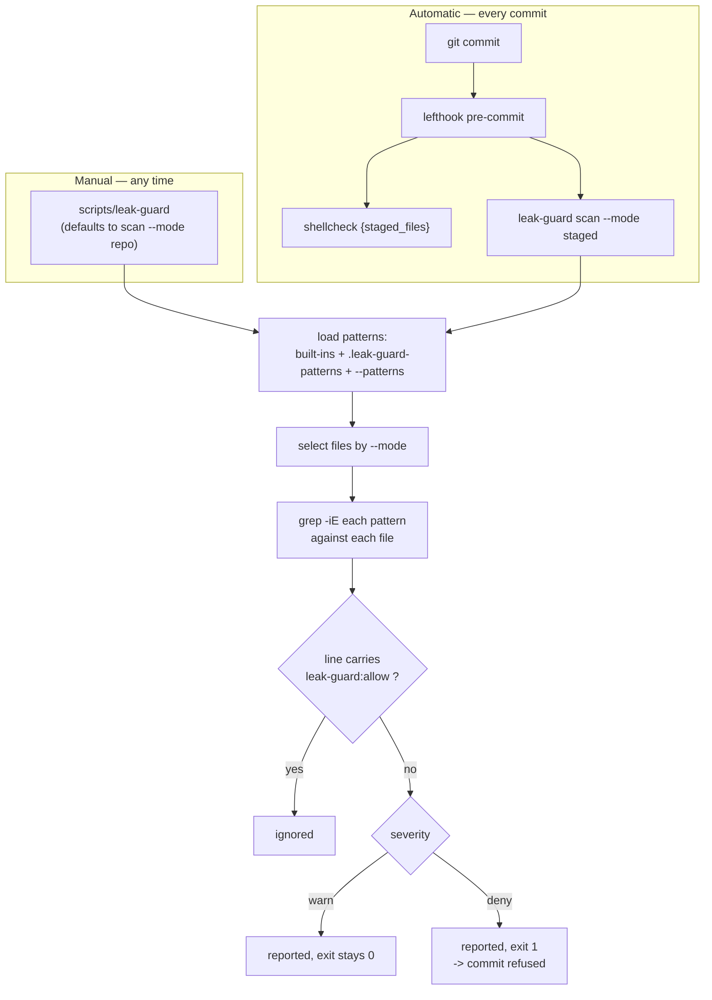
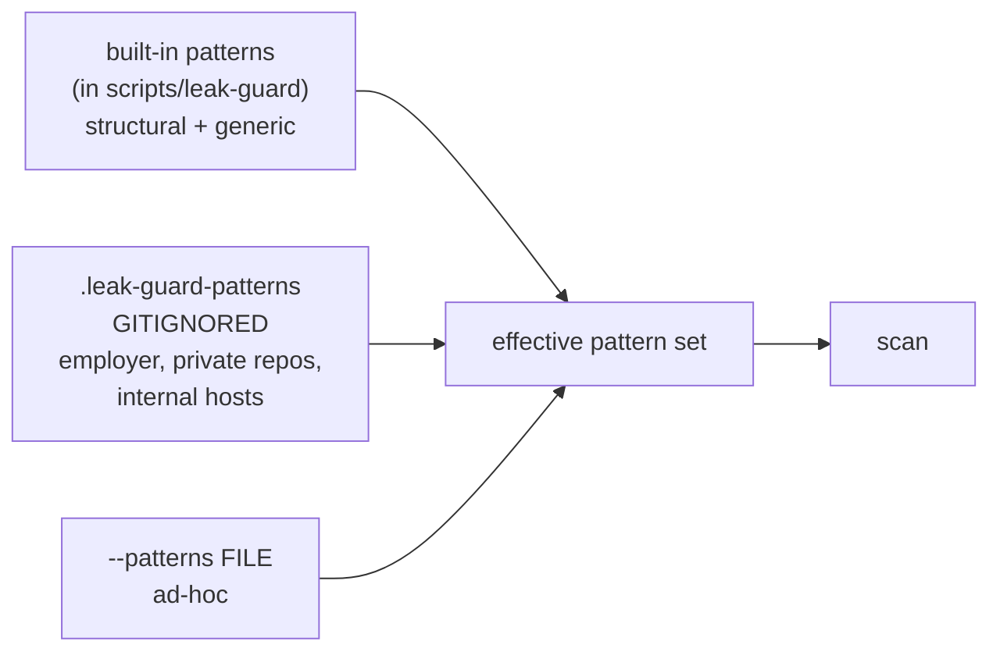

# leak-guard — keeping a public dotfiles repo generic

## Why this exists

`~/.claude/settings.json` is a **symlink into this repo**. Claude Code writes its learned auto-mode state directly
into that file. This repo is **public** (`gh repo view` → `"visibility":"PUBLIC"`).

This combination already caused a real leak. One `autoMode` block had collected these items:

| Leaked shape | Example class |
| --- | --- |
| Employer name | organisation identity |
| Internal service hostnames | `<app>-postgres`, `<app>-redis`, `<app>-kafka` |
| Local port map | `localhost:5432`, `localhost:6379`, … |
| Secret-adjacent paths | `.env`, `.env.example` locations |
| Deployment topology | `*.prod.yml`, prod-config script names |
| Absolute home paths | from two different machines, one of them macOS |
| Private repo names | `<owner>/<private-project>` |

If you delete the block once, the problem remains. **The next session writes it again.** A program keeps
regenerating this file, so a human reviewer cannot be the gate. The gate is a machine.

> The scope is narrow on purpose. The guard enforces *"dotfiles stays generic"*. It is not a general secret
> scanner. It also checks a few credential shapes that it can find with high confidence, because the check is free.

## How it runs


```mermaid
flowchart TD
    subgraph MANUAL["Manual — any time"]
        M1["scripts/leak-guard<br/>(defaults to scan --mode repo)"]
    end

    subgraph HOOK["Automatic — every commit"]
        H1["git commit"] --> H2["lefthook pre-commit"]
        H2 --> H3["shellcheck {staged_files}"]
        H2 --> H4["leak-guard scan --mode staged"]
    end

    M1 --> SCAN
    H4 --> SCAN

    SCAN["load patterns:<br/>built-ins + .leak-guard-patterns + --patterns"]
    SCAN --> FILES["select files by --mode"]
    FILES --> MATCH["grep -iE each pattern<br/>against each file"]
    MATCH --> SUPPRESS{"line carries<br/>leak-guard:allow ?"}
    SUPPRESS -->|yes| SKIP["ignored"]
    SUPPRESS -->|no| SEV{"severity"}
    SEV -->|warn| REPORT["reported, exit stays 0"]
    SEV -->|deny| BLOCK["reported, exit 1<br/>-> commit refused"]
```

The `staged` mode reads the content from the **index**, not from the worktree. A commit records the staged content.
If the guard scanned the files on disk, it would miss leaks that exist only in the index. It would also block on
unstaged edits that are not in the commit.

## Commands

| Command | Effect |
| --- | --- |
| `leak-guard` / `leak-guard scan` | Report findings. Default `--mode repo` — the "run it whenever" mode |
| `leak-guard install [--dry-run]` | Append the job to `configurations/lefthook.yml`'s pre-commit block |
| `leak-guard uninstall [--dry-run]` | Remove that job |
| `leak-guard patterns` | Print the effective pattern set (built-ins + private + `--patterns`) |
| `leak-guard init-private [--force]` | Write the gitignored private-pattern template |
| `leak-guard --help` | Full inline reference |

### Scan options

| Flag | Values | Default | Notes |
| --- | --- | --- | --- |
| `--mode` | `repo` \| `staged` \| `worktree` | `repo` | `staged` reads the index; the hook uses it |
| `--patterns FILE` | path, repeatable | — | Extra records, appended to the built-ins |
| `--exempt GLOB` | glob, repeatable | — | Paths to skip |
| `--severity` | `all` \| `deny` \| `warn` | `all` | Filters the report, not the exit code |
| `--format` | `table` \| `plain` | `table` | `plain` is TAB-separated, for piping |
| `-q`, `--quiet` | — | off | Exit code only |

### Exit codes

| Code | Meaning |
| --- | --- |
| `0` | No `deny` findings (warnings may still have printed) |
| `1` | At least one `deny` finding — this is what refuses a commit |
| `2` | Usage error |

## Built-in patterns

The built-in patterns are structural and generic. It is safe to publish them. **Tabs are required** in the record
format.

| Severity | id | Path scope | Catches |
| --- | --- | --- | --- |
| `deny` | `automode-block` | `configurations/claude/settings.json` | The `autoMode` key — the original leak vector |
| `deny` | `private-key` | all | `-----BEGIN … PRIVATE KEY-----` |
| `deny` | `skill-in-repo` | `*SKILL.md` | Any skill vendored into this repo — they belong in `${AGENT_SKILLS_DIR}` |
| `deny` | `aws-access-key` | all | `AKIA` + 16 uppercase alphanumerics |
| `deny` | `bearer-token` | all | `Authorization: Bearer <20+ chars>` |
| `deny` | `localhost-port` | all | `localhost:<2–5 digits>` — one machine's infra map |
| `deny` | `prod-config-name` | all | `*.prod.{yml,yaml,json,toml,conf}` |
| `warn` | `absolute-home` | all | `/home/<user>/`, `/Users/<user>/` — see hard rule #10 |
| `warn` | `dotenv-path` | all | `.env` / `.env.<suffix>` references |

`absolute-home` is **warn, not deny**, on purpose. Hard rule #10 in `CLAUDE.md` must quote those shapes to forbid
them. A rule that you cannot commit has no use.

## Why the interesting patterns are not in the repo

An organisation name, a private repo name, and an internal service hostname must not appear in a public repo. **A
committed pattern list that names them would be the leak that the guard must prevent.**

These patterns are in `${DOTFILES_DIR}/.leak-guard-patterns`. Git ignores this file, and `.gitignore` names it
explicitly. The command `leak-guard init-private` writes a template with comments. The template has placeholder
examples only.


```mermaid
flowchart LR
    B["built-in patterns<br/>(in scripts/leak-guard)<br/>structural + generic"]
    P[".leak-guard-patterns<br/>GITIGNORED<br/>employer, private repos,<br/>internal hosts"]
    X["--patterns FILE<br/>ad-hoc"]
    B --> E["effective pattern set"]
    P --> E
    X --> E
    E --> S["scan"]
```

Note this result: **until you fill in that file, the guard does not check any employer, private-repo, or service
patterns.** If the file is missing, every scan prints a NOTE about it. The guard does not imply clean coverage.

## Suppressing a legitimate match

Put `leak-guard:allow` anywhere on the line. Use it for rule text or doc text that must quote a forbidden shape to
forbid it.

The guard always exempts its own files (`scripts/leak-guard`, `doc/leak-guard.md`, `.leak-guard-patterns`). By
design, these files contain every forbidden shape.

## Escape hatch

```sh
LEAK_GUARD=off git commit ...
```

This command skips the scan **and prints a notice to stderr**. The notice is required. A silent bypass removes the
gate. (`LEFTHOOK=0` still bypasses every hook, as before.)

## Idempotency

| Subcommand | Re-run behaviour |
| --- | --- |
| `scan` | Never writes anything |
| `install` | Reports "already installed", changes nothing |
| `uninstall` | Reports "nothing to do", changes nothing |
| `init-private` | Refuses to overwrite without `--force` |

Verified: after `install` and then `uninstall`, `configurations/lefthook.yml` is **byte-identical** to the start.

`install` appends the job. This is correct only when `pre-commit:` is the last top-level block in `lefthook.yml`.
The command checks this and **refuses** to continue if it is not. It does not attach the job to a later hook.

## Known limits

| Limit | Detail |
| --- | --- |
| Forward-only | No effect on already-published history. A leak that reached the public remote stays reachable via GitHub, forks and search indexes |
| Coverage depends on the private file | Missing `.leak-guard-patterns` → no identity patterns checked (a NOTE says so) |
| Not a secret scanner | Credential patterns are opportunistic, not comprehensive |
| Text only | Binary and minified content is not meaningfully scanned |
| `lefthook install` required once | The job is declared in `lefthook.yml`, but git only calls lefthook after `lefthook install` has run in the clone |
