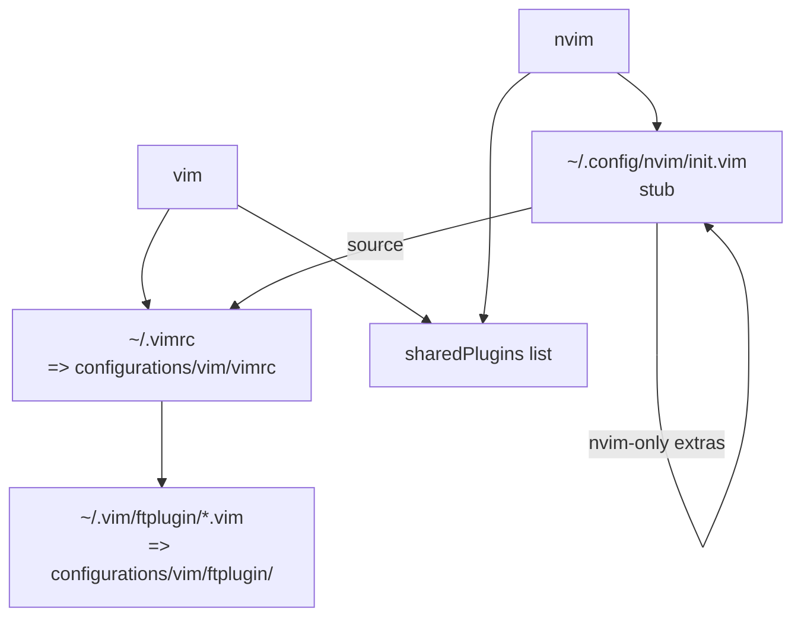

# editor — vim + neovim shared rc

## Purpose

Both Vim and Neovim installed, sharing a single rc
(`configurations/vim/vimrc`). Neovim's `~/.config/nvim/init.vim` is
a tiny stub that re-uses `~/.vimrc` plus a few Neovim-only extras.
Plugins are declared once and pulled in by both editors.

## My preferences (why it's configured this way)

- **Both editors, one rc.** I switch between vim (servers, quick
  edits) and nvim (workstation, LSP-curious) often; one rc keeps
  muscle memory consistent.
- **`vimAlias=false`, `viAlias=false`.** `vim` stays vim and `nvim`
  stays nvim. The HM `vimAlias` would alias `vim` → `nvim` and
  break the dual-editor design.
- **`defaultEditor = true` on Neovim.** Sets `EDITOR=nvim`. The
  common.nix module deliberately does not declare `EDITOR` to
  avoid the HM duplicate-declaration error.
- **One shared `plugins` list** wired into both `programs.vim` and
  `programs.neovim`. Every plugin in the list is plain vimscript,
  so it works on either binary. Lua-only Neovim plugins are out of
  scope until I commit to nvim-only.
- **Per-filetype indent overrides as files**, not inline. ftplugin
  rules for `nix`, `go`, `yaml`, `python` live under
  `configurations/vim/ftplugin/` and are linked via `home.file`.

## Options enabled

- `programs.vim.enable = true`, `plugins = sharedPlugins`.
- `programs.neovim.enable = true`,
  `vimAlias = false`, `viAlias = false`,
  `defaultEditor = true`, `plugins = sharedPlugins`.
- `sharedPlugins` (plain vimscript only):
  - file tree: `nerdtree`, `vim-nerdtree-syntax-highlight`,
    `vim-devicons`.
  - fuzzy: `fzf-vim`.
  - git: `vim-fugitive`, `vim-gitgutter`, `vim-rhubarb`.
  - editing: `vim-surround`, `vim-commentary`, `vim-repeat`,
    `auto-pairs`, `vim-multiple-cursors`, `tabular`,
    `vim-easymotion`.
  - UI: `vim-airline`, `vim-airline-themes`, `catppuccin-vim`,
    `indentLine`.
  - syntax + lint: `vim-polyglot`, `ale`.
  - snippets: `ultisnips`, `vim-snippets`.
  - buffer mgmt: `bufexplorer`.
  - QoL: `vim-sensible`.
- `home.file`:
  - `~/.vimrc` → `configurations/vim/vimrc`.
  - `~/.vim/ftplugin/{nix,go,yaml,python}.vim` →
    `configurations/vim/ftplugin/*.vim`.
- `xdg.configFile."nvim/init.vim"` →
  `configurations/nvim/init.vim`.

## Diagram

## Related

- [configurations/vim/vimrc](../configurations/vim/vimrc) — the
  shared rc.
- [configurations/nvim/init.vim](../configurations/nvim/init.vim)
  — Neovim stub.
- [doc/theming.md](theming.md) — Catppuccin Mocha is set in the
  shared rc.
