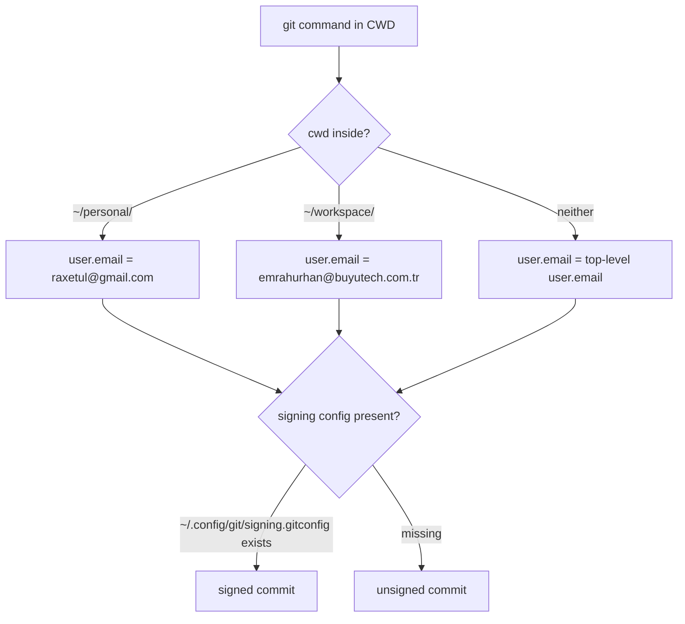

# git

## Purpose

Daily-driver git ergonomics: delta as the pager, rebase-pull,
autostash/autosquash, zdiff3 conflict markers, histogram diff,
Conventional Commits template, dual-identity by gitdir
(personal vs work), and an `include` for the GPG signing config
that turns on signing iff `scripts/gpg-setup.sh` has run.

## My preferences (why it's configured this way)

- **Delta on by default.** Diffs / log / blame all pick up the
  Catppuccin Mocha palette via `configurations/themes/delta/`.
- **Rebase pull, autostash on rebase.** Linear history; never get
  bitten by a stash-and-recover dance.
- **`zdiff3` conflict style.** Three-way markers show the common
  ancestor, which makes resolving real conflicts faster.
- **Identity selected by directory.** Personal mail under
  `~/personal/`, work mail under `~/workspace/`. Switching
  projects can't mis-attribute commits.
- **Signing turned on via include, not top-level keys.** The
  module declares an `includes.path` pointing at
  `~/.config/git/signing.gitconfig`. If the file is missing (no
  `gpg-setup.sh` run yet), git silently skips the include and
  commits remain unsigned but valid. Running the wizard writes
  that file and flips signing on without touching anything HM
  manages.
- **Global hook template + commit template.** Every new repo
  cloned on this host inherits both, so the Conventional Commits
  guard travels.

## Options enabled

- `programs.git.enable = true`, `delta.enable = true`.
- Identity (top-level): `user.name = "Emrah URHAN"`,
  `user.email = "raxetul@gmail.com"`.
- `init.defaultBranch = "main"`,
  `init.templateDir = ~/.config/git/template`.
- `pull.rebase = true`, `push.autoSetupRemote = true`.
- `rebase.autoStash = true`, `rebase.autosquash = true`.
- `merge.conflictStyle = "zdiff3"`.
- `diff.algorithm = "histogram"`, `diff.colorMoved = "default"`.
- `fetch.prune = true`.
- `commit.template = ~/.config/git/commit-template`,
  `commit.verbose = true`.
- Four `includes`:
  1. `gitdir:~/personal/` → `user.email = raxetul@gmail.com`.
  2. `gitdir:~/workspace/` → `user.email = emrahurhan@buyutech.com.tr`.
  3. `path = …configurations/themes/delta/catppuccin.gitconfig`.
  4. `path = ~/.config/git/signing.gitconfig` (written by
     `scripts/gpg-setup.sh`).
- `xdg.configFile` links: `git/commit-template`,
  `git/template/hooks/commit-msg`,
  `git/template/hooks/pre-commit`.

## Diagram

## Related

- [home/modules/gpg.nix](../home/modules/gpg.nix) — declarative
  GPG profile + agent that makes signing possible.
- [scripts/gpg-setup.sh](../scripts/gpg-setup.sh) — wizard that
  generates the key and writes `signing.gitconfig`.
- [configurations/git/commit-template](../configurations/git/commit-template)
  — the Conventional Commits skeleton.
- [configurations/git/template/hooks/](../configurations/git/template/hooks/)
  — global hook template seeded into every new repo.
- [configurations/lefthook.yml](../configurations/lefthook.yml)
  — repo-local commit-msg + pre-commit checks.
