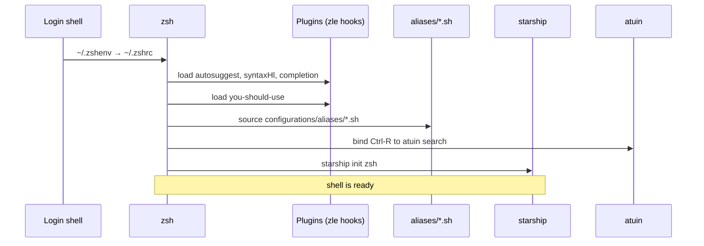

# zsh

## Purpose

Daily-driver shell. The module installs zsh with a minimal plugin
set (no oh-my-zsh), wires in atuin for history recall, sources the
cross-shell `configurations/aliases/` folder, and sets Catppuccin
Mocha syntax-highlighting colors.

## My preferences (why it's configured this way)

- **No oh-my-zsh.** Phase 3 of the v2 refactor dropped it. OMZ's
  plugin model conflicts with declarative HM management, and 95%
  of the value (git/k8s aliases, autosuggest, syntax-hl) ships
  inside Home Manager natively or in the `configurations/aliases/`
  folder.
- **`you-should-use` is the only third-party plugin.** It catches
  cases where I typed the long form instead of the alias I'd
  already defined — a 24h reminder loop that's been worth it.
- **History recall delegated to atuin.** zsh's own history is still
  enabled for in-session arrow-up, but Ctrl-R goes through atuin
  (encrypted SQLite, fuzzy search). The old `zsh-histdb` plugin and
  the `HISTORY_IGNORE` regex are both gone.
- **Autosuggest color = `fg=8`** (the terminal's bright-black slot)
  so the suggestion fades into whatever palette is loaded; pinned
  hex values fight Catppuccin Mocha when transparency is on.
- **Aliases folder, not inline.** Same file is sourced by zsh and
  bash, so the two shells can't drift on alias coverage.

## Options enabled

- `programs.zsh.enable = true`.
- `autosuggestion.enable`, `syntaxHighlighting.enable`,
  `enableCompletion`, `historySubstringSearch.enable`.
- `history` — size + save 50000, ignoreDups, share.
- `plugins = [ { you-should-use } ]`.
- `initContent` — sets prompt_subst, autosuggest highlight style,
  `ZSH_HIGHLIGHT_STYLES` palette (Catppuccin Mocha hexes), sources
  `configurations/aliases/*.sh` and
  `configurations/themes/fzf/catppuccin-mocha.sh`.

## Diagram

## Related

- [home/modules/atuin.nix](../home/modules/atuin.nix) — Ctrl-R
  history backend.
- [home/modules/bash.nix](../home/modules/bash.nix) — sources the
  same `configurations/aliases/` folder.
- [configurations/aliases/](../configurations/aliases/) — the
  alias source of truth.
- [configurations/themes/fzf/catppuccin-mocha.sh](../configurations/themes/fzf/catppuccin-mocha.sh)
  — palette sourced into the env so fzf, fzf-vim, and fzf-tab
  agree.
- [doc/theming.md](theming.md) — palette table.
