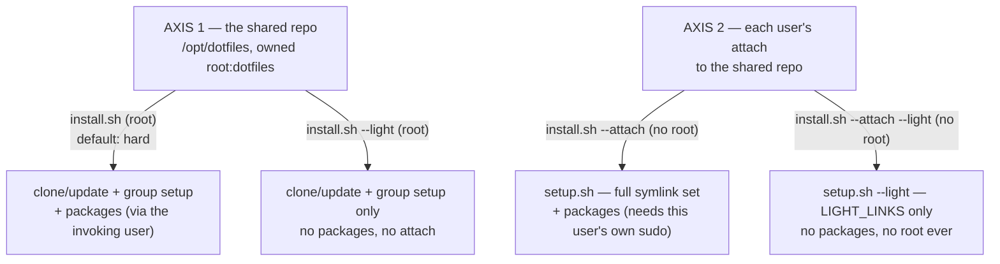

# `/opt/dotfiles` — shared install, one-line bootstrap, migration

Two independent axes govern how these dotfiles land on a machine — see
[light-profile.md](light-profile.md) for the per-user half (axis 2). This
doc covers the shared-repo half (axis 1) and the tooling around it.



## Where things live

| What | Where | Owner |
| --- | --- | --- |
| The repo itself | `/opt/dotfiles` (or `${HOME}/gel-ort/dotfiles` for a plain dev checkout) | `root:dotfiles`, group-readable, setgid |
| Per-user shell-init (`load`, `path`) | `$HOME/.dotfiles/` | that user |
| Realized-state ledger | `$HOME/.local/state/dotfiles/` | that user — unchanged, was already per-user |

`scripts/dotfiles-dir.sh` is the one place the `DOTFILES_DIR` resolution
order lives: explicit env var → `/opt/dotfiles` if it exists → `${HOME}/gel-ort/dotfiles`.
Every script sources it instead of repeating the expression; the two rc
files inline a copy since nothing is known yet about where the repo is
at shell startup (see the comment there).

## `install.sh` — the one-line installer

```sh
# Machine half (root) — provision /opt/dotfiles + the shared group,
# then (unless --light) attach the invoking user too, packages included:
curl -fsSL https://raw.githubusercontent.com/raxetul/dotfiles/<SHA>/install.sh \
  | sudo sh -s --

# Machine half, light — just the shared repo + group, no packages, no attach:
curl -fsSL https://raw.githubusercontent.com/raxetul/dotfiles/<SHA>/install.sh \
  | sudo sh -s -- --light

# Per-user half (no root, ever) — attach THIS account:
curl -fsSL https://raw.githubusercontent.com/raxetul/dotfiles/<SHA>/install.sh \
  | sh -s -- --attach --light
```

🔴 The URL is pinned to a commit SHA, never `.../main/install.sh` — this
lane executes remote code as root, and `scripts/run-script-installers`'s
own SECURITY note requires exactly this: a reviewed, pinned entry, never
a moving branch. `install.sh` pins a second time internally
(`INSTALL_PIN_SHA`, the commit it checks the fresh `/opt/dotfiles` clone
out to before letting `git pull` take over) — bump **both** together on
release, after reviewing the diff at the new commit.

POSIX `sh`, not bash: this runs before anything (including bash) is
guaranteed to exist on the machine.

### What each half actually does

| Half | Root? | Steps |
| --- | --- | --- |
| Machine (default / "hard") | yes | clone or fast-forward `/opt/dotfiles` → `scripts/provision-shared-group.sh` (group, ownership, setgid) → `sudo -u "$SUDO_USER" /opt/dotfiles/setup.sh` (packages + full attach for the invoking user) |
| Machine `--light` | yes | clone or fast-forward + group setup only — stops there |
| Attach (`--attach`) | no | `setup.sh` on an already-provisioned `/opt/dotfiles` (full symlink set; needs this account's own sudo for packages) |
| Attach `--light` (`--attach --light`) | no | `setup.sh --light` — `LIGHT_LINKS` only, never touches packages |

🟡 A hard **machine** install also attaches the invoking user (via
`sudo -u`) as a convenience — on a single-admin box that's the whole
install in one command. On a shared server, everyone *else* uses
`--attach --light` (no root needed) once the admin has run the
machine half.

## `scripts/provision-shared-group.sh` — group + ownership

Linux only (macOS has no `groupadd`/`usermod` — `dseditgroup`'s
semantics differ enough that guessing is worse than refusing; this
script detects Darwin and exits with that explanation). A separate
root-run step, **not** part of a normal user install — `setup.sh` never
calls it. `install.sh`'s machine half calls it once per machine; a later
admin can re-run it by hand to add another user's membership:

```sh
sudo scripts/provision-shared-group.sh <user> [<user> ...]
```

```sh
groupadd -f dotfiles
chgrp -R dotfiles /opt/dotfiles
chmod -R g+rX /opt/dotfiles
find /opt/dotfiles -type d -exec chmod g+s {} +   # setgid: NOT optional —
                                                    # without it, files a
                                                    # `git pull` creates
                                                    # don't inherit the group
usermod -aG dotfiles <user>
```

## `scripts/migrate-to-opt.sh` — moving an existing install

For a host that already has a plain `${HOME}/gel-ort/dotfiles` (or
`$DOTFILES_DIR`) checkout and wants to move to the shared layout.
Idempotent, `DRY_RUN=1` honored, confirms before every destructive step
(`--yes`/`YES=1` skips the prompts):

```sh
scripts/migrate-to-opt.sh              # interactive
DRY_RUN=1 scripts/migrate-to-opt.sh    # preview only, touches nothing
scripts/migrate-to-opt.sh --yes        # no prompts
```

1. Refuses if the source repo has uncommitted changes.
2. Moves `$HOME/.load` / `$HOME/.path` (the legacy in-repo files) out to
   `$HOME/.dotfiles/{load,path}` **first** — before the repo itself
   moves, so a same-device `mv` of the repo directory can't drag them
   into the shared tree.
3. Relocates the repo: a same-device `mv` to `/opt/dotfiles` when safe
   (needs root to create `/opt/dotfiles` the first time — the script
   tells you the exact `sudo mkdir + chown` to run first if it can't),
   or a fresh `git clone` from the old checkout — leaving the old
   directory in place — when a move isn't safe (already exists at
   `/opt/dotfiles`, or cross-device).
4. Re-runs `scripts/symlinks.sh install` so every symlink repoints at
   the new location, then verifies **zero dangling links** and reports
   the count (`N/N links resolve; 0 dangling`).
5. **Never deletes the old directory** — that decision is the user's,
   once they've confirmed the new location works.

Group/ownership setup (`provision-shared-group.sh`) is a separate step —
migration only relocates *this user's* checkout; sharing it with other
accounts is the machine half's job.
