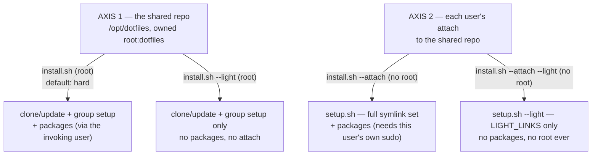

# `/opt/dotfiles` — shared install, one-line bootstrap, migration

Two independent axes control how these dotfiles get onto a machine.
For the per-user half (axis 2), see [light-profile.md](light-profile.md).
This doc covers the shared-repo half (axis 1) and the tools for it.


```mermaid
graph TD
    A["AXIS 1 — the shared repo<br/>/opt/dotfiles, owned root:dotfiles"]
    A -->|"install.sh (root)<br/>default: hard"| A1["clone/update + group setup<br/>+ packages (via the invoking user)"]
    A -->|"install.sh --light (root)"| A2["clone/update + group setup only<br/>no packages, no attach"]

    B["AXIS 2 — each user's attach<br/>to the shared repo"]
    B -->|"install.sh --attach (no root)"| B1["setup.sh — full symlink set<br/>+ packages (needs this user's own sudo)"]
    B -->|"install.sh --attach --light (no root)"| B2["setup.sh --light — LIGHT_LINKS only<br/>no packages, no root ever"]
```

## Where things live

| What | Where | Owner |
| --- | --- | --- |
| The repo itself | `/opt/dotfiles` (or `${HOME}/gel-ort/dotfiles` for a plain dev checkout) | `root:dotfiles`, group-readable, setgid |
| Per-user shell-init (`load`, `path`) | `$HOME/.dotfiles/` | that user |
| Realized-state ledger | `$HOME/.local/state/dotfiles/` | that user — no change, it was already per-user |

`scripts/dotfiles-dir.sh` is the one place that sets the `DOTFILES_DIR` resolution
order: explicit env var → `/opt/dotfiles` if it exists → `${HOME}/gel-ort/dotfiles`.
Every script sources this file and does not repeat the expression. The two rc
files contain an inline copy. At shell startup, the rc files do not yet know where the repo is
(see the comment there).

## `install.sh` — the one-line installer

```sh
# Machine half (root) — provision /opt/dotfiles + the shared group,
# then (unless --light) attach the invoking user too, packages included:
curl -fsSL https://raw.githubusercontent.com/raxetul/dotfiles/<SHA>/install.sh \
  | sudo sh -s --

# Machine half, light — just the shared repo + group, no packages, no attach:
curl -fsSL https://raw.githubusercontent.com/raxetul/dotfiles/<SHA>/install.sh \
  | sudo sh -s -- --light

# Per-user half (no root, ever) — attach THIS account:
curl -fsSL https://raw.githubusercontent.com/raxetul/dotfiles/<SHA>/install.sh \
  | sh -s -- --attach --light
```

🔴 Pin the URL to a commit SHA. Do not use `.../main/install.sh`. This
lane runs remote code as root. The SECURITY note in `scripts/run-script-installers`
requires a reviewed, pinned entry and never a moving branch. `install.sh` also pins
a second time inside the script (`INSTALL_PIN_SHA`). This is the commit that the script
checks out in the fresh `/opt/dotfiles` clone before `git pull` takes over.
On a release, review the diff at the new commit. Then change **both** pins together.

The script uses POSIX `sh`, not bash. It runs before the machine must have
any other tool, bash included.

### What each half actually does

| Half | Root? | Steps |
| --- | --- | --- |
| Machine (default / "hard") | yes | clone or fast-forward `/opt/dotfiles` → `scripts/provision-shared-group.sh` (group, ownership, setgid) → `sudo -u "$SUDO_USER" /opt/dotfiles/setup.sh` (packages + full attach for the invoking user) |
| Machine `--light` | yes | clone or fast-forward + group setup only — stops there |
| Attach (`--attach`) | no | `setup.sh` on an already-provisioned `/opt/dotfiles` (full symlink set; needs this account's own sudo for packages) |
| Attach `--light` (`--attach --light`) | no | `setup.sh --light` — `LIGHT_LINKS` only, never touches packages |

🟡 A hard **machine** install also attaches the invoking user (with
`sudo -u`). This is a convenience. On a box with one admin, this is the whole
install in one command. On a shared server, after the admin runs the
machine half, all *other* users run `--attach --light` (no root needed).

## `scripts/provision-shared-group.sh` — group + ownership

This script works on Linux only. macOS has no `groupadd`/`usermod`, and the
semantics of `dseditgroup` are different. A guess is worse than a refusal, so the
script detects Darwin and exits with this explanation. The script is a separate
step that root runs. It is **not** part of a normal user install, and `setup.sh` never
calls it. The machine half of `install.sh` calls it one time for each machine.
Later, an admin can run it again by hand to add the membership of another user:

```sh
sudo scripts/provision-shared-group.sh <user> [<user> ...]
```

```sh
groupadd -f dotfiles
chgrp -R dotfiles /opt/dotfiles
chmod -R g+rX /opt/dotfiles
find /opt/dotfiles -type d -exec chmod g+s {} +   # setgid: NOT optional —
                                                    # without it, files a
                                                    # `git pull` creates
                                                    # don't inherit the group
usermod -aG dotfiles <user>
```

## `scripts/migrate-to-opt.sh` — moving an existing install

Use this script for a host that already has a plain `${HOME}/gel-ort/dotfiles` (or
`$DOTFILES_DIR`) checkout and must move to the shared layout.
The script is idempotent and honors `DRY_RUN=1`. It asks for confirmation before each
destructive step. The `--yes` flag or `YES=1` skips the prompts:

```sh
scripts/migrate-to-opt.sh              # interactive
DRY_RUN=1 scripts/migrate-to-opt.sh    # preview only, touches nothing
scripts/migrate-to-opt.sh --yes        # no prompts
```

1. The script stops if the source repo has uncommitted changes.
2. The script moves `$HOME/.load` / `$HOME/.path` (the legacy in-repo files) to
   `$HOME/.dotfiles/{load,path}` **first**. This happens before the repo moves.
   A `mv` of the repo directory on the same device then cannot take the files
   into the shared tree.
3. The script relocates the repo. When it is safe, the script does a `mv` on the same device
   to `/opt/dotfiles`. To create `/opt/dotfiles` the first time, the script needs root.
   If it cannot, it tells you the exact `sudo mkdir + chown` to run first.
   When a move is not safe, the script does a fresh `git clone` from the old checkout
   and leaves the old directory in place. A move is not safe when
   `/opt/dotfiles` already exists, or when the move is across devices.
4. The script runs `scripts/symlinks.sh install` again, so that each symlink points to
   the new location. It then checks that there are **zero dangling links**
   and reports the count (`N/N links resolve; 0 dangling`).
5. The script **never deletes the old directory**. The user decides this
   after they confirm that the new location works.

Group and ownership setup (`provision-shared-group.sh`) is a separate step.
The migration moves only the checkout of *this user*. The machine half
shares the checkout with other accounts.
